# Platforms State of the Union - WWDC26

WWDC26のセッション [Platforms State of the Union](https://developer.apple.com/videos/play/wwdc2026/102/) で発表された、Appleプラットフォームの最新テクノロジー、フレームワーク、開発ツールのアップデート内容を技術アーカイブとして整理します。

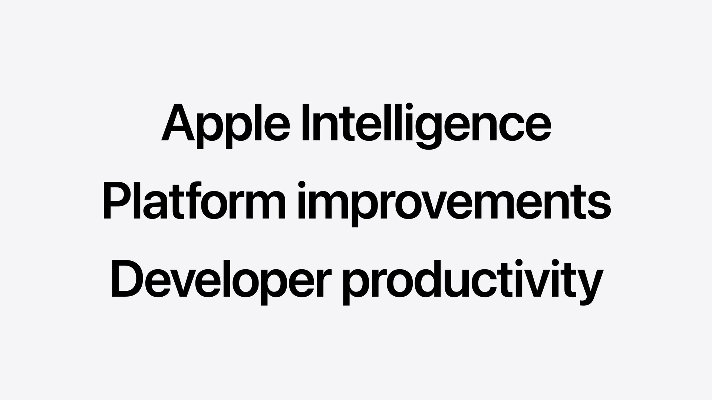

今年度のアップデートは、**「Apple Intelligenceの進化」**、**「プラットフォームの機能向上（デザイン・Swift/SwiftUI）」**、**「デベロッパの生産性強化（Xcode・AIエージェント）」** の3つを主要な柱として構成されています。

---

## 1. Apple Intelligence & 生成AIインテグレーション

Apple Intelligenceのコアとなるのは、オンデバイスおよびプライベートクラウドで安全に動作する最新の **Apple Foundation Model** です。

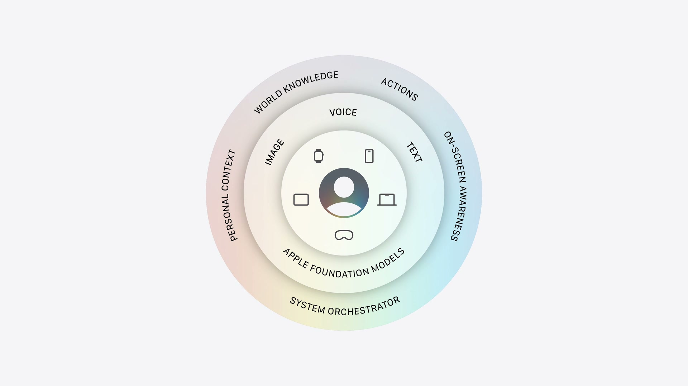

### Foundation Model フレームワーク
Foundation Modelフレームワークを介して、Apple Intelligenceを支えるLLMへSwift APIから直接アクセス可能です。

* **マルチモーダル入力の対応**: テキストに加え、プロンプトへの画像添付による画像認識機能が追加されました。
* **Visionフレームワークの統合**: OCR（光学文字認識）やデバイス上での高速なバーコード認識機能など、Visionの専門ツールがモデルのツールとして利用可能になりました。
* **プライベートクラウドの無償開放**: App Storeでのダウンロード数が200万以下のデベロッパアカウントに対し、プライベートクラウド上のApple Foundation ModelをクラウドAPIコストなしで利用可能にしました。
* **サードパーティ製サーバーモデルのサポート**: ClaudeやGeminiなどの外部LLMへの呼び出しに対応。ツールコーリングやガイド付き生成などの高度な機能も制御できます。
* **Language Model プロトコル**: プロトコルに準拠することで、開発者は任意のモデルプロバイダのSwiftパッケージを作成し、アプリに最適なモデルを自由に選択可能です。
* **オープンソース化**: 今夏後半にFoundation Modelフレームワーク自体をオープンソース化し、サーバーサイドを含むマルチプラットフォームで同じSwift APIを利用可能にする予定です。

<div style="background-color: #fffef0; padding: 10px; border-radius: 8px; border: 1px solid #e6e6e6; width: 100%;">
<svg xmlns="http://www.w3.org/2000/svg" width="16" height="16" viewBox="0 0 24 24" fill="none" stroke="currentColor" stroke-width="2" stroke-linecap="round" stroke-linejoin="round" style="vertical-align: middle; margin-right: 4px;"><polygon points="23 7 16 12 23 17 23 7"></polygon><rect x="1" y="5" width="15" height="14" rx="2" ry="2"></rect></svg>
<a href="https://developer.apple.com/videos/play/wwdc2026/102/">
Platforms State of the Union (Session Video)
</a>
</div>

### Dynamic Profile
複雑なワークフローやマルチエージェントを少ないコードで構築するための新しい宣言型APIです。`LanguageModelSession` を継続的に更新し、状況に応じてProfile（AIエージェントの役割、インストラクション、使用するツールやモデル）を切り替えることができます。

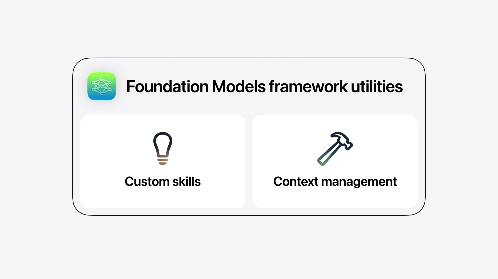

同じセッション内でモデルやプロファイルを切り替えても、単一の連続したトランスクリプト（会話履歴）が共有されるため、少ないプロンプトで文脈に沿った回答が得られます。

```swift
struct CraftProfile: LanguageModelSession.DynamicProfile {
    var viewModel: CraftOrchestrator
    
    var body: some DynamicProfile {
        switch viewModel.mode {
        case .brainstorm:
            Profile {
                Instructions {
                    "You are a warm and friendly expert crafting assistant. Your job is to help the user explore and define their craft project. When the user shares photos, identify the craft type, colors, materials, and any relevant details. Then generate craft project ideas that best fit what you see and the user's request. Recommend simple beginner-level crafts that require few pieces, unless the user explicitly requests something more complex."
                }
                .model(PrivateCloudComputeLanguageModel())
                .temperature(1.0)
            }
        case .tutorial:
            Profile {
                Instructions {
                    "You explain origami and craft jargon to beginners. Try to use those specific craft supplies in the tutorial."
                    if viewModel.isTutorialReady {
                        "You may also be asked to evaluate the user's work from a photo. When this happens, match it against the tutorial steps to provide specific, constructive feedback. Be warm and supportive - highlight what they did well before suggesting improvements. Reference the specific step they appear to be on."
                    }
                }
                CalculatePaperSizeTool()
                ConvertMeasurementTool()
                MovePhotoToStepTool(viewModel: viewModel)
                
                .model(PrivateCloudComputeLanguageModel())
                .reasoningLevel(.deep)
            }
        case .terminology:
            Profile {
                Instructions {
                    "You explain origami and craft jargon to beginners. Explain in 1-3 short sentences. Plain language. No preamble. If given the step, ground the answer in what they're physically doing. For follow-ups: answer directly, don't restate the term."
                }
                .model(SystemLanguageModel())
            }
        }
    }
}
```

### AI向けデベロッパツール群
* **Evaluationフレームワーク**: プロンプトのテストおよび出力結果の評価を行い、挙動をシステム的に検証。
* **Foundation Model Instrument**: モデルの動作、推論時間、トークン使用量をInstrumentsで視覚化・デバッグ。
* **`fm` コマンドラインツール**: ターミナルから直接モデルにプロンプトを提供して動作確認が可能。
* **Core Spotlight RAG**: アプリのローカル検索インデックスを活用したRAG（検索拡張生成）ツールをサポート。

---

## 2. Core AI & Machine Learning

オンデバイス上でモデルを実行するためのローレベルフレームワークとして、**Core AI** が新たに導入されました。

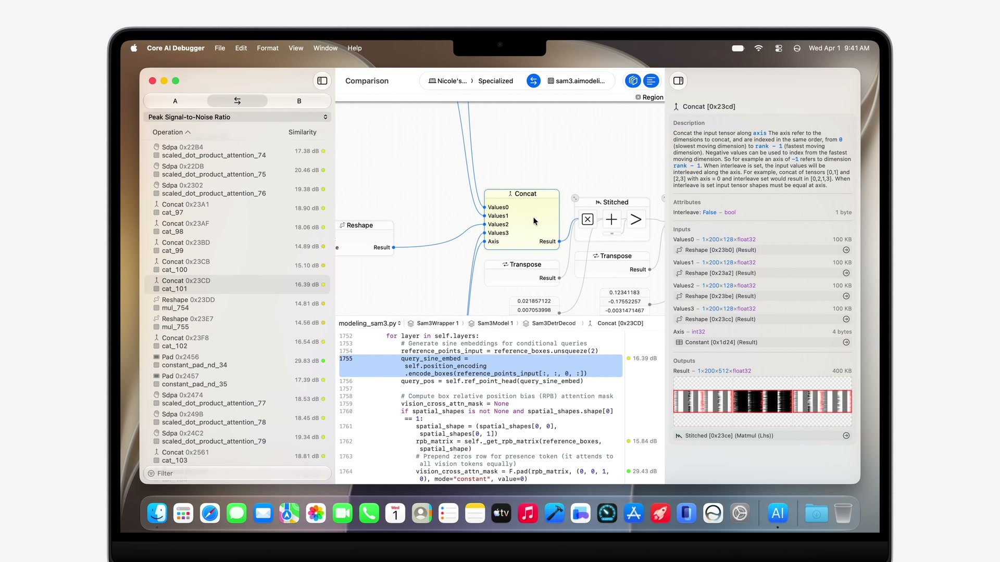

* **妥協のないパフォーマンス**: メモリセーフなSwift APIにより、Apple Siliconに最適化された速度を発揮します。
* **詳細な制御**: インタレスト管理、モデルの特化、カスタムGPUカーネル記述まで対応する広範なチューニング機能を提供。
* **Pythonエコシステムとの統合**: PyTorchモデルをCore AIランタイム向けに変換・最適化するPythonベースのツールを提供。
* **Core AI Debugger & Instruments**: 事前コンパイル、元のPythonソースコードのテンソル値までトレース可能なビジュアルデバッガを提供。
* **高いスケーラビリティ**: iPhoneでのリアルタイムカメラ解析（ビジョンモデル）から、Mac上での数十億パラメータLLMによる複雑なワークフロー実行まで対応。

### MLXのアップデート
Appleシリコンに最適化されたオープンソースのアレイフレームワーク **MLX** は、新たに **Metal 4** および **GPU Neural Accelerator** をサポート。Thunderbolt経由 of RDMAにより、複数台のMacを連結させた大規模な分散トレーニングへ拡張可能になりました。

---

## 3. App Intents & Siri

App Intentsフレームワークを使用することで、アプリのコンテンツとアクションを記述し、Apple Intelligence（Siri）と深く統合できます。

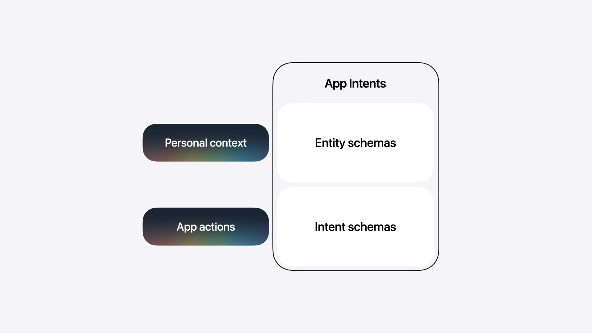

### システムスキーマ（System Schemas）
Siriがアプリのコンテキストを正しく推論するための標準構造として「スキーマ」が用意されています。

* **Entity Schema**: アプリが扱うコンテンツや概念（例: `Message`、`Contact`）を記述。
* **Intent Schema**: アプリが実行できるアクション（例: `sendMessage`）を記述。

システム定義のスキーマを使用するため、将来的にSiriの言語モデルのアップデートや、新しい言語・地域の方言サポートが追加された場合でも、デベロッパ側のコードを変更することなくそのまま機能します。

#### Spotlightインデックスの同期
アプリのコンテンツをSpotlightのセマンティックインデックスに提供することで、ユーザーがアプリの情報を素早く発見できるようになり、Siriによるパーソナルコンテキストの理解を助けます。

```swift
actor ModelManager {
    func indexEntities() throws {
        let contactEntities = try fetchRecentContacts(limit: nil).map(\.entity)
        let conversationEntities = try fetchRecentConversations(limit: nil).map(\.entity)
        let messageEntities = try fetchRecentMessages(limit: nil).map(\.entity)
        
        Task.detached {
            do {
                try await CSSearchableIndex.default().indexAppEntities(contactEntities)
                try await CSSearchableIndex.default().indexAppEntities(conversationEntities)
                try await CSSearchableIndex.default().indexAppEntities(messageEntities)
            } catch {
                print("Failed to index entities in Spotlight: \(error)")
            }
        }
    }
}
```

#### Intent Schemaの実装
アクションを記述する場合は `@AppIntent` マクロを使用します。以下はメッセージ送信をSiriに開放する例です。

```swift
struct SendMessageIntent: AppIntent {
    @Parameter var destination: MessageDestination
    @Parameter var subject: AttributedString?
    @Parameter var content: AttributedString?
    @Parameter(supportedContentTypes: [.image]) var attachments: [IntentFile]
    @Parameter(supportedContentTypes: [.audio]) var audioMessage: IntentFile?
    @Parameter var locations: [PlaceDescriptor]
    @Parameter var links: [URL]
    @Parameter var scheduledDate: Date?
    
    static let title = LocalizedStringResource("Send Message")
    
    @Dependency var model: ModelManager
    
    func perform() async throws -> some ReturnsValue<[MessageEntity]> {
        let recipientIDs = destination.persons.map(\.id)
        let messageText = content.flatMap { String($0.characters) } ?? ""
        let messageIDs = try await model.sendMessage(
            toRecipientIDs: recipientIDs,
            conversationID: nil,
            messageText: messageText,
            attachments: attachments
        )
        let messages = try await model.messageEntities(for: messageIDs)
        return .result(value: messages)
    }
}
```

### View Annotations API (オンスクリーン認識)
画面上の要素とApp Entityを関連付けることで、ユーザーが画面内の情報（「この写真」「2つ目のメッセージ」など）を曖昧に指し示しながらSiriに指示を送ることができるようになります。

```swift
ForEach(messages) { message in
    MessageRow(message: message, modelManager: modelManager)
        .appEntityIdentifier(EntityIdentifier(for: MessageEntity.self, identifier: message.id))
}
```

---

## 4. プラットフォームデザインの洗練

昨年導入された「Liquid Glass」デザイン言語がさらに洗練され、一貫性とパーソナライズ性が高められています。

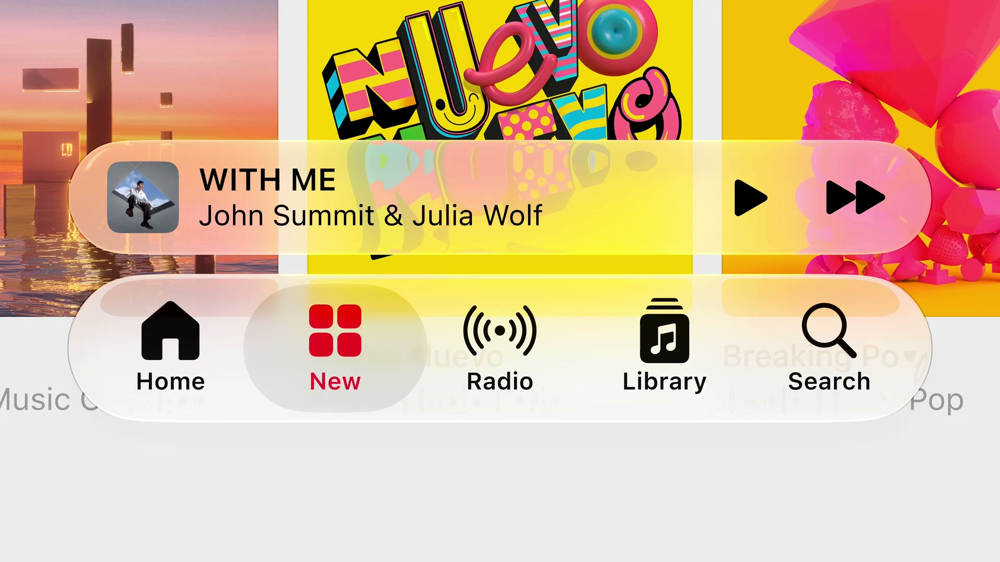

### Liquid Glassの改良
* **視認性の向上**: 奥行きや境界をより明確にするため、エッジの陰影を暗めに、鏡面ハイライトをより明るく強調する調整が加えられました。
* **不透明度調整スライダー**: システム設定にスライダーが追加され、ユーザーは「ウルトラクリア」から「完全な不透明」まで好みの透明度を選べるようになります。既存のLiquid Glass対応アプリは再ビルド不要で自動適用されます。
* **アクセシビリティ連携**: 「透明度を下げる」「コントラストを上げる」設定に自動追従するほか、macOS 27ではウィンドウの境界を示す「枠線を表示（Show borders）」環境値のサポートが追加されました。

### サイドバー & ツールバーの刷新
* **エッジ・トゥ・エッジ・サイドバー**: MacおよびiPadのサイドバーがエッジまで拡張され、構造が一層明確になりました。
* **アクセントカラーの復活**: サイドバー内のアイコンにアプリ独自のアクセントカラーを適用できるようになり、キーウィンドウの識別性も高められました。
* **macOSの角丸（Corner Radii）**: macOS上の全ウィンドウの角丸に一律の急角度なカーブが適用され、システム全体の統一感が向上。
* **スクロールエッジ効果**: スクロール中にコンテンツがツールバーの下に入り込む際、ツールバーが動的に不透明化してテキストのコントラストと可読性を保ちます。標準のツールバーに自動適用されるほか、`safeAreaBar(_:)` や `scrollEdgeEffectStyle(_:)` APIでカスタマイズも可能です。
* **メニュー内アクションアイコンの制御**: iPadOSおよびmacOSでメニュー表示時の重要アクションのアイコンのデフォルト表示状態を設定できる `labelStyle(titleAndIcon)` などのAPIが導入されました。

### アイコンエフェクト
* **Icon Composer**: Liquid Glassの多層レイヤー構造を持つアプリアイコンをデザインできるようになりました。屈折やガラス特有の反射効果を調整するための新しいアノテーション（注釈）機能や、実機での見た目を確認できるインタラクティブプレビューを搭載。

---

## 5. アプリのサイズ変更と適応性 (iPhone Mirroring & iPadOS)

iOSアプリがiPadOS上でサイズ変更可能な状態で表示される機会や、macOS上の「iPhoneミラーリング」を通じて実行される機会が増えたことに伴い、多様なアスペクト比・画面サイズに対応するための適応機能が強化されました。

* **自動有効化**: 最新のSDKでリビルドするだけで、iOSアプリの動的なリサイズ機能が自動的に有効になります。
* **Auto LayoutとTrait Collectionの重視**: 従来のサイズクラス（Regular / Compact）に加え、シミュレータやXcodeプレビューで様々なサイズのアスペクト比を動的に変更して確認できるテスト機能が追加されました。
* **コーディングエージェントの診断支援**: XcodeのAIエージェント向けに、サイズ変更時のレイアウト破壊や表示崩れを検出・自動修正するための専用スキルが追加されています。

---

## 6. SwiftUI の大幅な進化

### SwiftUIの採用拡大
NotionのSwiftUI移行や、オープンソースのGodotエンジンを用いたMac/iPadゲーム「The Goat」の開発、Apple内部における新しいSiriアプリやLogic Pro（Creator Studio）でのSwiftUIの活用など、パフォーマンスとクロスプラットフォームでのUI一貫性を理由とするSwiftUIの導入事例が紹介されています。

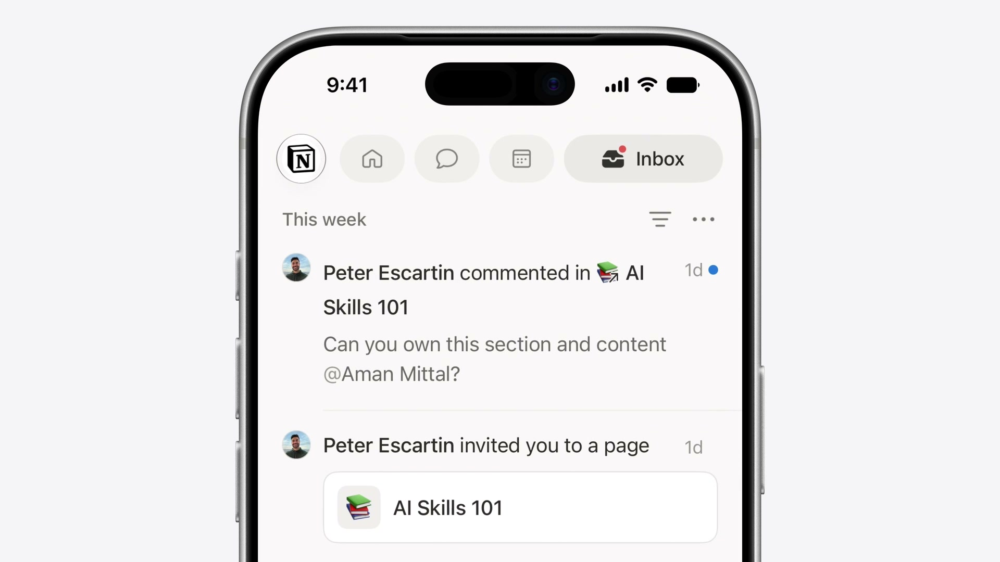

### 新たなインタラクション
* **ドラッグによる並べ替え**: リストやグリッド、スタックなどあらゆるコンテナに対し、簡単なコードで並べ替え機能を追加できます。

```swift
LazyVStack {
    ForEach(cranes) { crane in
        CraneRow(crane)
            .reorderable()
    }
}
.reorderContainer(for: Crane.self) { difference in
    difference.apply(to: &cranes)
}
```

* **スワイプアクションの拡張**: リスト以外の任意のスクロール可能なコンテナに対し、スワイプ操作によるクイックアクションを追加できます。

```swift
ScrollView {
    LazyVStack(spacing: 16) {
        ForEach(model.cranes) { crane in
            CraneRow(crane)
                .swipeActions(edge: .trailing) {
                    Button(role: .destructive) { ... }
                    Button { ... }
                }
        }
    }
    .swipeActionsContainer()
}
```

* **テキスト選択の柔軟性**: iOSにおける `textSelection(.enabled)` がTextField/TextEditorと同様の正確な部分選択をサポート。macOSではカスタムテキストレンダリングや縦書き（Vertical Text）のサポートが追加されました。

### パフォーマンス向上（スピード）
* **共通コントロール基盤**: SwiftUI、AppKit、UIKitのアーキテクチャ統合が進み、多数の標準コントロールが共通の基盤コードを共有するようになりました。これにより、macOSのメニューピッカーで大量のアイテムを処理する際の描画パフォーマンスが飛躍的に向上しました。
* **不要レイアウト計算の削減**: ネストされたスタックレイアウトにおいて、子ビューの冗長な複数回計測処理を省略。レイアウトのサイズ計算に要する時間が従来の半分（1/2）になりました。
* **Lazy State初期化**: ビューの再初期化のたびに一時インスタンスが作られていた `@State` オブジェクトが遅延処理（遅延評価）されるように変更。マクロへの移行と合わせて不要なメモリ確保と処理が自動的に削減されます。
* **AsyncImageの自動キャッシュ**: 標準のHTTPキャッシュを使用して取得済み画像をキャッシュし、同一の画像URLに対する不要な多重ダウンロードを防ぐようになりました。

### 新機能
* **ツールバー優先度制御**: 画面幅が狭まった際の挙動を制御する `visibilityPriority(.high)` が追加。重要度の低いアイテムを自動的に「オーバーフローメニュー」へ退避させるメニューコンテナや、どのようなレイアウト状態でもアイテムを必ず右端に固定する `topBarPinnedTrailing` プレースメントが提供されます。
* **ドキュメントインフラの刷新**: `DocumentGroup` 内のファイルURLに対するきめ細かな直接アクセスが追加され、ファイルの必要な部分だけを読み込み、変更された箇所だけを差分書き込みする（PagesやXcodeと同等の）高効率なI/Oカスタマイズが可能になりました。
* **Spatial Preview**: macOSアプリの3Dオブジェクトや空間モデルをリアルタイムでApple Vision Proの空間にストリーミングし、空間上で直接プレビュー、編集、共有できるAPIが追加されました。

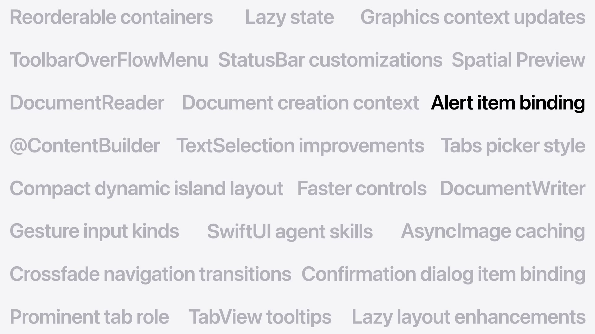

---

## 7. Swift 6.4

### Swiftのシステムレイヤーへの適用拡大
Swiftはモバイルアプリ開発にとどまらず、CやC++の安全な後継として、サーバー、ベアメタルファームウェア、デバイスドライバ、さらにはmacOS 27のカーネルコンポーネントに至るまで広く採用され始めています。

* **WebKitの移行**: SafariのコアレンダリングエンジンであるWebKit（巨大なC++コードベース）において、安全なC++相互運用性を活用し、コアコンポーネントのSwiftへの置き換えが段階的に進んでいます。
* **QUICトランスポートのSwift実装**: ネットワークスタックのQUIC実装をSwiftで書き直し、SwiftNIOとの統合を経てオープンソース公開される予定です。
* **TrueTypeフォントエンジン**: メモリ安全性の強化のため、歴史的なCの実装コードがSwiftで完全に再実装されました。

### 言語およびコンパイラのアップデート
* **available属性の簡略化**: プラットフォームごとの記述をまとめられる `anyAppleOS` 指定が導入されました。
* **deferブロック内のawait対応**: 非同期処理を含むクリーンアップコードを `defer` ブロック内で実行できるようになりました。
* **コンパイル警告の制御**: 特定のコードブロックにおいて警告を一時的に非表示にしたり、厳格に対処すべきファイルのみ警告をコンパイルエラーへ昇格させたりする細かな制御が可能になりました。
* **型チェッカーの診断向上**: 深いネストのSwiftUIビュー等で頻発していた「式の型チェックが妥当な時間内に実行できません」というコンパイラエラーが大幅に解消。正常にビルドが完了するか、エラーの原因となる具体的な行やタイポを正確に提示するようコンパイラ診断が強化されました。

### Intel Macの終焉とApple Siliconへの完全移行
macOS TahoeがIntel Macをサポートする最後のリリースとなり、Apple Silicon（単一アーキテクチャ）への移行が完了しました。これにより、Mac App StoreではApple Silicon専用バイナリの配布が可能となり、ダウンロードサイズの削減と検証コストの低減をもたらします。
また、旧デザインとの互換性サポートが廃止され、Xcode 27で再コンパイルされたアプリには最新のLiquid Glassデザインが自動的に適用されます。

---

## 8. Xcode 27 & 生産性ツール

今年のXcodeのアップデートは、**「インテリジェンス（AIエージェントの導入）」** と **「日々の開発エクスペリエンス（動作速度と信頼性の向上）」** の2つのテーマに基づいて設計されています。

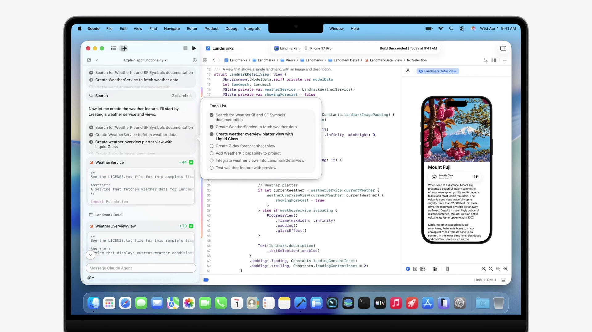

### インテリジェントな開発支援 (AI Agents)
* **Agent Client Protocol (ACP) のサポート**: Xcodeに適合する任意の外部AIエージェントを取り込むことができるプロトコルを追加。本日からXcode 26のアップデートとしてACPサポートとGoogle Geminiの連係が利用可能です。
* **Model Context Protocol (MCP) の活用**: エージェントがXcodeから直接ドキュメントを検索したり、プレビューを実行したり、FigmaやGitHubなどの外部サービスに接続するためのブリッジを提供します。
* **Xcode 27のエージェントシステム**: プロジェクトの文脈理解、診断ログの解析、プレビュー生成、バリアントのテスト、ローカライズなど、あらゆるフェーズにエージェントが組み込まれ並行して作業可能です。

### Xcode 27 エクスペリエンスの向上
* **30%の軽量化**: アプリケーションサイズを軽量化し、開発者用ドキュメントやエージェント等はバックグラウンドで必要に応じてダウンロードする仕組みに変更。
* **信頼性と速度の改善**: プロジェクトの読み込み速度向上、コンソールの大量ログ処理の円滑化、デバッグセッションでの式の評価速度向上、主要なクラッシュやスピン（応答なし）のバグ修正を実施。
* **iCloud同期設定**: 新しいMacをセットアップする際、前環境のXcode設定やGit configがiCloudを介して自動的にインポートされます。
* **ノーコンフィグ・セットアップ**: [New Project] からテンプレートを選ぶと、プロジェクト名やバンドルIDを入力することなくエディタが即座に起動し、プロトタイピングや新規APIの実験がすぐに始められます（後からの設定も可能）。
* **ツールバーカスタマイズ & テーマ**: ツールバーのドラッグ＆ドロップ編集に対応。「Emerald」「Neon Noir」「Coral Reef」などの新しいUIテーマが追加され、複数プロジェクトを異なるテーマで起動して一目で見分けることが可能です。

### Previews & Device Hub
* **バリアントのグリッドプレビュー**: 列挙型（`CaseIterable`）をプレビューに渡すことで、すべての状態（Enumパターン）を一覧表示するマルチプレビューグリッドがサポートされました。

```swift
enum CraftStage: CaseIterable {
    case planning
    case gathering
    case folding
    case finished
}

#Preview(arguments: CraftStage.allCases) { stage in
    WashiTapeStageView(stage: stage)
}
```

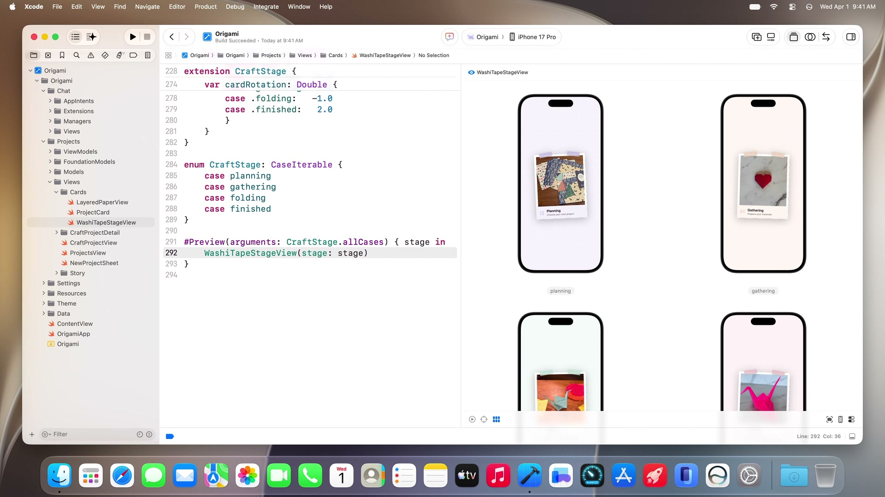

* **Device Hub**: シミュレータに代わる新しいデバイスコントロールセンターです。実機およびシミュレータを一元管理し、ダークモード切り替え、フォントサイズ調整、位置情報変更などのシステムテストをシミュレータの利便性と実機の忠実度を兼ね備えたウインドウから直接操作可能です。また、物理デバイス（実機）の画面をMacに映し出してキーボードとマウスで直接操作することもサポートされました。

---

## 9. AIエージェントを用いた機能構築と修正の実例

セッション内では、Xcode 27のAIエージェントを活用したOrigamiアプリの新機能実装デモが行われ、その一連のワークフローが提示されました。

### 機能設計からコード生成の流れ
1. **指示の入力**: プロジェクト詳細から書籍アイコンをタップして起動する「Choose-Your-Own-Adventure（ストーリー生成）」機能の実装指示をエージェントに提示。
2. **インタラクティブな設計整合**: エージェントがプロジェクトのビュー構造、Foundation Modelsのドキュメントを解析。プラン作成前に「選択肢の数はブランチごとにいくつか（2または3択）」などの質問を開発者に投げかけ、整合をとった上で設計図（SwiftData構造ダイアグラムを含む）を出力。
3. **ビューファースト開発**: `StorySetupSheet` → `StoryChoiceBar` → `StoryView` の順でビューコンポーネントを先行構築し、プレビューを生成。
4. **モデルと状態永続化の接続**: Foundation Modelsの `@Generable` と `@Guide` アノテーションを使用し、`LanguageModelSession` を介して生成データを `SwiftData`（`storySessionJSON`）にシームレスに永続化。

### エージェントによるテストとデバッグ
デバイス上での動作確認において、エージェントは自らシミュレータを操作してバグを検出し、その修正プロセスを自動実行します。

* **バグ検出と自動修正**: 
  * プロジェクト名が重複して文章に埋め込まれるバグや、選択肢が固定されるバグを検知し、`StoryViewModel` の生成プロンプトとツールバインドを修正。
* **ローカライズ自動化**:
  * 文字列カタログ（String Catalog）を解析し、アプリ内のすべての表示テキスト（90箇所）をフランス語へバッチ翻訳・適用。

#### クラッシュログの解析と修正
エージェントは、Xcodeに表示されたデバイス上の上位クラッシュ一覧からクラッシュ原因を特定し、コードの修正まで完結させます。

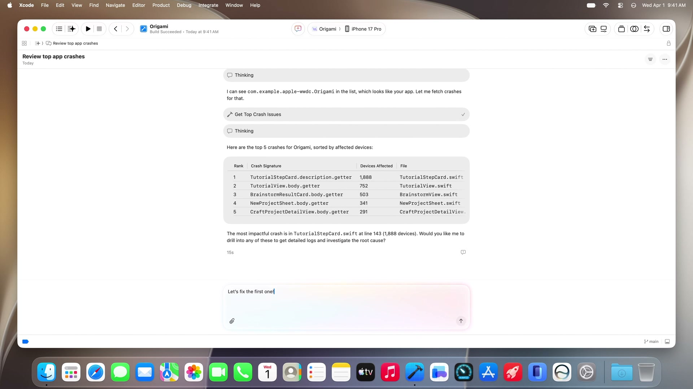

---

## 10. まとめ

WWDC26のPlatforms State of the Unionで示された内容は、AIモデルを単にAPIで叩く存在から、`Dynamic Profile` や `Core AI`、`App Intents` システムスキーマによってOSレベルで完全に統合された **「インテリジェント・プラットフォーム」** への飛躍です。

また、デベロッパが向き合う統合開発環境であるXcode自体も、`Agent Client Protocol` や `Device Hub`、`テーマカスタマイズ` によって、エージェントと人間がシームレスに並行作業できるパーソナルな仕事場へと刷新されています。
これらのアップデートは、最新のXcode 26およびXcode 27ベータ版を導入することで順次キャッチアップ可能です。
