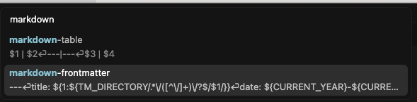
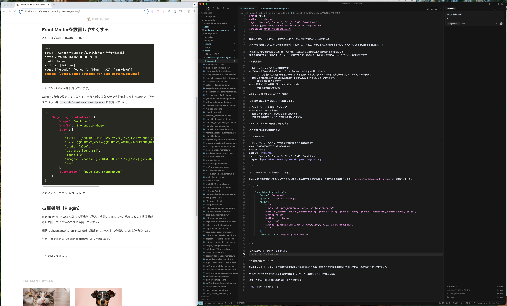
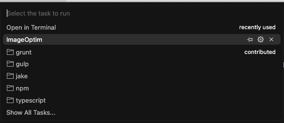
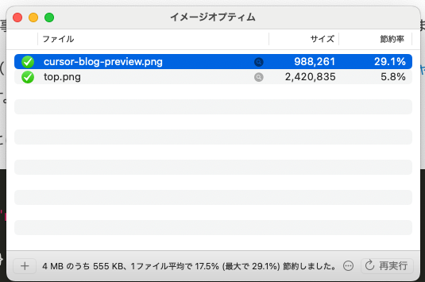
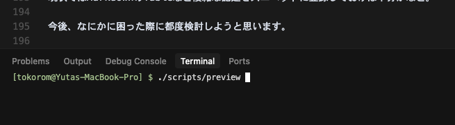

最近は本業のプログラミングを専らAIエディタのCursorで書くようになりました。

このブログ記事はずっとVimで書き続けていたのですが、こちらもVSCodeやAIの恩恵を受けられるのではないかと考え、環境の移行を開始しました。

本記事では、その移行でCursor（VSCode）にどのような設定を加えたかをまとめています。
まだこの設定で運用を開始したばかりの段階ですので、改善点やアドバイスをいただけると幸いです！

## 前提条件

- わたしはCursor/VSCode初級者です
- ブログは昔からの経緯でStatic Site GeneratorのHugoを使っています
    - これから新しく採択するなら別のものにすると思いますが、今Generatorに不満があるわけではないのでそのままで
- わたしはVimmerなのでVSCodeVimを使いますがこの記事ではそのことに触れません
    - 別途記事を書く予定です
- この記事ではAIの利用方法については触れません
    - 別途記事を書く予定です

## Cursor導入後にやったこと（要約）

この記事では以下の内容について紹介します。

- Front Matterを設置しやすくする
- そのほかスニペットを設定
- 画像をドラッグ＆ドロップして記事に挿入する
- タスクで画像のファイルサイズ縮小をまとめてやる
- 記事のリアルタイムプレビュー
- 拡張機能

## Front Matterを設置しやすくする

このブログ記事では具体的には、

```markdown
---
title: "Cursor/VSCodeでブログ記事を書くときの基本設定"
date: 2025-05-06T15:00:00+09:00
draft: false
authors: [tokorom]
tags: ["vscode", "cursor", "blog", "AI", "markdown"]
images: [/posts/basic-settings-for-blog-writing/top.png]
---
```

というFront Matterを設定しています。

Cursorに自動で設定してもらってもそれっぽくはなるのですが安定しなかったので以下のスニペットを `.vscode/markdown.code-snippets` に設定しました。

```json
{
	"Hugo Blog Markdown Front Matter": {
		"scope": "markdown",
		"prefix": "markdown-frontmatter",
		"body": [
			"---",
			"title: ${1:${TM_DIRECTORY/.*\\/([^\\/]+)\\/?$/$1/}}",
			"date: ${CURRENT_YEAR}-${CURRENT_MONTH}-${CURRENT_DATE}T${CURRENT_HOUR}:${CURRENT_MINUTE}:${CURRENT_SECOND}+09:00",
			"draft: false",
			"authors: [tokorom]",
			"tags: [$2]",
			"images: [/posts/${TM_DIRECTORY/.*\\/([^\\/]+)\\/?$/$1/}/top.png]",
			"canonical: https://spinners.work",
			"---",
		],
	}
}
```

これにより、コマンドパレット[^1]で *Insert Snippets* を呼び出せば簡単にFront Matterが設置できます。



## そのほかスニペットを設定

Front Matter以外にお好みでスニペットを追加するのが良さそうですが、Markdownはスニペットなしでも簡単に書けてしまうので、とりあえずMarkdownに表を追加するスニペットだけ追加しておきました。

```json
{
	"Markdown Table": {
		"scope": "markdown",
		"prefix": "markdown-table",
		"body": [
			"$1 | $2",
			"---|---",
			"$3 | $4",
		],
	}
}
```

## 画像をドラッグ＆ドロップして記事に挿入する

ブログ記事に画像を入れたいときにドラッグ＆ドロップで簡単にできると嬉しいです。

Vimで記事を書いていたときは [自作のVimプラグイン](https://www.tokoro.me/posts/vim-markdown-image-tool/) を作って実現していました。

Cursor（というかVSCode）ではなんとこれをプラグインなしで [オフィシャルに対応](https://code.visualstudio.com/updates/v1_79#_copy-external-media-files-into-workspace-on-drop-or-paste-for-markdown) してくれます。

なんと、Shiftキーを押しながら画像をドラッグ＆ドロップすればそのファイルと同じディレクトリに画像をコピーしてくれたうえで、

```markdown

```

とMarkdownも埋め込んでくれます。

このとき画像をサブディレクトリに設置したい場合には、 `.vscode/settings.json` に以下の設定を加えるだけです。

```json
{
    "markdown.copyFiles.destination": {
        "/**/*": "images/"
    }
}
```

これで `images` というサブディレクトリ以下に画像が設定されるようになります。

注意点として、記事ごとにディレクトリが分かれていないとこの設定が面倒になりそうです。

わたしはこれを機に [Page Bundles](https://gohugo.io/content-management/page-bundles/) 方式で記事ごとにディレクトリを分けてMarkdownファイルを設定するように変更しました。

## タスクで画像のファイルサイズ縮小をまとめてやる

画像の設置についてはこれでも十分なのですが、ついでに [ImageOptim](https://imageoptim.com/mac) などで画像のサイズを最適に縮小するのも簡単にできるようにしたいところです。

Vimで自作プラグインを使っていたときはそのプラグインでまかなっていたのですが、VSCodeのオフィシャルなドラッグ＆ドロップ機能ではそういったカスタマイズができそうになかったため、ブログを書き終えたらその記事の画像をまとめてImageOptimにかけるタスクを追加しました。

具体的には、 `.vscode/tasks.json` に、

```json
{
    "version": "2.0.0",
    "tasks": [
        {
            "label": "ImageOptim",
            "type": "shell",
            "command": "open -a ImageOptim ./",
            "options": {
                "cwd": "${fileDirname}"
            },
            "problemMatcher": []
        }
    ]
} 
```

を加えました。

ImageOptimに `open -a ImageOptim ./` というコマンドで現在のディレクトリの画像ファイルをまとめて渡せますので、それでブログ記事の画像ファイルをまとめてサイズ縮小できます。

このタスクもコマンドパレット[^1]で **Run Tasks** で呼び出すだけです。





## 記事のリアルタイムプレビュー

Markdownで記事を書きながらリアルタイムにプレビューする方法として、VSCodeが標準で提供している**Open Preview to the Side**なども利用可能です。

ただし、これだと実際のWebサイトでの表示と異なる可能性があるため、Static Site Generatorのプレビュー機能を使用することをお勧めします。

たとえばHugoなら `hugo server -D` というコマンドでプレビュー用のサーバをローカルで起動でき、 `http://localhost:1313/` をブラウザで開けばリアルタイムプレビューが可能です。

わたしはこのプレビューを簡単にするために `scripts/preview` というシェルコマンドを置いてあります。

```sh
#!/bin/sh

(sleep 1; open http://localhost:1313/)&

hugo server -D
```

そのため、 **Cmd + J** でCursor内でTerminalを呼び出し、そこで `./scripts/preview` スクリプトを実行すればブラウザでのリアルタイムプレビューができます。



わたしはこれで起動したブラウザのウィンドウをCursorのウィンドウの横においてプレビューをしています。


## 拡張機能（プラグイン）

Markdown All in Oneなどの拡張機能の導入も検討しましたが、現状では拡張機能なしでも十分に執筆が可能なため、使用していません。

今後、必要に応じて拡張機能の導入を検討していく予定です。

## 今後の展望

もともとAIの支援を得るためにCursorを導入しましたのでそのあたりの話や、VSCodeVimの話を別途記事にする予定です。

[^1]: Ctrl + Shift + p
