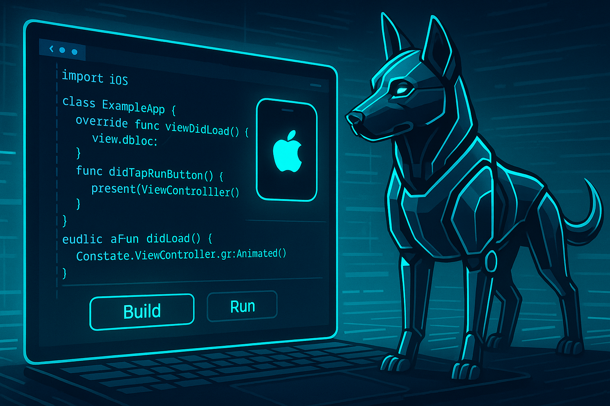

## 前提条件

### 必要なツール

### 環境設定

## CursorでのBuild&Run設定

### タスクの作成

### キーボードショートカットの設定

### シミュレータの起動設定

## 実行方法

### コマンドラインでの実行

### エディタからの実行

### 自動実行の設定

## トラブルシューティング

### よくある問題と解決方法

### パフォーマンスの最適化

### デバッグの設定

## ベストプラクティス

### 開発ワークフローの最適化

### チーム開発での活用

### CI/CDでの活用

## まとめ

## 参考リンク 