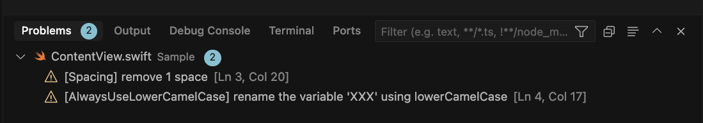

先日よりCursorでiOSアプリ開発をするようになり、これまでVimでやっていたことを順々にCursorに移植しています。

その中の1つが [`swift-format`](https://github.com/swiftlang/swift-format) です。
わたしは現在編集中のファイルのみ`swift-format`でチェックするのが好みです。

- プロジェクト全体を`swift-format`にかけるのはビルドのタイミング
- ファイルを保存したタイミングでそのファイルだけを`swift-format`でチェック

という区分けをしています。

実際にCursorでswift-formatを利用している様子がこちらです。Problemsでの一覧表示や自動整形にも対応しています。

<iframe width="560" height="315"
    src="https://www.youtube.com/embed/ZsqB8RmT7Gs?autoplay=1&loop=1&playlist=ZsqB8RmT7Gs"
    title="YouTube video player" frameborder="0"
    allow="autoplay; encrypted-media" allowfullscreen>
</iframe>

## swift-formatの使い方

Xcodeに内蔵された`swift-format`で特定のファイルをチェックするコマンドは以下です。

```shell
xcrun swift-format lint Sample/Sample.swift 
```

## Cursor/VSCodeのタスク

これをCursor/VSCodeのタスクに設定したのが以下です。

```json
{
    "label": "Lint Current File",
    "type": "shell",
    "command": "zsh",
    "args": [
        "-c",
        "if [ \"${fileExtname}\" = \".swift\" ]; then xcrun swift-format lint \"${file}\"; fi"
    ],
    "problemMatcher": [
        {
            "owner": "swift-format",
            "fileLocation": ["absolute"],
            "pattern": {
                "regexp": "^(.*):(\\d+):(\\d+):\\s+(error|warning):\\s+(.*)$",
                "file": 1,
                "line": 2,
                "column": 3,
                "severity": 4,
                "message": 5
            }
        }
    ],
    "presentation": {
        "reveal": "silent",
        "revealProblems": "onProblem"
    }
}
```

基本的には `xcrun swift-format lint \"${file}\"` というコマンドを実行するだけです。

以下、設定についての説明です。

- `problemMatcher`
    - この設定にマッチしたerrorやwarningをProblemsと認識され、Problemsパネルに一覧表示されたり、VSCodeの仕組みを利用できます
- `presentation`
    - `"reveal": "silent"`は問題が発生しなければターミナルパネル（実行結果）を表示しない設定です
    - `"revealProblems": "onProblem"`は問題が発生したらProblemsパネルを自動で開く設定です

## ファイル保存で自動実行

調べた限りですと、Cursor/VSCodeの公式な設定で「ファイル保存時に特定のタスクを実行する」ということはできないようです。
これをどうにかする方法として、

- [`Run On Save`](https://marketplace.visualstudio.com/items?itemName=emeraldwalk.RunOnSave) というプラグインを使う
- `editor.codeActionsOnSave` の設定で対応する

などもありそうでしたが、今回は、より簡易な方法としてファイル保存のキーボードショートカットで「ファイル保存」「swift-format lint」を実行することにしました。
わたしはVSCodeVimを使っているので`settings.json`に以下を加えました。

```json
"vim.normalModeKeyBindingsNonRecursive": [
    {
        "before": ["<leader>", "w"],
        "commands": [
            {
                "command": "workbench.action.files.save"
            },
            {
                "command": "workbench.action.tasks.runTask",
                "args": "Lint Current File"
            }
        ]
    }
]
```

わたしはキーボードを **Space, w** と打つとファイルを保存するようにしているので、これをしたときに同時に先ほど追加した **Lint Current File** というタスクを実行し、現在編集中のファイルだけ`swift-format lint`されるようになりました。

## Problemsパネルでの表示

この設定をしてファイル保存し、実際に問題となるコードがある場合、CursorのProblemsパネルに以下のように表示されます。



もちろん、このパネルから問題を選んでそのコード行にジャンプすることもできますし、これらの問題を各ファイルでインライン表示することも可能です。


## 自動整形

`swift-format`は以下のコマンドで自動整形もできますので、もちろんこれをCursorで実行することも可能です。

```shell
xcrun swift-format format --in-place Sample/Sample.swift
```

これを実行するタスクがこちらです。

```json
{
    "label": "Format Current File",
    "type": "shell",
    "command": "zsh",
    "args": [
        "-c",
        "if [ \"${fileExtname}\" = \".swift\" ]; then xcrun swift-format format --in-place \"${file}\"; fi"
    ],
    "presentation": {
        "reveal": "silent"
    },
    "problemMatcher": []
}
```

あとは、これを *Run Task* で実行するなり、お好みのキーボードショートカットで呼び出すようにするだけです。

## まとめ

- Cursor/VSCodeから`swift-format`を使うのは簡単です
- VSCodeのProblemsの仕組みに乗せるのも簡単です
- swift-formatの単体実行はビルドと違って一瞬で終わるため、問題を早期発見するのに役立ちます

Cursorで快適にSwiftを書くためにぜひご活用ください。

※ファイル保存のタイミングでswift-formatを実行する部分ですが、VSCodeオフィシャルな設定項目で簡単に実現する方法があれば、アドバイスをいただけると幸いです！
