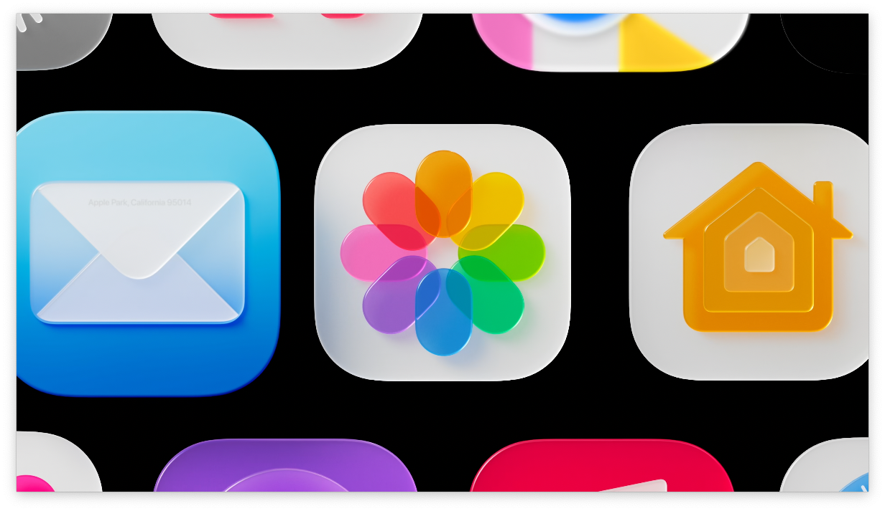
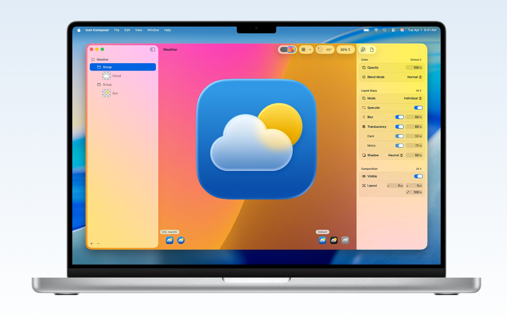
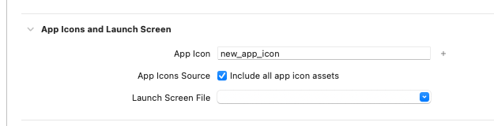

## 新しいアプリアイコン

WWDC25で新しいアプリアイコンの形式が発表されましたね。

iOS/iPadOS 26以降では、これまでvisionOSやtvOSがサポートしていたような複数レイヤーのアイコンをサポートするようになりました。

## Icon Composer

新しいアプリアイコンの詳細についてここでは書きませんが、新しい形式のアプリアイコンを作るための[Icon Composer](https://developer.apple.com/icon-composer/)という専用ツールもリリースされました。

## アプリアイコンのファイル

これまではiOS/visionOS/tvOS用にそれぞれ別のアイコン画像をXcode上で設定していました。
しかし、新しいアプリアイコンは`.icon`という拡張子の１つのファイルにパッケージングされ、その１つの`.icon`ファイルを適用すれば、全てのプラットフォームのアプリアイコンが含められるようになりました。

## Xcodeプロジェクトへの取り込み方法

ということで、デザイナーさんがIcon Composerで作ってくれた新しいアプリアイコンを適用しよう！と思ったのですが、WWDC25のセッションビデオを探してもなかなかその情報が見つかりません。

探してみたところ、[こちらのドキュメント](https://developer.apple.com/documentation/xcode/creating-your-app-icon-using-icon-composer)の最後のほうに明記されていました！

> Add your Icon Composer file to an Xcode project

> If you create your Icon Composer file outside of Xcode, you can add it to your Xcode project anytime to view your icon in Simulator and on real devices.
> Just drag the Icon Composer file from Finder to the project navigator, and Xcode provides feedback on where to drop it in a target folder. Alternatively, choose Add Files from the Add button at the bottom of the project navigator and select your Icon Composer file in the dialog that appears.
> In the project editor, select the target and the General tab. Under App Icons and Launch Screen, ensure that the name in the App Icon text field matches the name of the Icon Composer file without the extension. You can have multiple Icon Composer files in your project but only one that matches the name in the App Icon text field.

とても簡単です。

- Xcodeプロジェクトに`.icon`ファイルを追加する
- `General`タブの`App Icon`に`.icon`ファイルのファイル名（拡張子を省く）を書く

これだけで全プラットフォームのアプリアイコンを設定可能です。
これまでよりずいぶん簡単になりましたね（ただしデザイナーさんは大変になりますね）。

なお、`include all app icon assets`は理由がなければチェックをつけておくほうが良さそうです。[^1]

[^1]: 正直このオプションについては詳しくわかっていませんが https://developer.apple.com/documentation/xcode/configuring-your-app-icon に説明がありました

## まとめ

新しいアプリアイコンを設定するには`.icon`ファイルをXcodeにドラッグ＆ドロップしてApp Iconにファイル名を書くだけ！