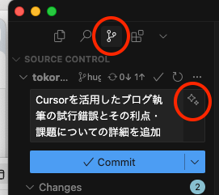
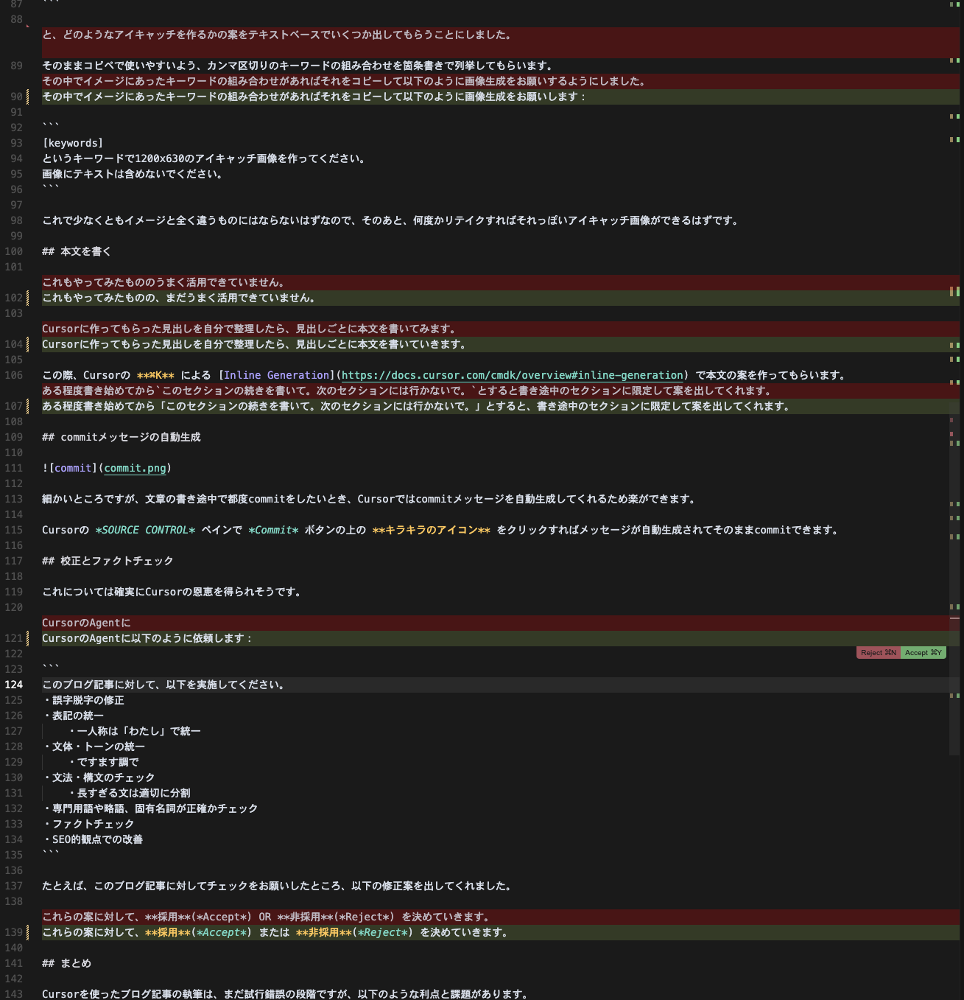

## はじめに

- まだAIによる執筆支援はうまく活用できていません（アドバイス求む！）
- Cursor/VSCode自体の設定については別途[こちら](/posts/basic-settings-for-blog-writing/)に書きました

## 記事のファイル作成と見出し案

まず記事を書くにあたってタイトルだけ決めて、CursorのAgentに以下のように依頼しました：

```
[title]
というタイトルでブログ記事のファイルを作ってください。
記事のファイル名は index.md で、content/posts ディレクトリに記事のタイトルを簡易な英語にした新しいディレクトリを作り、その直下に設置してください。
Front Matterのtitleには指定したタイトルを、tagsには記事内容に適したTagを幾つか設定してください。
記事の本文を書く必要はありませんので、この記事を書くための見出しの案だけ作ってください。見出しはMarkdown形式で連番を付与せずにSEOも考慮して構成してください。
```

これにより、適切なディレクトリを作成し、`index.md`を設置し、そこに見出しの案を書いてもらうことができます。

はじめは文章の案も作ってもらったのですが、イメージ通りの文面になかなかならないため、見出しだけを作ってもらうことにしました。

たとえば、このブログ記事のタイトルに対してCursorが作ってくれた見出しの案が以下です：

```md
## CursorのAI機能とは

## ブログ記事執筆での活用方法

### 文章の推敲と改善

### コードブロックの生成と最適化

### 画像の最適化と管理

### SEO対策の提案

## 実践的な使い方のコツ

### プロンプトの工夫

### 段階的な改善

### コードと文章のバランス

## 注意点と制限事項

## まとめ

## 今後の展望 
```

けっきょくこのまま使うわけではないですが、ゼロから書き始めるよりは良いかなということで。。。
このあたりはAIへの指示をもっときちんとすれば精度が良くなるのかも？

## アイキャッチ画像の生成と保存

結果としてこれはCursor単体ではできていません。

Cursorに「この記事のアイキャッチ画像を生成してtop.pngという名前で保存してください。」とお願いしても、

> 申し訳ありませんが、現在のツールセットには画像を生成する機能が含まれていません。

とつれない反応。

MCPなどを使いこなせば実現できそうですが、いったんあきらめて、外部でChatGPTに作ってもらった画像をドラッグ＆ドロップすることにしました。

### ChatGPTへのお願いのしかた

いきなりアイキャッチ画像の生成をお願いすると、長い時間をかけてイメージと違うものが生成されて無駄になることが多かったため、まずは以下のように依頼します：

```
[title]
というタイトルのブログ記事のアイキャッチ画像を作りたいのですが、まずは画像を生成せずにテキストベースで、どのようなキーワードで作成すべきかの案をいくつか出してください。
そのままコピペできるようにカンマ区切りのおすすめのキーワードの組み合わせを日本語で箇条書きで列挙してください。
案の中のいくつかには、犬というキーワードも含めてください。
```

これで、そのままコピペで使いやすいよう、カンマ区切りのキーワードの組み合わせを箇条書きで列挙してもらいます。

その中でイメージにあったキーワードの組み合わせがあればそれをコピーして以下のように画像生成をお願いします：

```
[keywords]
というキーワードで1200x630のアイキャッチ画像を作ってください。
画像にテキストは含めないでください。
```

これで少なくともイメージと全く違うものにはならないはずなので、そのあと、何度かリテイクすればそれっぽいアイキャッチ画像ができるはずです。

## 本文を書く

これもやってみたものの、まだうまく活用できていません。

Cursorに作ってもらった見出しを自分で整理したら、見出しごとに本文を書いていきます。

この際、Cursorの **⌘K** による [Inline Generation](https://docs.cursor.com/cmdk/overview#inline-generation) で本文の案を作ってもらうこともできます。
ある程度書き始めてから `このセクションの続きを書いて。次のセクションには行かないで。` とすると、書き途中のセクションに限定して案を出してくれます。

## commitメッセージの自動生成



細かいところですが、文章の書き途中で都度commitをしたいとき、Cursorではcommitメッセージを自動生成してくれるため楽ができます。

Cursorの *SOURCE CONTROL* ペインで *Commit* ボタンの上の **キラキラのアイコン** をクリックすればメッセージが自動生成されてそのままcommitできます。

## 校正とファクトチェック

これについては確実にCursorの恩恵を得られそうです。

CursorのAgentに以下のように依頼します：

```
このブログ記事に対して、以下を実施してください。
・誤字脱字の修正
・表記の統一
	・一人称は「わたし」で統一
・文体・トーンの統一
	・ですます調で
・文法・構文のチェック
	・長すぎる文は適切に分割
・専門用語や略語、固有名詞が正確かチェック
・ファクトチェック　
・SEO的観点での改善
```

たとえば、このブログ記事に対してチェックをお願いしたところ、以下の修正案を出してくれました。



これらの案に対して、**採用**(*Accept*) または **非採用**(*Reject*) を決めていきます。

## まとめ

Cursorを使ったブログ記事の執筆は、まだ試行錯誤の段階ですが、以下のような利点と課題があります。
課題についてはわたしが初級者すぎるからで、使いこなしている人たちはおそらくもっとAIの恩恵を上手に受けていると思います。

### 利点

- 記事を書くとっかかりになる
- 校正やファクトチェックをしてもらえて記事の品質が上がる
- commitメッセージが楽
- **記事を書くのに飽きてきた面があったが、また楽しくなってきた！**

### 課題

- 現状、文章を書くこと自体への恩恵はいまいち受けられていない
- 画像や図などの生成＆埋め込みもできそうだが使いこなせていない
