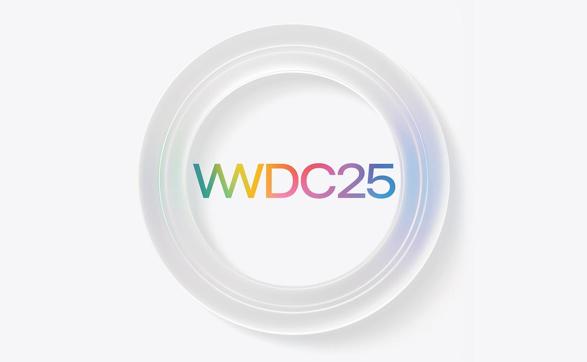
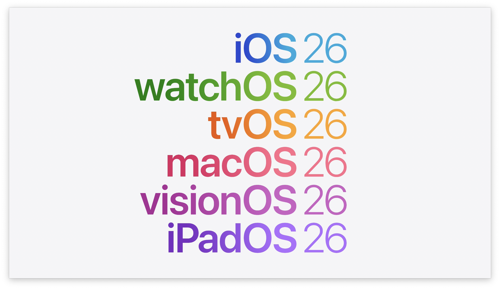

WWDC25で開発者向けアップデートをまとめたセッション「Platforms State of the Union」を視聴して、概要や気になった内容などまとめてみます。

## バージョン番号の統一

2025年秋以降にリリース予定の全てのOSは、**バージョン番号が一新**され、すべて**26**に統一されました。例えばiOS 19やmacOS 16と呼ばれるはずだった次期メジャーアップデートは、それぞれ**iOS 26**・**macOS 26** になります。

これによりプラットフォーム間でバージョン番号が揃い、Apple曰く「ユーザーにも開発者にも分かりやすい一貫性」がもたらされます。

なおOSだけでなくXcodeも**Xcode 26**になります。

## 新しいUIデザイン Liquid Glass

さらに、**12年ぶり**となる大規模なUIデザインの刷新が全プラットフォームで行われます。

新しいUIデザインは **Liquid Glass（リキッドグラス）** と呼ばれ、ガラスの光学的な性質と液体のなめらかさを融合させたUIです。

ボタンやスイッチ、スライダー、テキスト、メディアコントロールなど日常的に触れる要素から、タブバーやサイドバーなどの大きなUIに至るまで、このLiquid Glassで再設計されています。結果として、各OSは**親しみやすさはそのままに、より表現力豊かで楽しい**ビジュアルへと進化しており、ユーザーのコンテンツに一層フォーカスした体験を提供します。

Liquid Glassデザインへの対応にあたり、**SwiftUI**などの**ネイティブUIフレームワーク**が強化されています。デベロッパは特別な手間をかけずとも、SwiftUIを用いることで新デザインをアプリに簡単に取り入れられます。SwiftUIの標準コンポーネント（ボタン、トグル、リスト等）は自動的に新しいスタイルを適用して描画されるため、既存アプリでもSwiftUI部分はビジュアルアップデートの恩恵を受けるでしょう。UIKitについてもiOS 26上では標準UIコンポーネントの外観がLiquid Glass風にアップデートされるため、カスタムUIを extensively 作り込んでいない限り基本的な外観は刷新されます。**ベストプラクティス**として、可能な限り標準のUI要素（特にSwiftUI）を利用しつつ、独自の色やブラーエフェクトを適用している部分は、デザインガイドラインに合わせて調整・検証すると良いでしょう。新デザインでは**より丸みを帯びた角**や**半透明の質感**が特徴となっているため、そうした要素が崩れないかUI全体をチェックすることをおすすめします。

*Liquid Glassデザインと新しいIcon Composer。Liquid Glass素材による光沢や半透明効果を活かしたアイコン設計が可能になった。左はレイヤーごとにエフェクトを調整できるIcon Composerの画面例。右はLiquid Glassエフェクトが適用された新しいアイコンの例。*

また、新デザインに合わせて\*\*「Icon Composer」**という**新しいデザイン支援ツール**が提供されます。Icon ComposerはMac用のスタンドアローンアプリで、デベロッパやデザイナーがアプリアイコンを効率よく作成・最適化するためのものです。複数レイヤーのアイコンを読み込み、それぞれに対して**レンダリングモードの指定**や**ブラー・透過度の調整\*\*、**ハイライト（光沢）のシミュレーション**、様々な環境でのプレビュー（背景色や光の当たり方の違いを確認）など高度な機能が用意されています。これにより、Liquid Glassの質感にマッチした**一貫性のあるアイコン**を容易に設計できます。**実践上のポイント**として、Icon Composerで生成したアイコンアセットは各デバイス（iPhoneやMac等）での見え方を確認し、必要に応じて細部を調整しましょう。特にLiquid Glassでは光の反射具合がアイコンの印象に影響するため、Icon Composerのプレビュー機能で**ダークモード/ライトモード**や**様々な壁紙背景**でアイコンが埋もれないか確認するのがおすすめです。

## Apple Intelligenceと基盤モデルフレームワーク（オンデバイスAI）

今年のWWDCで最も注目すべき発表の1つが、Apple独自の大規模AIモデル（**Apple Intelligence基盤モデル**）へのデベロッパ向けアクセス解禁です。Appleは、iPhoneやMac上で動作する**オンデバイスAI**を強力に推進しており、その中心となる**基盤モデルフレームワーク**が新たに追加されました。このフレームワークを使うことで、**ネット接続不要・課金不要でデバイス上のAI推論を実行**し、ユーザーにインテリジェントな新体験を提供できるようになります。たとえば**大規模言語モデル (LLM)** を利用した文章生成や要約、質問応答機能などをアプリに組み込むことが可能です。それらの処理はすべて端末上で完結するため、**プライバシーが保護**され、サーバー費用なしで高度なAI機能を提供できるというメリットがあります。

基盤モデルフレームワークは**Swiftにネイティブ対応**しており、導入も非常に簡単です。**わずか3行のコード**でAppleのAIモデルを呼び出すことができ、生成結果のガイド（フォーマット指定）や、モデルから別の処理を呼び出す「ツール呼び出し」の仕組みなどもビルトインで提供されます。これにより、既存アプリに生成AIの機能を追加する敷居が大きく下がっています。例えば日記アプリ「Day One」を手がけるAutomattic社では、早速このフレームワークを組み込み、ユーザーのプライバシーを尊重しながら賢い提案を行う機能を実現しています。Day Oneではユーザーの入力内容に基づいて**プライバシー重視のインテリジェントなサジェスト**（次のトピック提案や文章のヒントなど）を行っており、クラウドを介さずオンデバイスで処理することで安心して利用できるようになっています。

デベロッパにとって、この基盤モデルフレームワークの登場は**アプリのユーザー体験を次の次元に引き上げるチャンス**です。**具体的な活用例**としては、以下のようなものが考えられます：

* **文章生成・要約**：メモアプリやチャットアプリで、ユーザーの入力内容を要約したり、続きを自動生成したりする機能を提供。
* **高度な検索・推薦**：ユーザーの嗜好や履歴に基づいてコンテンツをレコメンドする際に、基盤モデルで推論を行い、より文脈に沿った結果を提示。
* **音声アシスタント**：Siriのような体験をアプリ内で実装。ユーザーの質問に対して自然な言語で応答し、必要に応じてアプリ内の機能を実行（ツール呼び出し機能を活用）。

これらを実装する際も、データがデバイスから出て行かないため**ユーザープライバシーへの配慮**がしやすく、また通信遅延もないためリアルタイム性の高い応答が期待できます。もちろんモデルの品質や応答内容については、アプリの文脈に合わせたプロンプトエンジニアリングや評価が必要ですが、Apple提供の基盤モデルはシステムレベルで最適化・チューニングされているため、比較的少ない試行錯誤で高品質な結果を得られるでしょう。

**対応デバイスと言語**にも注意が必要です。Appleの基盤モデル（Apple Intelligence）は**M1チップ以降を搭載したデバイス**（iPhoneで言えばA系SoCでNeural Engine対応の近年モデル、MacならApple Silicon搭載機種）で利用可能です。対応言語も現時点で英語・日本語・フランス語など主要言語に限られていますが、年内にデンマーク語やオランダ語など順次拡大予定と発表されています。グローバル展開するアプリでは、対応する言語が増え次第、そのユーザーにもAI機能が行き渡るよう制御する必要があります。たとえば、モデルが日本語未対応の場合は従来の処理にフォールバックする等の実装が望ましいでしょう。

## Xcode 26の進化と新機能

デベロッパ向け統合開発環境である**Xcodeもバージョン26**へアップデートされ、多数の**生産性向上**につながる改良が加えられています。最大のトピックは、**生成系AI (LLM) の開発ワークフロー統合**でしょう。Xcode 26では**コーディング中に直接AIアシスタントを活用**でき、例えば**コードの自動生成**や**ユニットテストの作成**、Docコメントの下書き、UIデザインの反復やデバッグ時の不具合修正提案などを、AIにオフロードできます。具体的には、Xcodeエディタ内から選択範囲に対して「このコードの説明を書いて」とプロンプトを送ったり、「ここにテストケースを追加して」といった命令を与えると、**Xcodeが背後でLLMを利用して結果を提案**してくれます。

Xcode 26には**ChatGPT**がビルトインで統合されており、OpenAIのアカウント無しでも**すぐにChatGPTを使い始める**ことが可能です。OpenAIのAPIキーを自前で用意すれば、そちらを使ったより高回数のリクエストも行えますし、他社のLLMプロバイダ（例えばAnthropicのClaudeなど）のAPIキーを使うこともできます。さらにはApple Silicon搭載Mac上で**ローカルモデル**を実行して利用することも可能で、自社で学習させた独自モデルやオープンソースの小型モデルを組み込むこともできます。用途やプライバシーポリシーに応じて**最適なモデルを選択**できる柔軟性が特徴です。なお、ChatGPTをXcodeから利用する際はOpenAIの**利用規約やデータ使用ポリシー**が適用されます（Xcode上でも利用前に注意が表示されます）。社内コードベースに適用する際は、必要に応じてOpenAIアカウントを接続し、やりとりのログが外部サービスに送信されることについてチームで合意を取ると良いでしょう。

*Xcode 26の画面。コードエディタ横にLLMを活用した支援インターフェースが表示され、ChatGPTからコードの改善提案を受けている様子（UIは英語表示）。生成AIの組み込みにより、ドキュメンテーション作成やデバッグがシームレスに行える。*

Xcode 26でもう1つ目玉となるのが\*\*「コーディングツール (Coding Tools)」**と呼ばれる新機能です。コーディングツールはエディタのどこからでも呼び出せる**コンテキスト対応のユーティリティ**で、開発フロー中によく行う作業を支援してくれます。例えば、現在編集中のビューに対して即座に**プレビューを生成**したり、新しい**Playgroundを自動作成**して試験コードを実行したり、典型的な**バグ修正\*\*（未使用変数の削除や簡単なロジック修正など）を提案してくれたりします。これらはXcodeがコードの文脈を理解した上で**適切なアクション候補**として提示してくれるので、開発者は**考えるフローを中断せず**に必要な操作を実行できます。また、コーディングツール内でLLMへのプロンプトを投げることも可能で、\*\*「この関数の意味を要約」**や**「このクラスのテストを書いて」\*\*といった自由な指示にもインラインで応答してくれます。要するに、従来は自分でXcodeの別機能（例えばAssistant EditorやDocumentation検索、Playground作成等）を行き来していた作業を、一箇所で済ませられるようになる仕組みです。

さらに、Xcode自体の使い勝手にも改良が施されています。**ナビゲーションエクスペリエンスの再設計**により、ファイルやシンボルの検索・移動がより迅速かつ直感的になりました。また**ローカライゼーション管理**の強化では、「Localization Catalog」という仕組みが改善され、多言語対応アプリでの翻訳リソース管理が簡素化されています。これはXcode 25で導入された機能の改良版で、各言語の文字列を一元管理しつつ差分だけエクスポート・インポートできるようになっており、ローカライズ作業の効率が上がります。加えて、**Voice Control（音声操作）**のサポート強化も見逃せません。音声でSwiftコードを入力したり、Xcodeの各種UI操作（メニュー選択やエディタでの選択範囲移動等）を**全面的に音声で行える**よう改良されています。開発者自身のアクセシビリティ向上や、長時間コーディングによる疲労軽減にもつながるアップデートです。

**実践Tips**：Xcode 26の新機能を活かすには、まず**ChatGPT統合を有効**にしてみましょう。Xcodeをインストール後、Preferencesの新設された「AI & Assistant」パネルからChatGPTを有効化できます（ベータ版ではデフォルトで有効になっているはずです）。そこから試しにコード補完や説明生成を行い、プロジェクト内でどの程度使えるか評価してみると良いでしょう。また、チーム開発の場合はコーディングツールやAI提案によるコード変更がどのようにコードレビューに影響するか、運用ルールを決めておくと安心です。例えば「AIが生成したコードにはコメントで出所を明記する」「自動生成のテストコードもしっかりレビューする」等の指針を共有すると、品質と効率のバランスを保てます。

## App Intentsの拡張とSiri連携強化

Appleは昨年から**App Intents**というフレームワークを通じて、アプリの機能をSiriやSpotlight、ウィジェット等のシステム機能と統合しやすくしてきました。WWDC25ではこのApp Intentsに\*\*「ビジュアルインテリジェンス」\*\*への対応が加わり、新たなユーザー体験の扉が開かれています。

**ビジュアルインテリジェンス**とは、画像やカメラを通じた視覚的な文脈理解のことで、ユーザーが写真や実物を使って情報を検索・操作できる仕組みです。iOS純正の「ビジュアルルックアップ」（写真内の対象物を認識し調べる機能）を念頭に置くとわかりやすいでしょう。App Intentsの拡張により、**サードパーティーのアプリもこのビジュアル検索結果に自分のコンテンツを提供**できるようになります。例えば、ユーザーがiPhoneのカメラで撮影した商品画像から何かを検索した場合、結果にその商品を扱うECアプリ（例えばEtsy）の情報を直接表示し、ワンタップで該当アプリの画面へ遷移させる、といったことが可能になります。実際、**Etsy**はこのビジュアルインテリジェンス機能を活用し、「説明しづらいユニークなアイテム」でも写真を手がかりに素早く探せるよう、アプリ体験を強化したと述べています。ユーザーが写真から得たインスピレーションをそのまま購買行動につなげられるわけです。

デベロッパ視点で言えば、自分のアプリが取り扱うデータ（商品、場所、動物、料理...何でも）が**画像から検索され得るもの**であれば、App Intents経由でビジュアルインテリジェンスに対応する価値は大いにあります。実装としては、新しいApp インテントで「Visual Look Up」用のインテントタイプを定義し、画像入力に対する応答（マッチング結果）を返す処理を作成します。そして、そのIntentが返す結果に応じて**アプリへのディープリンク**を設定しておけば、ユーザーが結果をタップした際に該当商品ページなどに直接誘導できます。**ベストプラクティス**として、画像マッチングにはCore メーリングリストなどで自前モデルを組み込むことも考えられますが、Appleの提供するVisionフレームワークやUnified APIを活用してまずシンプルに実装してみるのがおすすめです。また、この機能をユーザーに認知してもらうため、アプリ内で「写真検索に対応」など明示的にアピールすると良いでしょう。うまく活用すれば**ユーザーの直感的な行動（写真を撮る）からアプリへ誘導**でき、新規ユーザー獲得や既存ユーザーのエンゲージメント向上につながるはずです。

## Swift 6.2: パフォーマンスと並行性のアップデート

プログラミング言語Swiftも着実な進化を遂げており、WWDC25で**Swift 6.2**の新機能が紹介されました。今回のアップデートでは、主に**パフォーマンス最適化**と**並行処理の利便性向上**、そして**他言語との相互運用性**が強化されています。

まず、Swift 6.2では**C++、Java、JavaScriptとの相互運用性**が改善されました。具体的には、これら他言語のライブラリをSwiftから直接呼び出す際のブリッジコードがより簡潔になり、データ型の変換も自動化が進んでいます。たとえばC++のクラスをSwiftから利用する場合、これまでは手書きでラッパを用意する必要があるケースもありましたが、6.2ではより多くのC++ STL型がネイティブにSwiftクラスへマッピングされ、シームレスに使えるようになっています。またJavaScriptに関しても、WebKitやJSCoreを介してオブジェクトを受け渡す処理が簡略化されており、Webとのやりとりを行うアプリで恩恵があるでしょう。

**WebAssembly (WASM) 対応**も見逃せないポイントです。オープンソースコミュニティとの協力により、SwiftコンパイラがWASMターゲットのビルドをサポートしました。これにより、Swiftで書いたロジックをそのままブラウザ上で動かす、といったことも可能になります。たとえば、Swift製のライブラリをWASMにコンパイルしてWebアプリに組み込むことで、フロントエンドWebでも高速な処理を実現したり、コードの共通化を図ったりできます。これはサーバサイドSwiftやマルチプラットフォーム展開にも影響する大きな一歩であり、将来的に**SwiftUI for Web**のような展開も期待されるところです（現時点ではあくまでローレベルなWASMターゲット対応ですが、技術的基盤が整った意義は大きいです）。

並行処理については、Swift 6で導入された**Strict Concurrency チェック**を基盤に、6.2で更なる洗練が加えられました。特に注目は、**「メインアクター by default」**の機能です。デベロッパはモジュール単位やファイル単位で、「この単位ではデフォルトでMainActor上で実行する」ことを指定できるようになりました。UIスレッドで動く前提のコード（例えばビューのロジックやViewModelなど）にいちいち`@MainActor`注釈を付けなくても、ファイルヘッダやビルド設定でまとめて指定できるイメージです。これにより**シングルスレッド前提のコード記述が簡潔**になり、不要な`DispatchQueue.main.async`の記述やMainActor周りのボイラープレートが減ります。逆に言えば、Strict Concurrencyのもとで漏れていたUI更新の非同期呼び出し忘れといった問題も、デフォルトMainActor指定を使えばコンパイル時に検知・強制できるようになります。**実践上の効果**として、UIKitやAppKitベースの従来コードをSwift Concurrencyに移行する際のハードルが下がり、またSwiftUI+Combine+並行処理といった現代的なコードでも、メインスレッド拘束部分を明示的にしやすくなるでしょう。

パフォーマンス面では、新しいコンパイラ最適化やランタイム改善により、一般的な処理速度やメモリ効率が向上しています。特にジェネリクスやプロトコルの厳格な特殊化がさらに進んだことで、テンプレートメタプログラミング的なコードでもオーバーヘッドが減っています。Appleは具体的な数値は示していませんが、いくつかのベンチマークではSwift 5系に比べて**数％〜十数％の性能向上**が見られるとのことです。高パフォーマンスが求められるアプリ（例えば画像処理や機械学習パイプライン）では、新コンパイラを試す価値があります。

**移行ガイド**：Swift 6.2はモジュールのABI安定性を保ちつつ進化しているため、Swift 6.xからのアップデートで大規模な破壊的変更は報告されていません。しかし、Strict Concurrencyチェックが有効なプロジェクトでは、新たに**デフォルトMainActor**を導入することで警告やエラーが減る一方、意図せずメインスレッド実行になっている箇所があれば逆にパフォーマンス上のボトルネックとなる可能性もあります。モジュール単位でこの設定を有効にする際は、そのモジュール内の処理が本当にUIスレッドでシリアル実行して問題ないか（重い処理を含んでいないか）確認しましょう。また、C++/Objective-Cとのインタフェース部分もコンパイラが強化された影響で挙動が変わる場合があります。特に古いObjective-C APIのnullability指定ゆれなどでワーニングが増えるケースが報告されていますので、Xcode 26に上げた際はビルドログをよく確認してください。

## 開発者ツールの新展開：Containerizationフレームワーク

Mac向けには、開発フローを支援する新たなフレームワークとして**Containerizationフレームワーク**が導入されました。これは名前の通り**コンテナ**技術を扱うためのAPIで、デベロッパは**Mac上で直接Linuxコンテナイメージの作成・ダウンロード・実行**を行えるようになります。Dockerなどに代表されるコンテナ技術は近年ソフトウェア開発で広く使われていますが、従来Mac上でのコンテナ実行はDocker Desktopなどサードパーティーツールに頼る必要がありました。Apple公式のContainerizationフレームワークにより、よりシームレスかつ高効率にコンテナを扱えます。

このフレームワークは**Appleシリコン向けに最適化**されたオープンソース基盤上に構築されており、コンテナ間の**高いセキュリティ隔離**を提供する点が特徴です。具体的には、各コンテナは仮想化フレームワークに近い仕組みで軽量に起動され、ホストMacとの間でリソースやネットワークのアクセスが明確に制限されます。デベロッパはAPI経由でコンテナを起動し、その中で特定のコマンドを実行したり、ファイルをコピーしたり、ログを取得したりできます。これにより、例えば**iOSアプリからクラウド上のコンテナサービスにデプロイ**するようなツールをMacアプリとして作ることも可能ですし、**開発中に必要なバックエンドサービスをコンテナで同時起動**してテストするといったワークフローも組み込みやすくなります。

開発者にとって嬉しいのは、こうしたコンテナ操作が**Xcodeやターミナルからスクリプトで制御できる**ようになる点です。CI環境でコンテナをビルドして成果物を取り出したり、特定のテストをコンテナ内のクリーンな環境で走らせる、という使い方が捗るでしょう。Appleは公式には言及していませんが、おそらくこのフレームワークの裏では**colimaやcontainerdのようなOSS**が動いている可能性があります。それゆえ、既存のDockerイメージを流用しつつApple独自最適化の恩恵を受けられると期待されます。

**ユースケース**としては、例えば以下のようなものが考えられます：

* iOS/Androidアプリ開発者が、ローカルMac上で**データベースや認証サーバー**のコンテナを立ち上げ、アプリと連携させて動作確認を行う。
* Macアプリ上で動作する**GUI付きの開発ツール**が、内部でコンテナを動かして様々な言語のビルド・実行環境を提供する（IDEのプラグインなどに応用できる）。
* セキュリティのために、ある処理（例えば非信頼コードの実行やファイル解析）を隔離環境で行いたい場合に、コンテナを使って**サンドボックス**を実現する。

Containerizationフレームワークは**Mac専用**機能であり、iOS/iPadOS上では直接利用できません。しかしMacは開発母艦としてほぼ全デベロッパが使用するプラットフォームでもあるため、この提供はAppleが**開発者体験を包括的に向上させようとしている**姿勢の表れと言えます。今後Xcodeビルドプロセスへの統合なども進む可能性がありますので、インフラ系のエンジニアやDevOps担当の方は注目しておきましょう。

## ゲーム開発アップデート（Metal 4・Apple Games・Game Center強化）

ゲーム開発者向けにも多数のアップデートが行われています（**ゲーム関連の詳細は簡略化してお伝えします**）。

* **Game Porting Toolkit 3**：昨年登場した、WindowsゲームをMacに移植評価するためのツールキットがさらに強化されました。最新版では**Metal Performance HUDのカスタマイズ**が可能になり、評価中のゲームのグラフィックス性能を詳細に可視化できます。描画フレーム毎の負荷やボトルネックをHUD上に表示し、パフォーマンスチューニングの指針を得られます。また、新機能として**WindowsマシンからリモートのMac上でビルド**ができる「Mac Remote Developer Tools for Windows」が提供され、Windows開発者が手元の環境から直接Mac用ビルドを走らせることができるようになりました。これにより、Mac実機を持たないスタジオでもMac移植の評価をスムーズに開始できます。

* **Metal 4**：AppleのグラフィックスAPIであるMetalもバージョン4となり、**Appleシリコンに特化**した拡張が行われました。大きなトピックの1つは、Metalシェーダー内で**ニューラルネットワークの推論**を直接実行できる機能です。これにより、ゲーム中のシェーダー計算でディープラーニングを活用し、光の表現やマテリアル計算、ジオメトリ生成などを高度化できます（例：AIを使ったダイナミックなライティング計算やプロシージャル地形生成）。さらに**MetalFXフレーム補完**（Frame Interpolation）機能が追加され、2フレームの間を埋める中間フレームを自動生成することでフレームレートを実質的に2倍に向上させられます。これはNVIDIAのDLSSフレーム生成に類似した技術で、動きのブレを低減しつつ滑らかな描画を可能にします。また**MetalFXデノイザ**も強化され、リアルタイムレイトレーシングのノイズ除去やパストレーシングへの適用が容易になりました。Metal 4のこれら新機能を活用することで、Appleプラットフォーム上でも**次世代級のグラフィックス表現**が可能になります。

* **Apple GamesアプリとGame Center**：iOS 26およびiPadOS 26、macOS 26には、新しく\*\*「Apple Games」**というアプリケーションが搭載されます。これは**ユーザー向けのゲームハブ**であり、自分がダウンロードした全ゲームタイトルやゲーム仲間のアクティビティを一箇所で閲覧・管理できるものです。興味深いのは、単なる受動的なライブラリに留まらず、デベロッパ向けにも**ゲーム再エンゲージメント**の機会を提供する点です。Apple Games内にはゲーム内イベントや新コンテンツのお知らせを表示する仕組みがあり、プレイヤーに継続的に自分のゲームへ戻ってきてもらう導線として活用できます。特に**Game Center**のリーダーボード（ランキング機能）を既に実装しているゲームでは、**「チャレンジ」**機能を簡単に追加できるようになりました。チャレンジとは、特定のスコアや実績を巡って**友人同士で競い合う対戦イベント**を作成できる機能です。デベロッパは数行コードを追加するだけでGame Center上にチャレンジを設定でき、Apple Gamesアプリ上でユーザーが友人を誘ってスコア対決し、勝者を決め、再戦する…といった**ソーシャルな遊び**が実現できます。シングルプレイ専用ゲームでも、この仕組みを使えば**コミュニティで盛り上がる要素\*\*を簡易に提供でき、ユーザーエンゲージメント向上が期待できます。

* **Game Overlay**：ゲーム中にGame Centerの機能をオーバーレイ表示できる仕組みも導入されました。ユーザーはプレイを中断することなく、ゲーム画面上に**フレンドのオンライン状況や直近の実績、スコア**などを呼び出して確認できます。そのまま友人にメッセージを送ったり、次の達成目標をチェックしたりも可能です。デベロッパ側の対応負担は低く、Appleが提供するOverlay UIを呼び出すだけで実装できます。これにより、**ゲームの没入感を損なわずにソーシャル機能を提供**できるようになります。

* **Managed Background Assets**：ゲームや大型アプリの**リソース配信**がより柔軟になりました。Managed Background Assets機能により、アプリやゲームの追加データをダウンロード配信する際の**ホスティング**が簡素化されます。デベロッパは自前サーバーでホスティングすることもできますし、Appleにホスティングを任せる**Apple-Hosted Background Assets**を選択することもできます。Apple Developer Program加入者には**無償で200GB**までのAppleホスティング容量が提供され、アプリ本体とは別に大容量アセットを配信できるようになります。これは従来のOn-Demand Resourcesの強化版とも言える仕組みで、アプリの初回ダウンロードを小さく保ちつつ、必要なときに高品質リソースを供給可能です。デベロッパは新作ゲームの追加ステージデータや、高解像度テクスチャパックなどをアプリリリース後に柔軟に提供でき、App Storeの審査を都度経ずにコンテンツ拡張が可能になります。

※ゲーム開発関連のアップデートは以上です。MetalやGame Center機能は非常に専門的な話題になるため、本記事では詳細な技術解説は割愛しますが、該当分野の開発者は公式ドキュメントやWWDCセッションビデオを参照し、新機能への対応計画を立てることをおすすめします。

## 子どもの安全とプライバシー保護: **Declared Age Range API**

Appleはユーザー保護の観点から、**年少ユーザー**への配慮を開発者にも促しています。WWDC25では、**子ども向けコンテンツの提供を適切に行う**ための新たな仕組みとして**Declared Age Range API**が導入されました。

このAPIを実装すると、アプリ起動時などに**ユーザーの年齢範囲（Age Range）**を取得し、それに応じて**年齢に適したコンテンツ**を出し分けることができます。ポイントは、年齢そのもの（生年月日や具体的な年齢）ではなく**範囲**で提供される点です。例えば「13歳未満」「13〜17歳」「18歳以上」といった区分でユーザー属性を把握でき、その情報をもとにアプリ内で表示内容や機能を調整します。**保護者の同意**のもとでのみ年齢範囲が共有される仕組みになっており、保護者は「常に共有」か「毎回確認」を選択可能、いつでも共有をオフにできます。ユーザー個人を特定する生年月日などの情報は開示されないため、**プライバシーに配慮**しながら年齢に基づく体験調整が可能です。

**具体的な活用例**としては、動画視聴アプリで年齢に応じて視聴可能な作品をフィルタリングしたり、SNSアプリで13歳未満には投稿機能を制限したUIを見せる、といったケースが考えられます。Appleは既存のペアレンタルコントロール（スクリーンタイムの制限など）や**Sensitive Content Analysis**フレームワークと組み合わせることで、より包括的な**子ども保護**を図れるとしています。開発者にとっては、App Store審査での年齢レーティング遵守だけでなく**実際のユーザー年齢に応じた柔軟な対応**が求められるようになるとも言えます。特にファミリー向けアプリや教育アプリを提供している場合、このAPIを使って\*\*「子どもに優しいモード」\*\*を自動適用するなどの工夫を凝らすと、保護者からの信頼獲得につながるでしょう。

実装面では、Declared Age Range APIを呼び出すとシステムUIで保護者に許可を求める画面が表示され、許可されれば年齢範囲がアプリに提供されます。その後は`Application.shared.ageRange`のような（仮の例示です）プロパティで範囲を参照でき、例えば:

* `ageRange == .under13`: 13歳未満 → チャット機能を無効化
* `ageRange == .teen`: 13〜17歳 → 一部機能は許可するが夜間は利用制限
* `ageRange == .adult`: 18歳以上 → 制限なし

といった分岐を行います。なお、一度許可を得ても保護者が設定で共有停止すれば値は取得できなくなるため、その場合の扱い（デフォルトで厳しめの設定にする等）も考慮しておきましょう。Appleはこの設計ポリシーについて「**親に選択権を与え、子どものプライバシーを守る**」ことを重視しています。デベロッパーもその意図を汲み取り、年齢範囲の活用は必要最小限にとどめ、取得した情報は他目的に使わない、といった倫理的配慮が求められます。

## アプリ流通と運用: App Storeアクセシビリティ情報・新機能

**App Store関連**の改善点もいくつか発表されました。まず、**アクセシビリティ対応状況**をユーザーに明示できる\*\*「Accessibility Nutrition Labels」（アクセシビリティ情報ラベル）**がApp Store製品ページに追加されます。デベロッパはApp Store Connect上で、自分のアプリが**VoiceOver**や**音声コントロール\*\*、**大型テキスト**、**字幕**など各種アクセシビリティ機能に対応しているかを申告できるようになります。設定した情報はプラットフォームごと（iOS用、macOS用など）にApp Store上のアプリページに表示され、ユーザーはダウンロード前にそのアプリが自身のニーズに合うアクセシビリティ対応を持っているか確認できます。例えば視覚障害のあるユーザーがVoiceOver対応アプリを探す際、このラベル表示が大いに役立つでしょう。

開発者にとって、この変更は**アクセシビリティへの取り組みを「見える化」する好機**です。自アプリが対応している機能は積極的に申告し、まだ対応できていない項目があれば今後のアップデートでサポートを検討すると良いでしょう。アクセシビリティ対応はユーザー層の拡大につながるだけでなく、App StoreでのプロモーションやApple主催の表彰（AppleVisのようなコミュニティ評価）においてもプラスになります。さらに、App Store製品ページには補足情報として**詳細なアクセシビリティ情報へのリンクURL**も掲載できるようになるため、自社サイトでガイドやサポート情報を提供している場合は活用しましょう。

次に**App Store Connectモバイルアプリ**および**App Store Connect API**の強化です。iOS/iPadOS向けのApp Store Connectアプリでは、**TestFlightのスクリーンショット**や**クラッシュレポート**を閲覧できるようアップデートされました。これにより、ベータテスターからのフィードバック内容（スクリーンショット付きの不具合報告など）を開発者がモバイルで手軽に確認できます。また、テスターがフィードバックを送った際に**プッシュ通知**で受信を知らせる機能も追加され、リアルタイムに対応しやすくなっています。これらの変更は、TestFlightでのベータテストサイクルを高速化し、デベロッパが素早く改善を反映できる環境づくりに寄与します。

一方、App Store Connect APIにも拡張が行われました。先述の**TestFlightフィードバック**（スクリーンショットやクラッシュログ）の取得に対応したほか、**ウェブフック**を設定して特定イベントをリアルタイム受信することが可能になりました。ウェブフック対応により、例えば「新しいテスターのフィードバック受信」や「アプリ審査のステータス更新」といったイベントを自社のSlackやメールに即時通知する、といった開発者向けの自動化が実現します。また、前述の**Apple-Hosted Background Assets**や**Game Center設定**に関するAPIも追加されており、アプリの大容量コンテンツ管理やゲーム機能設定をプログラム的に行えるようになっています。運用規模の大きなデベロッパーやCI/CDパイプラインを構築しているチームにとって、これらのAPI拡充は**配信フローの自動化**・効率化に直結するメリットです。

## visionOS 26とスペーシャルコンピューティングの進化

昨年初公開された**Apple Vision Pro**（スペーシャルコンピューティングデバイス）向けOSである**visionOS**も、今年のリリースで**バージョン26**にアップデートされます。他のプラットフォーム同様Liquid Glassデザインが適用されるほか、**3Dユーザインタフェース**や**複数ユーザーでの体験共有**、**外部デバイス連携**など、開発者向けに興味深い新機能が盛り込まれています。

* **SwiftUIとRealityKitの統合強化**：visionOS 26では、SwiftUIを使って**3DボリューメトリックUI**を構築するためのAPIが充実しました。例えば、レイアウトに**奥行き方向の配置 (depth alignments)** を指定できたり、通常のビュー修飾子が3Dオブジェクトにも適用可能になっています。これにより、2Dで使い慣れたSwiftUIの感覚で、よりリッチな3Dインタフェースを設計できます。また**UIプレゼンテーション**（アラートやシート、ポップオーバー等）も空間上のボリューム内に表示することが可能となり、3Dオブジェクト上にメニューを開く等の演出が容易です。さらに、**RealityKit**と**ARKit**との連携も深まりました。**統一座標変換API**の導入により、SwiftUIビューとRealityKitエンティティ間、あるいはARKitの空間アンカー間で座標をシームレスにやりとりできます。例えば、ARで検出した物体位置（ARKitのanchor）に対してSwiftUIビューを重ねる、といったことが簡単になります。また、RealityKitの`Entity`がObservableに準拠しSwiftUIのViewと直接バインディング可能になったり、SwiftUI側で定義したジェスチャをRealityKitオブジェクトに適用できたりと、**2D UIと3Dコンテンツの境界がますます薄く**なっています。開発者はSwiftUIとRealityKitを組み合わせて、従来よりも少ないコードでリッチな空間体験を構築できるでしょう。

* **複数ユーザーでの共有体験 (Shared Experiences)**：Vision Proの目玉である**SharePlay**による共有AR体験も進化しました。同じ空間にいる複数人が**Vision Pro同士でアプリやオブジェクトを共有**できるようになり、たとえば一人が配置した仮想オブジェクトを隣の人も同じ位置に表示して一緒に見る、といったことが可能です。既存のSharePlay対応アプリは**追加実装なし**で基本的にこのマルチユーザー共有に対応するとのことで、iPad等で作ったSharePlay対応コンテンツもVision Pro上でそのまま共同体験できます。ARKitには**共有ワールドアンカー**のサポートが追加され、ルームスケールでのコンテンツ位置合わせがより正確になっています。ユーザーはSharePlay中にオブジェクトやウィンドウを自由に**移動・リサイズ・スナップ配置**でき、現実の机に貼り付けるように仮想画面を固定することもできます。さらにQuick Lookで表示した3Dオブジェクトを複数人で同時に掴んで動かしたり手渡したりすることも可能となり、**まるで現実の物体を共有しているかのような**自然なコラボレーションが実現されています。

* **空間上の永続化とウィジェット**：visionOS 26では、仮想コンテンツを現実空間の特定位置に\*\*「固定」して配置**できるようになりました。例えば仮想のメモを自宅の冷蔵庫の位置に貼り付けておけば、Vision Proを再起動した後でもその場所にメモが残って表示されます。この**ロックされたコンテンツ**はシステムによって永続化され、デバイスを再起動したり一時的に別のアプリを使っても、所定の場所に復帰します。デベロッパーは**Persistence API**でどのコンテンツを復元するか指定でき、ユーザーの空間体験を連続的なものにできます。これにより、**「現実空間をキャンバスにしてアプリを配置する」**というVision Proのコンセプトがさらに強化されました。加えて、**ウィジェット**も空間対応し、壁やテーブルに**貼り付くようにスナップ配置**できます。iOS/iPadOS向けにWidgetKit+SwiftUIで作られたウィジェットは、特別な対応をしなくてもVision Pro上で自動的に**奥行きのある立体的な表現**に適応します。例えば天気ウィジェットが部屋の壁に浮かぶように表示され、見る角度でわずかにパースが付くような演出がシステムによってなされます。デベロッパーは必要に応じてVisionOS固有のウィジェット拡張（ユーザーが近づいたときに詳細ビューを表示する等）も実装でき、ウィジェットに**ガラスや紙の質感\*\*を持たせる指定も可能です。モバイル用に既にウィジェット対応しているアプリは、Vision Pro上でウィジェットが新たなエンゲージメント手段となるため、ぜひ表示レイアウトやインタラクションを確認しておきましょう。

* **ゲーム＆高速な手のトラッキング、外部デバイス入力**：完全没入型のゲームやアプリ向けに、Vision Proの**ハンドトラッキングが最大90Hz**まで高速化されました。開発者は追加のコードを書かずとも、動きの速いシーンで手の追従性が向上します（従来60Hzだったものが90Hz駆動になるイメージです）。これにより、アクションゲームなどで素早いジェスチャー操作が要求される場合でも遅延が減り、ユーザー体験が向上します。また、Vision Proは従来以上に**大容量のメモリ割り当て**をサポートし、**高品質なiPad向けゲーム**をそのまま移植しやすくなりました。Metalエンジンでは**Dynamic Render Quality**という仕組みが導入され、シーンの複雑さに応じてレンダリング負荷を動的に最適化できます。さらに**Macのパワーを活用したレンダリング**もサポートされました。開発者はmacOS上で重いレンダリング処理を行い、その結果をストリーミングしてVision Proに表示させることが可能です。これにより、Vision Pro単体の性能に制約されないハイクオリティなVR/AR体験（まるでPC接続型VRのような）が実現可能となります。

そして注目すべきは、**Vision Proが外部のスペーシャル入力デバイスに対応**したことです。具体例として、**SonyのPlayStation VR2用Senseコントローラ**をVision Proで利用できるようになりました。両手用のモーションコントローラで、6DoFの完全トラッキングに対応したデバイスです。加えて、**Logitechの「Muse」スタイラス**のようなクリエイティブ向けデバイスもサポートされます。これらはAppleが公式に認定した**スペーシャルアクセサリ**として、ゲームコントローラフレームワークやARKit経由で利用可能になります。デベロッパーは自分のVisionOSアプリにこれらコントローラの入力を組み込むことで、よりリッチな操作体系を提供できます。例えばVRシューティングゲームではPS VR2のコントローラを使った直感的な操作ができ、デザイン系アプリではMuseペンを使って空間にスケッチしたりできます。Vision Proの発売当初は手と視線による操作が基本でしたが、これらハードウェア追加により**他プラットフォームからのゲーム移植もしやすく**なり、エンタープライズ用途でも精密入力機器を活用できるようになりました。

* **Spatial Web（空間Web）と没入型メディア**：SafariなどWebプラットフォームにもスペーシャル対応が進んでいます。Safariブラウザでは**Spatial Browsing**というモードが追加され、対応ウェブサイトにおいて記事本文などを余計なUIを排して**立体的に閲覧**できるようになります（記事の内容が空間に浮かぶように表示され、スクロールに合わせて3Dシーンが展開される）。開発者は自サイト内で対応させたい部分にReaderモード対応と3Dシーンを埋め込んでおくことで、この機能を活用できます。また、HTML標準にも\*\*<model>タグ**が提案されており、Webページに3Dモデルデータを直接埋め込んで**インタラクティブに表示**できます。ユーザーはページ上のモデルを操作したり、掴んで空間に取り出して実寸大で眺めることもできます。モデルはCSSでスタイルを当てたりJavaScriptで制御したりできるため、Web制作スキルだけで簡易なARコンテンツが作れる時代が来ています。さらに**Apple Immersive Video**と呼ばれる360º映像コンテンツのための拡張も整備されました。AppleはBlackMagic社と協力し、180º/360º撮影に対応したプロ向けカメラや、Final Cut/DaVinci Resolveで編集可能な**Apple独自の投影メディアプロファイル (APMP)\*\* を策定。Vision Pro上でこれらの映像をネイティブ再生できるほか、Safari上でも<video>タグを使って**没入型ビデオ**を再生できるようになります。デベロッパーは**Immersive Media Support (IMS) フレームワーク**を使って、自前のアプリで360º動画の処理・共有を行ったり、APMP形式のコンテンツを生成・配信することも可能になります。

* **Enterprise向けVisionOS機能**：企業用途でVision Proを活用するための専用APIも追加されました。**Enterprise APIs**により、通常は制限されているセンサーやOS機能へのアクセスが解放されます。例えば、デバイスの**メインカメラ映像**をアプリで直接利用したり（Shared Spaceへのアクセス拡張）、**スクリーンショットや画面録画、AirPlay**等を禁止して機密情報の流出を防ぐことができます。また、ユーザーの動きに合わせて自動でウィンドウを追従させる（作業者が移動しても常に視界に入るようにする）といった機能も可能です。さらに、インターネット非接続環境でも**ローカルネットワーク内で共有体験**を実現するAPIも提供され、企業内閉域網でのマルチユーザーARシナリオが作れます。これらは一般アプリでは使えずAppleの許可が必要な領域ですが、産業訓練や医療、製造現場でVision Proを使う際に求められていた機能だけに、今後ビジネス分野での活用が広がる可能性があります。

以上、WWDC25セッション102「開発者向けアップデート」の内容をまとめてご紹介しました。発表された新機能群は多岐にわたりますが、共通しているのは\*\*「デベロッパがよりリッチで直感的な体験をユーザーに届けられるよう支援する」**というAppleの姿勢です。Liquid Glassによるデザイン統一しかり、オンデバイスAIの開放しかり、開発ツールや言語の強化しかり。中〜上級のAppleプラットフォーム開発者にとっては、今年のアップデートは**大きなチャンスと変化\*\*をもたらすものと言えます。ぜひ興味のある領域のドキュメントやWWDCセッションビデオを深掘りし、これら新要素をプロジェクトに取り入れてみてください。アプリのビジュアル刷新やAI機能の追加、効率的な開発フローの構築など、できるところから始めることで、ユーザー体験と開発者体験双方の向上につながるはずです。新しいAppleのプラットフォームで、皆さんのクリエイティビティがさらに花開くことを期待しています。

**Sources:**

* Apple Newsroom (日本語) – *「Appleはデベロッパのためのツールとテクノロジーを強化し、創造性、イノベーション、デザインを育みます」* (2025年6月9日)

* Apple Developer Documentation – *What’s New in visionOS 26*

* Production Expert – *Apple WWDC 2025 – What’s New?*
