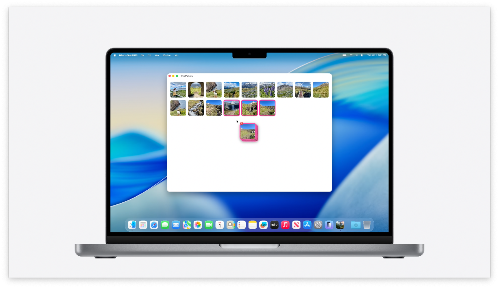

WWDC25のセッション [SwiftUIの新機能](https://developer.apple.com/jp/videos/play/wwdc2025/256/) で紹介されたSwiftUI新機能をカテゴリごとにまとめます。
[昨年のWWDC24のSwiftUIの新機能](/posts/wwdc24-whats-new-in-swiftui/)から引き続き盛りだくさんなアップデートですね！

## Liquid Glassデザインの適用


アプリを新しいXcode（SDK）でリビルドするだけで、全プラットフォームでLiquid Glassデザインが適用されます。


例えば、**ナビゲーションコンテナ**が一新され、**タブバー**や**ツールバー**もコンパクトな新スタイルに変更されました。これらはナビゲーション遷移時にアイテムがなめらかにモーフィング（形状変化）します。
iPadOSやmacOSの**サイドバー**も半透明のガラスのようなデザインになり、背後のコンテンツが映り込むようになりました。
もちろん**トグル**、**セグメントコントロール**、**スライダー**など標準UIコントロールもデザイン刷新され、プラットフォーム全体で統一感のあるモダンな見た目になっています。

<div style="background-color: #fffef0; padding: 10px; border-radius: 8px; border: 1px solid #e6e6e6; width: 100%;">
<svg xmlns="http://www.w3.org/2000/svg" width="16" height="16" viewBox="0 0 24 24" fill="none" stroke="currentColor" stroke-width="2" stroke-linecap="round" stroke-linejoin="round" style="vertical-align: middle; margin-right: 4px;"><polygon points="23 7 16 12 23 17 23 7"></polygon><rect x="1" y="5" width="15" height="14" rx="2" ry="2"></rect></svg>
<a href="https://developer.apple.com/jp/videos/play/wwdc2025/323/">
Build a SwiftUI app with the new design
</a>
</div>

## ToolbarSpacer


`ToolbarSpacer`を使用することで、ツールバー項目のセクション分けを調整できるようになりました。
このサンプルでは、上下の矢印ボタンのグループと、設定ボタンの間に固定スペーサを配置して分離しています。

```swift
.toolbar {
    ToolbarItemGroup(placement: .primaryAction) {
        UpButton()
        DownButton()
    }

    ToolbarSpacer(.fixed, placement: .primaryAction)

    ToolbarItem(placement: .primaryAction) {
        SettingsButton()
    }
}
```

<div style="background-color: #e6f3ff; padding: 10px; border-radius: 8px; border: 1px solid #e6e6e6; width: 100%;">
<svg xmlns="http://www.w3.org/2000/svg" width="16" height="16" viewBox="0 0 24 24" fill="none" stroke="currentColor" stroke-width="2" stroke-linecap="round" stroke-linejoin="round" style="vertical-align: middle; margin-right: 4px;"><path d="M4 19.5A2.5 2.5 0 0 1 6.5 17H20"></path><path d="M6.5 2H20v20H6.5A2.5 2.5 0 0 1 4 19.5v-15A2.5 2.5 0 0 1 6.5 2z"></path></svg>
<a href="https://developer.apple.com/documentation/swiftui/toolbarspacer">
ToolbarSpacer
</a>
</div>

## Liquid Glassへの着色


ツールバーの特定のボタンを目立たせたいなど、必要ならLiquid Glass UIに`tint`で着色できます。

```swift
.toolbar {
    ToolbarItem(placement: .primaryAction) {
        SaveLocationButton()
            .buttonStyle(.borderedProminent)
            .tint(.pink)
    }
}
```

カスタムビューにもこの新デザインを取り入れることが可能です。SwiftUIに新登場したビュー修飾子`.glassEffect()`を使うと、任意のビューに周囲の背景を映し込むガラス風のブラー効果を適用できます。例えば次のようにボタンに`glassEffect()`を付与すれば、背後が透けるスタイリッシュなボタンになります。

```swift
Button("To Top", systemImage: "chevron.up") {
    // 上にスクロールする処理
}
.padding()
.glassEffect()
```

## Searchableの刷新


`.searchable`による検索UIは、iPhoneでは画面下部に表示されるよう変更されました。一方、iPadやmacOSでは画面右上に表示されるなど、プラットフォームに応じて適切な場所に表示されます。

```swift
NavigationSplitView {
    Text("Sidebar")
} detail: {
    Text("Detail")
}
.searchable(
    text: $query,
    prompt: "What are you looking for?"
)
```

## Tab(role: .search)


タブバーに検索UIを含むこともできるようになりました。
`TabView`の要素として`Tab(role: .saerch)`を加えるだけです。
この検索タブを選択すると、タブバーがモーフィングして検索フィールドに変化します。

```swift
TabView {
    Tab("Summary", systemImage: "heart") {
        NavigationStack {
            Text("Summary")
        }
    }
    Tab("Sharing", systemImage: "person.2") {
        NavigationStack {
            Text("Sharing")
        }
    }
    Tab(role: .search) {
        NavigationStack {
            Text("Search")
        }
    }
}
.searchable(text: $text)
```

## カスタムビューもLiquid Glassに


`glassEffect`モディファイアにより、カスタムビューにもLiquid Glassを適用できます。

```swift
Button("To Top", systemImage: "chevron.up") {
    scrollToTop()
}
.padding()
.glassEffect()
```

<div style="background-color: #e6f3ff; padding: 10px; border-radius: 8px; border: 1px solid #e6e6e6; width: 100%;">
<svg xmlns="http://www.w3.org/2000/svg" width="16" height="16" viewBox="0 0 24 24" fill="none" stroke="currentColor" stroke-width="2" stroke-linecap="round" stroke-linejoin="round" style="vertical-align: middle; margin-right: 4px;"><path d="M4 19.5A2.5 2.5 0 0 1 6.5 17H20"></path><path d="M6.5 2H20v20H6.5A2.5 2.5 0 0 1 4 19.5v-15A2.5 2.5 0 0 1 6.5 2z"></path></svg>
<a href="https://developer.apple.com/documentation/swiftui/view/glasseffect(_:in:isenabled:)/">
glassEffect
</a>
</div>

## iPadのメニューバー対応


これまでmacOSアプリにメニューバーを表示するために使われていた`commands`モディファイアがiPadOSでも使えるようになりました。

```swift
WindowGroup {
    RootView()
}
.commands {
    TextEditingCommands()
}
```

## iPadのマルチウィンドウ対応


iPadOSがマルチウィンドウに対応しました。これに伴いiPadOS用アプリのウィンドウが自由にリサイズできるようになります。

開発者目線では対応負荷は高いですが、たとえば標準のSplit Viewを使っていればウィンドウサイズに応じて自動でレイアウトが変わるなどのサポートを受けられます。

<div style="background-color: #fffef0; padding: 10px; border-radius: 8px; border: 1px solid #e6e6e6; width: 100%;">
<svg xmlns="http://www.w3.org/2000/svg" width="16" height="16" viewBox="0 0 24 24" fill="none" stroke="currentColor" stroke-width="2" stroke-linecap="round" stroke-linejoin="round" style="vertical-align: middle; margin-right: 4px;"><polygon points="23 7 16 12 23 17 23 7"></polygon><rect x="1" y="5" width="15" height="14" rx="2" ry="2"></rect></svg>
<a href="https://developer.apple.com/jp/videos/play/wwdc2025/208/">
Elevate the design of your iPad app
</a>
</div>

## windowResizeAnchor


macOSではウィンドウリサイズ時のアニメーションのアンカーポイント（どこが固定されるか）を指定して調整することができるようになりました。
このサンプルでは上部が固定さう、リサイズに伴い下部が伸縮するようになります。

```swift
TabView(selection: $selection.animation()) {
    Tab("General", systemImage: "gear", value: .general) { Text("一般") }
    Tab("Sections", systemImage: "list.bullet", value: .sections) { Text("セクション") }
}
.windowResizeAnchor(.top)
```

<div style="background-color: #e6f3ff; padding: 10px; border-radius: 8px; border: 1px solid #e6e6e6; width: 100%;">
<svg xmlns="http://www.w3.org/2000/svg" width="16" height="16" viewBox="0 0 24 24" fill="none" stroke="currentColor" stroke-width="2" stroke-linecap="round" stroke-linejoin="round" style="vertical-align: middle; margin-right: 4px;"><path d="M4 19.5A2.5 2.5 0 0 1 6.5 17H20"></path><path d="M6.5 2H20v20H6.5A2.5 2.5 0 0 1 4 19.5v-15A2.5 2.5 0 0 1 6.5 2z"></path></svg>
<a href="https://developer.apple.com/documentation/swiftui/view/windowresizeanchor(_:)/">
windowResizeAnchor
</a>
</div>

## パフォーマンスの大幅向上


パフォーマンス改善にも注力されたとのことです。特に、大量のデータをリストで扱う際のパフォーマンスが22倍速くなるケースもあるとのこと。

スクロール処理も改善され、高速スクロール時のフレーム落ちが起きにくくなりました。

また、SwiftUIのアプリのパフォーマンスを改善するための診断ツールもInstrumentsに追加されました。これによりSwiftUIのビューの更新やレイアウト処理のボトルネックを視覚的に捉えやすくなります。

<div style="background-color: #fffef0; padding: 10px; border-radius: 8px; border: 1px solid #e6e6e6; width: 100%;">
<svg xmlns="http://www.w3.org/2000/svg" width="16" height="16" viewBox="0 0 24 24" fill="none" stroke="currentColor" stroke-width="2" stroke-linecap="round" stroke-linejoin="round" style="vertical-align: middle; margin-right: 4px;"><polygon points="23 7 16 12 23 17 23 7"></polygon><rect x="1" y="5" width="15" height="14" rx="2" ry="2"></rect></svg>
<a href="https://developer.apple.com/jp/videos/play/wwdc2025/306/">
Optimize SwiftUI performance with Instruments
</a>
</div>

## Swift Concurrency

Swift Concurrencyについては以下のセッションビデオがあります。

<div style="background-color: #fffef0; padding: 10px; border-radius: 8px; border: 1px solid #e6e6e6; width: 100%;">
<svg xmlns="http://www.w3.org/2000/svg" width="16" height="16" viewBox="0 0 24 24" fill="none" stroke="currentColor" stroke-width="2" stroke-linecap="round" stroke-linejoin="round" style="vertical-align: middle; margin-right: 4px;"><polygon points="23 7 16 12 23 17 23 7"></polygon><rect x="1" y="5" width="15" height="14" rx="2" ry="2"></rect></svg>
<a href="https://developer.apple.com/jp/videos/play/wwdc2025/268/">
Embracing Swift Concurrency
</a>
</div>

<div style="background-color: #fffef0; padding: 10px; border-radius: 8px; border: 1px solid #e6e6e6; width: 100%;">
<svg xmlns="http://www.w3.org/2000/svg" width="16" height="16" viewBox="0 0 24 24" fill="none" stroke="currentColor" stroke-width="2" stroke-linecap="round" stroke-linejoin="round" style="vertical-align: middle; margin-right: 4px;"><polygon points="23 7 16 12 23 17 23 7"></polygon><rect x="1" y="5" width="15" height="14" rx="2" ry="2"></rect></svg>
<a href="https://developer.apple.com/jp/videos/play/wwdc2025/266/">
Explore concurrency in SwiftUI
</a>
</div>

## Animatableマクロ

`Animatable`マクロにより、従来は自分で書かなければならなかったコードを削減できます。
たとえば、１つのプロパティをアニメーション対象から除外したい場合、`@AnimatableIgnored`をつけるだけです。

```swift
@Animatable
struct LoadingArc: Shape {
    var center: CGPoint
    var radius: CGFloat
    var startAngle: Angle
    var endAngle: Angle
    @AnimatableIgnored var drawPathClockwise: Bool

    func path(in rect: CGRect) -> Path {
        // Creates a `Path` arc using properties
        return Path()
    }
}
```

<div style="background-color: #e6f3ff; padding: 10px; border-radius: 8px; border: 1px solid #e6e6e6; width: 100%;">
<svg xmlns="http://www.w3.org/2000/svg" width="16" height="16" viewBox="0 0 24 24" fill="none" stroke="currentColor" stroke-width="2" stroke-linecap="round" stroke-linejoin="round" style="vertical-align: middle; margin-right: 4px;"><path d="M4 19.5A2.5 2.5 0 0 1 6.5 17H20"></path><path d="M6.5 2H20v20H6.5A2.5 2.5 0 0 1 4 19.5v-15A2.5 2.5 0 0 1 6.5 2z"></path></svg>
<a href="https://developer.apple.com/documentation/swiftui/animatable()">
@Animatable
</a>
</div>

## 3次元レイアウト


visionOSに`Alignment3D`や`spatialOverlay`が加わり、立体的なレイアウトがより簡単になります。

```swift
@Binding var timeAlignment: Alignment3D

var body: some View {
    Model3D(named: "Map")
        .spatialOverlay(
            alignment: timeAlignment
        ) {
            Sun()
        }
}
```

<div style="background-color: #fffef0; padding: 10px; border-radius: 8px; border: 1px solid #e6e6e6; width: 100%;">
<svg xmlns="http://www.w3.org/2000/svg" width="16" height="16" viewBox="0 0 24 24" fill="none" stroke="currentColor" stroke-width="2" stroke-linecap="round" stroke-linejoin="round" style="vertical-align: middle; margin-right: 4px;"><polygon points="23 7 16 12 23 17 23 7"></polygon><rect x="1" y="5" width="15" height="14" rx="2" ry="2"></rect></svg>
<a href="https://developer.apple.com/jp/videos/play/wwdc2025/273/">
Meet SwiftUI spatial layout
</a>
</div>

<div style="background-color: #e6f3ff; padding: 10px; border-radius: 8px; border: 1px solid #e6e6e6; width: 100%;">
<svg xmlns="http://www.w3.org/2000/svg" width="16" height="16" viewBox="0 0 24 24" fill="none" stroke="currentColor" stroke-width="2" stroke-linecap="round" stroke-linejoin="round" style="vertical-align: middle; margin-right: 4px;"><path d="M4 19.5A2.5 2.5 0 0 1 6.5 17H20"></path><path d="M6.5 2H20v20H6.5A2.5 2.5 0 0 1 4 19.5v-15A2.5 2.5 0 0 1 6.5 2z"></path></svg>
<a href="https://developer.apple.com/documentation/swiftui/alignment3d/">
Alignment3D
</a>
</div>
<div style="background-color: #e6f3ff; padding: 10px; border-radius: 8px; border: 1px solid #e6e6e6; width: 100%;">
<svg xmlns="http://www.w3.org/2000/svg" width="16" height="16" viewBox="0 0 24 24" fill="none" stroke="currentColor" stroke-width="2" stroke-linecap="round" stroke-linejoin="round" style="vertical-align: middle; margin-right: 4px;"><path d="M4 19.5A2.5 2.5 0 0 1 6.5 17H20"></path><path d="M6.5 2H20v20H6.5A2.5 2.5 0 0 1 4 19.5v-15A2.5 2.5 0 0 1 6.5 2z"></path></svg>
<a href="https://developer.apple.com/documentation/swiftui/view/spatialoverlay(alignment:content:)/">
spatialOverlay
</a>
</div>

## manipulable


visionOSではSwiftUIとRealityKitの連携も強化されています。

`maniputable`モディファイアで3Dモデルをユーザーが掴んで移動できるようになります。

また、`SurfaceSnappingInfo`を監視することで、モデルが置かれている現実世界の面（机や壁など）を知ることもできます。

```swift
@Environment(\.surfaceSnappingInfo) var snappingInfo: SurfaceSnappingInfo

var body: some View {
    VStackLayout().depthAlignment(.center) {
        waterBottleView
            .manipulable()

        Pedestal()
            .opacity(snappingInfo.classification == .table ? 1.0 : 0.0)
    }
}
```

<div style="background-color: #e6f3ff; padding: 10px; border-radius: 8px; border: 1px solid #e6e6e6; width: 100%;">
<svg xmlns="http://www.w3.org/2000/svg" width="16" height="16" viewBox="0 0 24 24" fill="none" stroke="currentColor" stroke-width="2" stroke-linecap="round" stroke-linejoin="round" style="vertical-align: middle; margin-right: 4px;"><path d="M4 19.5A2.5 2.5 0 0 1 6.5 17H20"></path><path d="M6.5 2H20v20H6.5A2.5 2.5 0 0 1 4 19.5v-15A2.5 2.5 0 0 1 6.5 2z"></path></svg>
<a href="https://developer.apple.com/documentation/swiftui/view/manipulable(using:)/">
manipulable
</a>
</div>
<div style="background-color: #e6f3ff; padding: 10px; border-radius: 8px; border: 1px solid #e6e6e6; width: 100%;">
<svg xmlns="http://www.w3.org/2000/svg" width="16" height="16" viewBox="0 0 24 24" fill="none" stroke="currentColor" stroke-width="2" stroke-linecap="round" stroke-linejoin="round" style="vertical-align: middle; margin-right: 4px;"><path d="M4 19.5A2.5 2.5 0 0 1 6.5 17H20"></path><path d="M6.5 2H20v20H6.5A2.5 2.5 0 0 1 4 19.5v-15A2.5 2.5 0 0 1 6.5 2z"></path></svg>
<a href="https://developer.apple.com/documentation/swiftui/surfacesnappinginfo">
SurfaceSnappingInfo
</a>
</div>

## visionOSのウィンドウ、ボリューム、シーン

その他、visionOSではウィンドウの復元ができるようになったり、新しいシーンタイプが加えられました。

<div style="background-color: #fffef0; padding: 10px; border-radius: 8px; border: 1px solid #e6e6e6; width: 100%;">
<svg xmlns="http://www.w3.org/2000/svg" width="16" height="16" viewBox="0 0 24 24" fill="none" stroke="currentColor" stroke-width="2" stroke-linecap="round" stroke-linejoin="round" style="vertical-align: middle; margin-right: 4px;"><polygon points="23 7 16 12 23 17 23 7"></polygon><rect x="1" y="5" width="15" height="14" rx="2" ry="2"></rect></svg>
<a href="https://developer.apple.com/jp/videos/play/wwdc2025/290/">
Set the scene with SwiftUI in visionOS
</a>
</div>
<div style="background-color: #fffef0; padding: 10px; border-radius: 8px; border: 1px solid #e6e6e6; width: 100%;">
<svg xmlns="http://www.w3.org/2000/svg" width="16" height="16" viewBox="0 0 24 24" fill="none" stroke="currentColor" stroke-width="2" stroke-linecap="round" stroke-linejoin="round" style="vertical-align: middle; margin-right: 4px;"><polygon points="23 7 16 12 23 17 23 7"></polygon><rect x="1" y="5" width="15" height="14" rx="2" ry="2"></rect></svg>
<a href="https://developer.apple.com/jp/videos/play/wwdc2025/317/">
What’s new in visionOS 26
</a>
</div>

## Scene bridging

Scene bredging APIにより、UIKitアプリやAppKitアプリとSwiftUIのシーンが相互運用できるようになります。
それにより例えば、VolumeやImmersive Spaceを直接UIKitアプリで直接扱えるようにもなります。

## Remote Immersive Space

RemoteImmersiveSpaceにより、visionOS用のImmersive SpaceをmacOS上でレンダリングしてプレビューできるようになりました。
Vision Proシミュレータのようなものをサードパーティアプリでも再現できるイメージかと思います。

## Assistive Access


```swift
@main
struct PhotoWalk: App {
    var body: some Scene {
        WindowGroup {
            ContentView()
        }

        AssistiveAccess {
            AssistiveAccessContentView()
        }
    }
}
```

認知障害のあるユーザー向けのViewを表示するための`AssistiveAccess`も追加されました。

<div style="background-color: #fffef0; padding: 10px; border-radius: 8px; border: 1px solid #e6e6e6; width: 100%;">
<svg xmlns="http://www.w3.org/2000/svg" width="16" height="16" viewBox="0 0 24 24" fill="none" stroke="currentColor" stroke-width="2" stroke-linecap="round" stroke-linejoin="round" style="vertical-align: middle; margin-right: 4px;"><polygon points="23 7 16 12 23 17 23 7"></polygon><rect x="1" y="5" width="15" height="14" rx="2" ry="2"></rect></svg>
<a href="https://developer.apple.com/jp/videos/play/wwdc2025/238/">
Customize your app for Assistive Access
</a>
</div>

<div style="background-color: #e6f3ff; padding: 10px; border-radius: 8px; border: 1px solid #e6e6e6; width: 100%;">
<svg xmlns="http://www.w3.org/2000/svg" width="16" height="16" viewBox="0 0 24 24" fill="none" stroke="currentColor" stroke-width="2" stroke-linecap="round" stroke-linejoin="round" style="vertical-align: middle; margin-right: 4px;"><path d="M4 19.5A2.5 2.5 0 0 1 6.5 17H20"></path><path d="M6.5 2H20v20H6.5A2.5 2.5 0 0 1 4 19.5v-15A2.5 2.5 0 0 1 6.5 2z"></path></svg>
<a href="https://developer.apple.com/documentation/swiftui/assistiveaccess/">
AssistiveAccess
</a>
</div>

## AppKit連携強化

- `NSWindow`からSwiftUIの`View`を含むシートを表示できる
- `NSGestureRecognizerRepresentable`でAppKitのジェスチャーをSwiftUIにブリッジできる
- Interface BuilderでNSHostingViewを使用できる

## RealityKit連携強化


- RealityKitエンティティが`Observable`に
- Coordinate Conversion APIの強化
- RealityKitのエンティティからSwiftUIを直接ポップオーバー表示
- アタッチメントコンポーネント
- アニメーションの同期
- コンポーネントへのバインド
- RealityVieのサイズ関連の動作が新しく


```swift
RealityView { c in
    let mapEntity = Entity()

    let popover = Entity()
    mapEntity.addChild(popover)
    popover.components[PresentationComponent.self] = PresentationComponent(
        isPresented: $popoverPresented,
        configuration: .popover(arrowEdge: .bottom),
        content: DetailsView()
    )
}
```

<div style="background-color: #fffef0; padding: 10px; border-radius: 8px; border: 1px solid #e6e6e6; width: 100%;">
<svg xmlns="http://www.w3.org/2000/svg" width="16" height="16" viewBox="0 0 24 24" fill="none" stroke="currentColor" stroke-width="2" stroke-linecap="round" stroke-linejoin="round" style="vertical-align: middle; margin-right: 4px;"><polygon points="23 7 16 12 23 17 23 7"></polygon><rect x="1" y="5" width="15" height="14" rx="2" ry="2"></rect></svg>
<a href="https://developer.apple.com/jp/videos/play/wwdc2025/274/">
Better together: SwiftUI and RealityKit
</a>
</div>

## watchOSとmacOSのカスタムコントロールサポート


iOS/iPadOSがサポートしていたコントロールセンターのカスタムコントロールをwatchOSとmacOSもサポートしました。

## visionOSとCarPlayのWidgetサポート


visionOSとCarPlayもWidgetをサポートしました。

また、Widgetをどの程度の詳細さで表示するかの指示もOSから受けられるようになりました。
具体的には、visionOSでユーザーがWidgetから遠い位置にいると`simplified`レベルになり、他のOSでは常に`default`レベルになるとのことです。

```swift
import SwiftUI
import WidgetKit

struct PhotoCountdownView: View {
    @Environment(\.levelOfDetail) var levelOfDetail: LevelOfDetail
    var body: some View {
        switch levelOfDetail {
        case .default:
            RecentPhotosView()
        case .simplified:
            CountdownView()
        default:
            Text("Unknown level of detail")
        }
    }
}
```

<div style="background-color: #e6f3ff; padding: 10px; border-radius: 8px; border: 1px solid #e6e6e6; width: 100%;">
<svg xmlns="http://www.w3.org/2000/svg" width="16" height="16" viewBox="0 0 24 24" fill="none" stroke="currentColor" stroke-width="2" stroke-linecap="round" stroke-linejoin="round" style="vertical-align: middle; margin-right: 4px;"><path d="M4 19.5A2.5 2.5 0 0 1 6.5 17H20"></path><path d="M6.5 2H20v20H6.5A2.5 2.5 0 0 1 4 19.5v-15A2.5 2.5 0 0 1 6.5 2z"></path></svg>
<a href="https://developer.apple.com/documentation/widgetkit/levelofdetail/">
LevelOfDetail
</a>
</div>

その他、以下のアップデートもあります。

- CarPlayのライブアクティビティサポート
- プッシュベースの更新
- watchOSでの関連性の新API

<div style="background-color: #fffef0; padding: 10px; border-radius: 8px; border: 1px solid #e6e6e6; width: 100%;">
<svg xmlns="http://www.w3.org/2000/svg" width="16" height="16" viewBox="0 0 24 24" fill="none" stroke="currentColor" stroke-width="2" stroke-linecap="round" stroke-linejoin="round" style="vertical-align: middle; margin-right: 4px;"><polygon points="23 7 16 12 23 17 23 7"></polygon><rect x="1" y="5" width="15" height="14" rx="2" ry="2"></rect></svg>
<a href="https://developer.apple.com/jp/videos/play/wwdc2025/278/">
What’s new in widgets
</a>
</div>

## WebView


SwiftUIに`WebView`が追加されました（これまではUIKitのWebViewを埋め込んで利用する必要がありました）。

`Observable`な`WebPage`オブジェクトを使用することで、ページの読み込み状態やタイトル、URLなどを監視できます。
また、ページ遷移やリロードもコードから制御可能です。

```swift
import SwiftUI
import WebKit

struct InAppBrowser: View {
    @State private var page = WebPage()

    var body: some View {
        WebView(page)
            .ignoresSafeArea()
            .onAppear {
                page.load(URLRequest(url: sunshineMountainURL))
            }
    }

    var sunshineMountainURL: URL {
        URL(string: "sunshineMountainURL")!
    }
}
```

SwiftUIの`WebView`は以下の機能にも対応しています：
- カスタムUser-Agentの設定
- JavaScriptの実行
- カスタムURLスキームのハンドリング

<div style="background-color: #fffef0; padding: 10px; border-radius: 8px; border: 1px solid #e6e6e6; width: 100%;">
<svg xmlns="http://www.w3.org/2000/svg" width="16" height="16" viewBox="0 0 24 24" fill="none" stroke="currentColor" stroke-width="2" stroke-linecap="round" stroke-linejoin="round" style="vertical-align: middle; margin-right: 4px;"><polygon points="23 7 16 12 23 17 23 7"></polygon><rect x="1" y="5" width="15" height="14" rx="2" ry="2"></rect></svg>
<a href="https://developer.apple.com/jp/videos/play/wwdc2025/231/">
Meet WebKit for SwiftUI
</a>
</div>

<div style="background-color: #e6f3ff; padding: 10px; border-radius: 8px; border: 1px solid #e6e6e6; width: 100%;">
<svg xmlns="http://www.w3.org/2000/svg" width="16" height="16" viewBox="0 0 24 24" fill="none" stroke="currentColor" stroke-width="2" stroke-linecap="round" stroke-linejoin="round" style="vertical-align: middle; margin-right: 4px;"><path d="M4 19.5A2.5 2.5 0 0 1 6.5 17H20"></path><path d="M6.5 2H20v20H6.5A2.5 2.5 0 0 1 4 19.5v-15A2.5 2.5 0 0 1 6.5 2z"></path></svg>
<a href="https://developer.apple.com/documentation/webkit/webview-swift.struct">
WebView
</a>
</div>
<div style="background-color: #e6f3ff; padding: 10px; border-radius: 8px; border: 1px solid #e6e6e6; width: 100%;">
<svg xmlns="http://www.w3.org/2000/svg" width="16" height="16" viewBox="0 0 24 24" fill="none" stroke="currentColor" stroke-width="2" stroke-linecap="round" stroke-linejoin="round" style="vertical-align: middle; margin-right: 4px;"><path d="M4 19.5A2.5 2.5 0 0 1 6.5 17H20"></path><path d="M6.5 2H20v20H6.5A2.5 2.5 0 0 1 4 19.5v-15A2.5 2.5 0 0 1 6.5 2z"></path></svg>
<a href="https://developer.apple.com/documentation/webkit/webpage/">
WebPage
</a>
</div>

## 3Dチャート


Swift Chartsが3Dをサポートしました。

```swift
Chart3D {
    SurfacePlot(
        x: "x", y: "y", z: "z") { x, y in
            sin(x) * cos(y)
        }
        .foregroundStyle(Gradient(colors: [.orange, .pink]))
}
.chartXScale(domain: -3 ... 3)
.chartYScale(domain: -3 ... 3)
.chartZScale(domain: -3 ... 3)
```

<div style="background-color: #fffef0; padding: 10px; border-radius: 8px; border: 1px solid #e6e6e6; width: 100%;">
<svg xmlns="http://www.w3.org/2000/svg" width="16" height="16" viewBox="0 0 24 24" fill="none" stroke="currentColor" stroke-width="2" stroke-linecap="round" stroke-linejoin="round" style="vertical-align: middle; margin-right: 4px;"><polygon points="23 7 16 12 23 17 23 7"></polygon><rect x="1" y="5" width="15" height="14" rx="2" ry="2"></rect></svg>
<a href="https://developer.apple.com/jp/videos/play/wwdc2025/313/">
Bring Swift Charts to the third dimension
</a>
</div>

<div style="background-color: #e6f3ff; padding: 10px; border-radius: 8px; border: 1px solid #e6e6e6; width: 100%;">
<svg xmlns="http://www.w3.org/2000/svg" width="16" height="16" viewBox="0 0 24 24" fill="none" stroke="currentColor" stroke-width="2" stroke-linecap="round" stroke-linejoin="round" style="vertical-align: middle; margin-right: 4px;"><path d="M4 19.5A2.5 2.5 0 0 1 6.5 17H20"></path><path d="M6.5 2H20v20H6.5A2.5 2.5 0 0 1 4 19.5v-15A2.5 2.5 0 0 1 6.5 2z"></path></svg>
<a href="https://developer.apple.com/documentation/charts/chart3d/">
Chart3D
</a>
</div>

## ドラッグ＆ドロップの強化



新しい`draggable`と`dragContainer`を使うことで複数の項目を同時にドラッグできるようになりました。

`dragConfiguration`でドラッグ操作をカスタマイズともできます。

ドラッグ中の見た目を変えるための`dragPreviewsFormation`も加わりました。

```swift
import SwiftUI

struct DragDropExample: View {
    @State private var selectedPhotos: [Photo.ID] = []
    var body: some View {
        ScrollView {
            LazyVGrid(columns: gridColumns) {
                ForEach(model.photos) { photo in
                    view(photo: photo)
                        .draggable(containerItemID: photo.id)
                }
            }
        }
        .dragContainer(for: Photo.self, selection: selectedPhotos) { draggedIDs in
            photos(ids: draggedIDs)
        }
        .dragConfiguration(DragConfiguration(allowMove: false, allowDelete: true))
            .onDragSessionUpdated { session in
                let ids = session.draggedItemIDs(for: Photo.ID.self)
                    if session.phase == .ended(.delete) {
                        trash(ids)
                        deletePhotos(ids)
                    }
            }
        .dragPreviewsFormation(.stack)
    }
}
```

<div style="background-color: #e6f3ff; padding: 10px; border-radius: 8px; border: 1px solid #e6e6e6; width: 100%;">
<svg xmlns="http://www.w3.org/2000/svg" width="16" height="16" viewBox="0 0 24 24" fill="none" stroke="currentColor" stroke-width="2" stroke-linecap="round" stroke-linejoin="round" style="vertical-align: middle; margin-right: 4px;"><path d="M4 19.5A2.5 2.5 0 0 1 6.5 17H20"></path><path d="M6.5 2H20v20H6.5A2.5 2.5 0 0 1 4 19.5v-15A2.5 2.5 0 0 1 6.5 2z"></path></svg>
<a href="https://developer.apple.com/documentation/swiftui/view/draggable(for:id:_:)">
draggable
</a>
</div>

<div style="background-color: #e6f3ff; padding: 10px; border-radius: 8px; border: 1px solid #e6e6e6; width: 100%;">
<svg xmlns="http://www.w3.org/2000/svg" width="16" height="16" viewBox="0 0 24 24" fill="none" stroke="currentColor" stroke-width="2" stroke-linecap="round" stroke-linejoin="round" style="vertical-align: middle; margin-right: 4px;"><path d="M4 19.5A2.5 2.5 0 0 1 6.5 17H20"></path><path d="M6.5 2H20v20H6.5A2.5 2.5 0 0 1 4 19.5v-15A2.5 2.5 0 0 1 6.5 2z"></path></svg>
<a href="https://developer.apple.com/documentation/swiftui/view/dragcontainer(for:in:_:)/">
dragContainer
</a>
</div>

<div style="background-color: #e6f3ff; padding: 10px; border-radius: 8px; border: 1px solid #e6e6e6; width: 100%;">
<svg xmlns="http://www.w3.org/2000/svg" width="16" height="16" viewBox="0 0 24 24" fill="none" stroke="currentColor" stroke-width="2" stroke-linecap="round" stroke-linejoin="round" style="vertical-align: middle; margin-right: 4px;"><path d="M4 19.5A2.5 2.5 0 0 1 6.5 17H20"></path><path d="M6.5 2H20v20H6.5A2.5 2.5 0 0 1 4 19.5v-15A2.5 2.5 0 0 1 6.5 2z"></path></svg>
<a href="https://developer.apple.com/documentation/swiftui/view/dragconfiguration(_:)/">
dragConfiguration
</a>
</div>

<div style="background-color: #e6f3ff; padding: 10px; border-radius: 8px; border: 1px solid #e6e6e6; width: 100%;">
<svg xmlns="http://www.w3.org/2000/svg" width="16" height="16" viewBox="0 0 24 24" fill="none" stroke="currentColor" stroke-width="2" stroke-linecap="round" stroke-linejoin="round" style="vertical-align: middle; margin-right: 4px;"><path d="M4 19.5A2.5 2.5 0 0 1 6.5 17H20"></path><path d="M6.5 2H20v20H6.5A2.5 2.5 0 0 1 4 19.5v-15A2.5 2.5 0 0 1 6.5 2z"></path></svg>
<a href="https://developer.apple.com/documentation/swiftui/view/dragpreviewsformation(_:)/">
dragPreviewsFormation
</a>
</div>

## リッチテキスト


`TextEditor`に`AttributedString`を渡すことで、太字、イタリック、色の変更などの装飾をサポートしたリッチテキストが扱えるようになりました。

しかも書式設定用のツールバーも標準で用意されていますのでリッチテキストエディターが簡単に実現できます。

```swift
struct CommentEditor: View {
    @Binding var commentText: AttributedString

    var body: some View {
        TextEditor(text: $commentText)
    }
}
```

## まとめ

今年も昨年に引き続き盛りだくさんなアップデートでした。
このまとめをするのにだいぶ時間を食うため迷いましたが、[WWDC24のまとめ](/posts/wwdc24-whats-new-in-swiftui/)も結果として自分で何度も見返す[^1]ことになったため、今年もがんばってまとめました。

直近ではアップデート内容のキャッチアップ、1年後2年後にはこれらのAPIを実際に使えるようになったときのインデックスとして利用できれば幸いです。

[^1]: このまとめの存在を忘れていたのに新APIについてGoogle検索をするとなぜか自分のまとめに行き着いたり