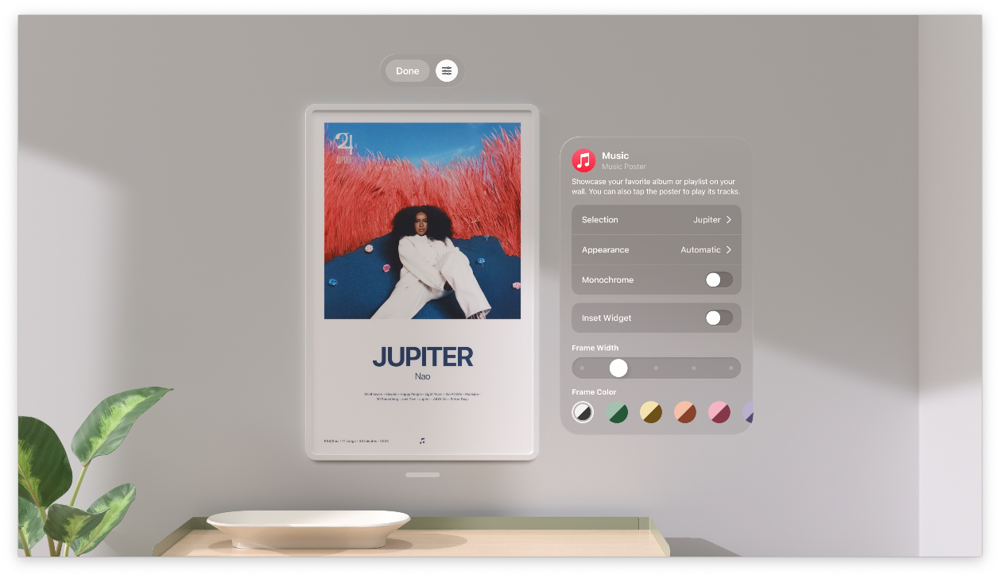

**visionOS 26** で **空間Widget（ウィジェット）** がサポートされましたね！
この記事では空間Widgetでできることをサンプルコードを交えて解説します。

## 空間Widgetとは

iOSやmacOS同様に`WidgetKit`で構築したWidgetをvisionOSにも表示できます。

visionOSが他OSと大きく違うのはWidgetを現実世界の机や壁に設置できるところです。
机の上など水平面に設置したWidgetは自動でユーザーのほうに向きます。

<figure style="display: flex; gap: 20px; margin: 20px 0;">
  <figure style="flex: 1;">
    
    <figcaption style="text-align: center; margin-top: 8px;"><b>机の上に配置</b></figcaption>
  </figure>
  <figure style="flex: 1;">
    
    <figcaption style="text-align: center; margin-top: 8px;"><b>壁に設置</b></figcaption>
  </figure>
</figure>

## Widgetのサイズ

Widgetのサイズは以下５種類から選べます。

- **Small** 158x158pt
- **Medium** 354x158pt
- **Large** 354x354pt
- **Extra Large Portrait** 354x550pt
- **Extra Large Landscape** 550x354pt


どのWidgetもユーザーが任意にリサイズ（縦横比は変わらず75%から125%の範囲内で）できます。


どのサイズをサポートするかは従来のiOSなどのWidgetと同様に`supportedFamilies`モディファイアで指定できます。

```swift
.supportedFamilies(
    [.systemExtraLarge, .systemExtraLargePortrait]
)
```

## 素材


visionOSのWidgetは素材が **Paper(紙)** なのか **Glass(ガラス)** なのかを指定できます。

**Paper**は印刷物のようなリアルなあしらいになり、**Glass**なら前景と背景の間に深みが出ます。


**Paper**と**Glass**で周辺環境の明るさによる見え方の違いも出てきます。

素材は`widgetTexture`モディファイアで指定できます。

```swift
.widgetTexture(.paper)
```

## マウントスタイル


マウントスタイルとして以下２つをユーザーが選択可能です。

- **Recessed** 埋没したようなスタイル
- **Elevated** 浮き上がったようなスタイル

壁面に設置する場合はどちらのスタイルも選べますが、机など水平面に設置する場合は**Elevated**のみです。そのため、マウントスタイルとして**Recessed**しかサポートしていない場合、水平面に設置できなくなります。

デフォルトで両方のマウントスタイルをサポートしますが、必要なら`supportedMountingStyles`モディファイアでどちらか片方のみに限定できます。

```swift
.supportedMountingStyles([.recessed])
```

## 距離によるUIの変更


visionOSのWidgetは他OSのWidgetと違い、現実世界に設置されるためユーザーからの距離が遠くなることもあります。

そのため、ユーザーからの距離を検知してUIを変更できます。
例えば、ユーザーが離れたら表示項目を減らしてより大きなフォントで表示するなどです。

<figure style="display: flex; gap: 20px; margin: 20px 0;">
  <figure style="flex: 1;">
    
    <figcaption style="text-align: center; margin-top: 8px;"><b>.default 距離が近い</b></figcaption>
  </figure>
  <figure style="flex: 1;">
    
    <figcaption style="text-align: center; margin-top: 8px;"><b>.simplified 距離が遠い</b></figcaption>
  </figure>
</figure>

距離による切り替えは`levelOfDetail` environment variable により可能で、以下２種の値を検知できます。

- `.default` デフォルト/距離が近い
- `.simplfied` 簡易表示/距離が遠い

```swift
@Environment(\.levelOfDetail) var levelOfDetail

var body: some View {
    VStack {
        if levelOfDetail == .simplified {
            SimpleView()
        } else {
            DefaultView()
        }
    }
}
```

## レンダリングモード



デフォルトではvisionOSのWidgetはフルカラーで表示されますが、ユーザーが特定の色でのアクセントモードやモノクロモードに変更もできます。


具体的には以下３種のレンダリングモードがあります。

- `.fullColor` フルカラー
- `.accented` 特定の色
- `.vibrant` モノクロ

これらのモードへの対応はvisionOSが自動である程度やってくれますが、必要ならアプリごとにカスタマイズできます。

具体的には`widgetRenderingMode` environment variable により振り分けます。

アクセントモード（`.accented`）では、白や黒で強調表示させたいViewを`.widgetAccentable`モディファイアで明示できます。

```swift
@Environment(\.widgetRenderingMode) var widgetRenderingMode

var body: some View {
    ZStack {
       switch renderingMode {
        case .fullColor:
           Text("Full color")
        case .accented:
           ZStack {
               Circle(...)
               VStack {
                   Text("Accented")
                       .widgetAccentable()
                   Text("Normal")
               }
           }
        case .vibrant:
           Text("Full color")
        }
    }
}
```

## まとめ

待望の空間Widgetに、たくさんのアプリが対応してくれるのが楽しみですね！

