WWDC26のセッション [SwiftUIの新機能](https://developer.apple.com/jp/videos/play/wwdc2026/269/) で紹介されたSwiftUIの主要なアップデートをまとめます。

<div style="background-color: #fffef0; padding: 10px; border-radius: 8px; border: 1px solid #e6e6e6; width: 100%;">
<svg xmlns="http://www.w3.org/2000/svg" width="16" height="16" viewBox="0 0 24 24" fill="none" stroke="currentColor" stroke-width="2" stroke-linecap="round" stroke-linejoin="round" style="vertical-align: middle; margin-right: 4px;"><polygon points="23 7 16 12 23 17 23 7"></polygon><rect x="1" y="5" width="15" height="14" rx="2" ry="2"></rect></svg>
<a href="https://developer.apple.com/jp/videos/play/wwdc2026/269/">
SwiftUIの新機能
</a>
</div>

---

## 0. はじめにまとめ

ざっくりとは以下のアップデートがあります。

- Liquid Glassが改善
- ドキュメントベースのアプリが作りやすく
- 全てのコンテナ内で要素の並び替えやスワイプアクションを使えるように
- confirmationDialogとalertでitem-bindingが使えるように
- AsyncImageのcache対応
- @Stateの改善
- @ContentBuilderによる型チェックの高速化
- Xcode 17 Agent Skillsの導入

## 1. Refreshed look and feel（洗練された外観と操作感）

### Liquid Glassデザインの自動更新

iOS 27 / macOS 17 / iPadOS 27 向けにXcode 27でリビルドするだけで、アプリに刷新された **Liquid Glassデザイン** が自動的に適用されます。コードを1行も変更することなく、最新のUI外観を得ることができます。

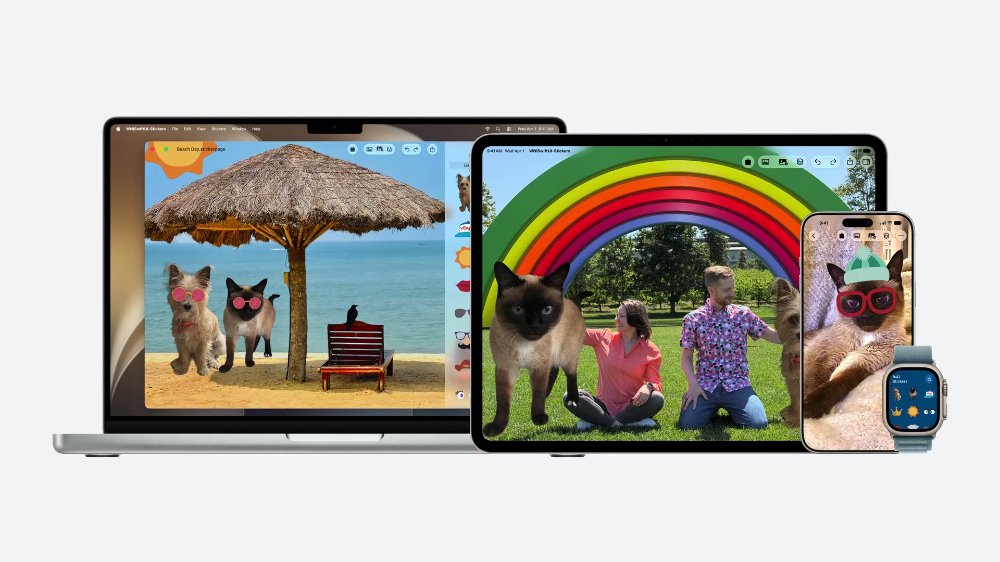

Liquid Glassは洗練された外観を持ち、新しいLiquid Glassスライダーに自動的に対応してティントを調整します。

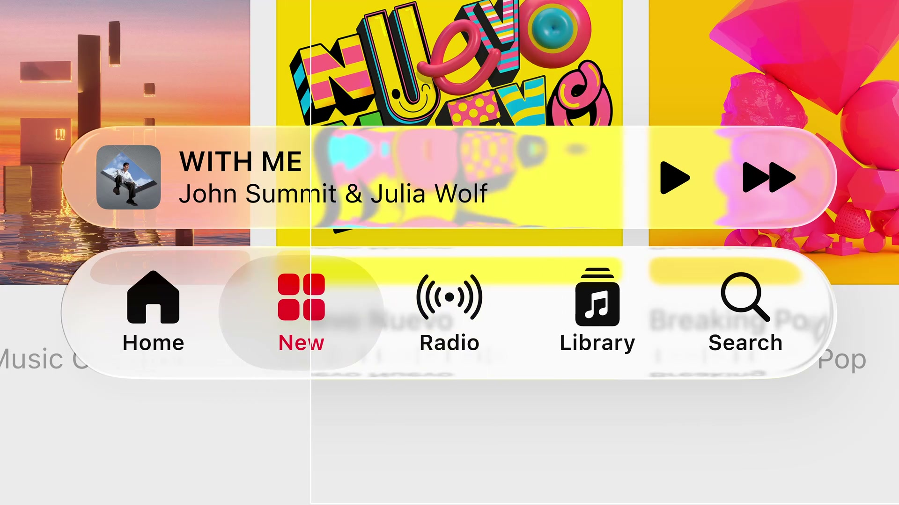

macOSでは、Liquid Glassのカスタム要素を「インタラクティブ」としてマークすると、ユーザーのクリックにより流動的に反応します。これはマウスポインターでうまく動作するように最適化されています。

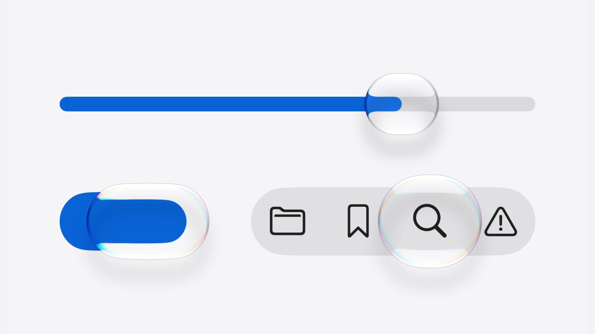

### ウィンドウの制御とアクティブ状態の検知

iPadやMacでは、非アクティブなウィンドウは独特の外観になり、アイコンとテキストが自動的に薄くなってアクティブなウィンドウが区別しやすくなります。

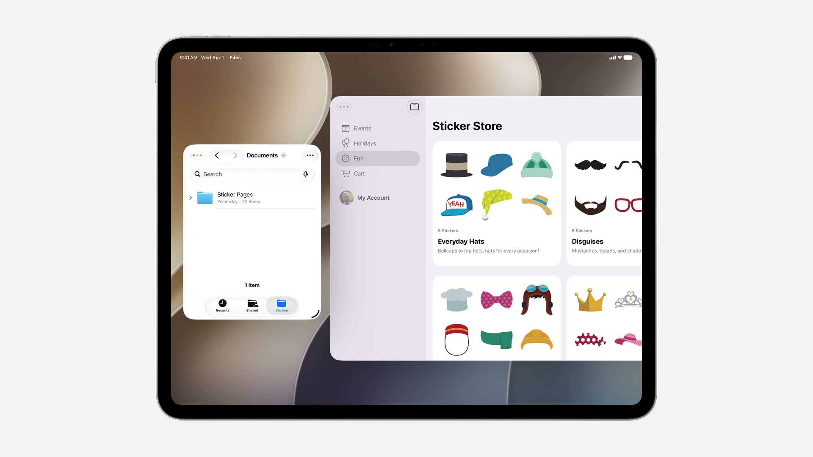

この動作を細かく制御するために、新しい環境変数 `appearsActive` が導入されました。ウィンドウが非アクティブのときに、サイドバーのカスタムアカウントボタンなどの不透明度を下げるカスタマイズが可能です。

```swift
struct SidebarFooterView: View {
    @Environment(\.appearsActive) private var appearsActive

    var body: some View {
        MyAccountView()
            .opacity(appearsActive ? 1 : 0.5)
    }
}
```

<div style="background-color: #e6f3ff; padding: 10px; border-radius: 8px; border: 1px solid #e6e6e6; width: 100%;">
<svg xmlns="http://www.w3.org/2000/svg" width="16" height="16" viewBox="0 0 24 24" fill="none" stroke="currentColor" stroke-width="2" stroke-linecap="round" stroke-linejoin="round" style="vertical-align: middle; margin-right: 4px;"><path d="M4 19.5A2.5 2.5 0 0 1 6.5 17H20"></path><path d="M6.5 2H20v20H6.5A2.5 2.5 0 0 1 4 19.5v-15A2.5 2.5 0 0 1 6.5 2z"></path></svg>
<a href="https://developer.apple.com/documentation/swiftui/environmentvalues/appearsactive">
appearsActive
</a>
</div>

### メニューバーのカスタマイズ

iPadとMacのメニューバーには、デフォルトで最小限のアイコンが表示され、主要なアクション専用になります。しかし、`labelStyle(.titleAndIcon)` モディファイアを適用することで、特定のメニュー項目にアイコンを表示して目立たせることができます。

```swift
CommandMenu("Stickers") {
    Button { openStore() } label: {
        Label("Store", systemImage: "bag.fill")
            .labelStyle(.titleAndIcon)
        }
    }
    // Other menu items
}
```

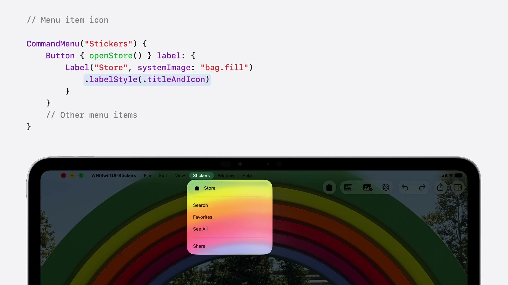

### iPhoneアプリのサイズ変更対応

iOS 27では、iPhoneアプリもサイズ変更可能（リサイズ対応）になります。

Xcode 27のライブプレビューにリサイズハンドルが追加され、iPhone Mirroringの動作や、iPadでiPhoneアプリとして実行された場合のレイアウト変更（サイズクラスの対応）を即座にプレビュー・テストできるようになりました。

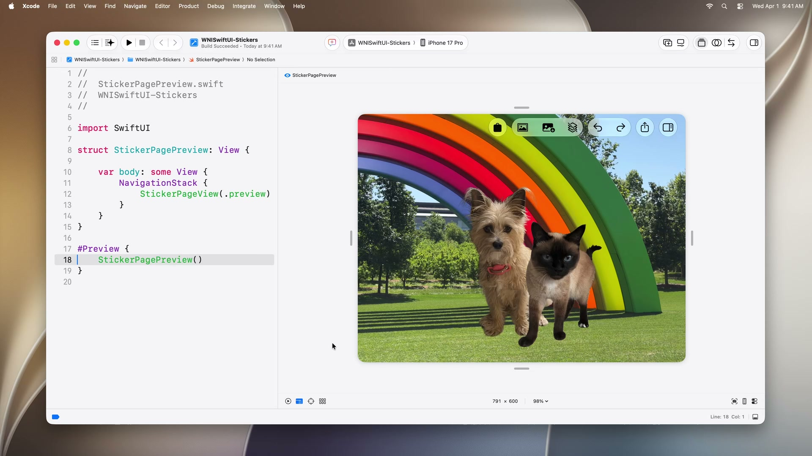

#### UIKitとSwiftUIが混在するアプリの注意点
画面のジオメトリを正しく決定する方法、ビューのサイズ設定にidiomではなくサイズクラスを使用すること、インターフェースの向きの変更への対応などを考慮する必要があります。詳細は「Modernize your UIKit app」セッションを参照してください。

<div style="background-color: #fffef0; padding: 10px; border-radius: 8px; border: 1px solid #e6e6e6; width: 100%;">
<svg xmlns="http://www.w3.org/2000/svg" width="16" height="16" viewBox="0 0 24 24" fill="none" stroke="currentColor" stroke-width="2" stroke-linecap="round" stroke-linejoin="round" style="vertical-align: middle; margin-right: 4px;"><polygon points="23 7 16 12 23 17 23 7"></polygon><rect x="1" y="5" width="15" height="14" rx="2" ry="2"></rect></svg>
<a href="https://developer.apple.com/videos/play/wwdc2026/278/">
Modernize your UIKit app
</a>
</div>

### Tab(role: .prominent)による特別なタブ配置

`TabView` 内の特定のタブを目立たせるために、新しい `prominent` タブロールが追加されました。このロールを指定したタブ（例：ショッピングカートなど）は、画面の端に配置され、他の通常のタブと区別されます。

```swift
TabView {
    Tab { EventsTab() }
    Tab { HolidaysTab() }
    Tab { FunTab() }

    Tab(role: .prominent) {
        CartTab()
    }
}
```
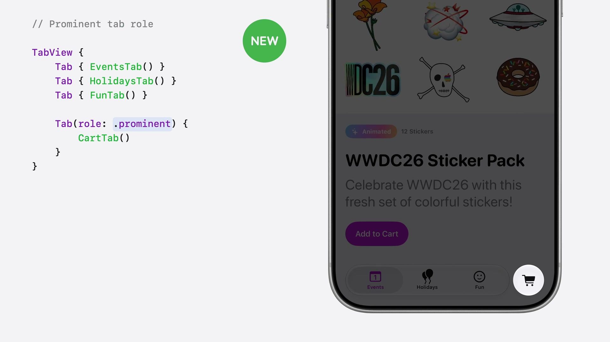

### ツールバーAPIの強化

アプリウィンドウやスクリーンのサイズを変更した際、ツールバー内の項目はシステムによって自動的に調整されます。収まりきらない項目は自動的に非表示になり、オーバーフローメニューに隠れます。

スペース制限がある状況でも、重要なアクションを常に表示させたり、特定の配置を維持するための新しいツールバーAPIが追加されました。

* **`.visibilityPriority(.high)`**: 優先度を高めることで、スペースが限られているときもボタンを常に表示させます。
* **`ToolbarOverflowMenu`**: 頻繁に使用しないボタンをオーバーフローメニューに明示的にグループ化して配置します。
* **`.topBarPinnedTrailing` 配置**: 指定したボタンを常にトレーリング位置に固定表示し続けます。

```swift
StickerPageView()
    .toolbar {
        ToolbarItemGroup {
            UndoButton()
            RedoButton()
        }
        .visibilityPriority(.high)
        ToolbarOverflowMenu {
            ChoosePhotoButton()
            ExportAsImageButton()
            ClearAllStickersButton()
        }
        ToolbarItem(placement: .topBarPinnedTrailing) {
            ShareButton()
        }
    }
```

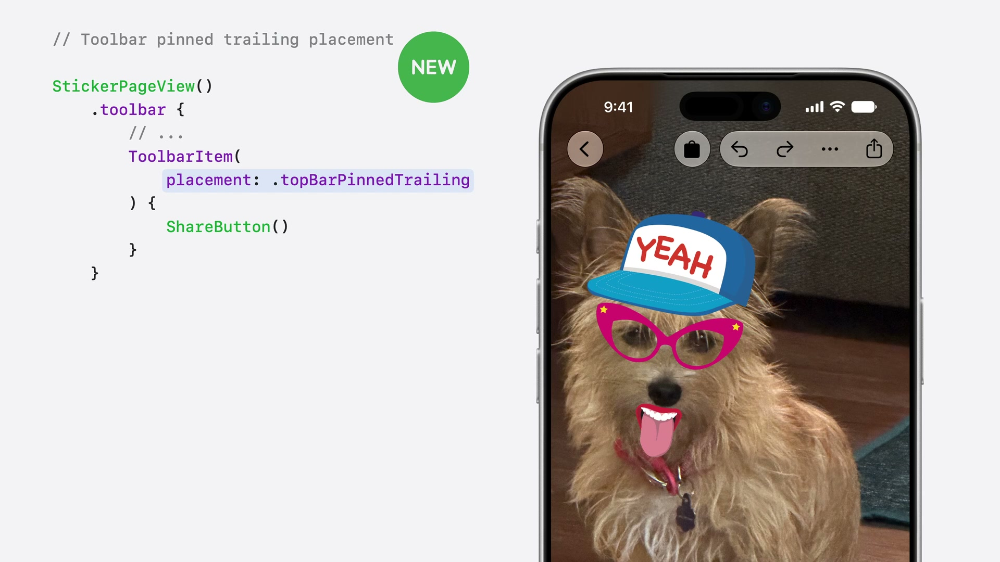

#### スクロール時のツールバー最小化
スクロール中の作業スペースを最大化するために、新しい `toolbarMinimizeBehavior` モディファイアが追加されました。`onScrollDown` を指定することで、下方向へスクロールした際に自動的にナビゲーションバーを移動（最小化）させることができます。

```swift
ScrollView {
    StickerListView()
}
.toolbarMinimizeBehavior(.onScrollDown, for: .navigationBar)
```

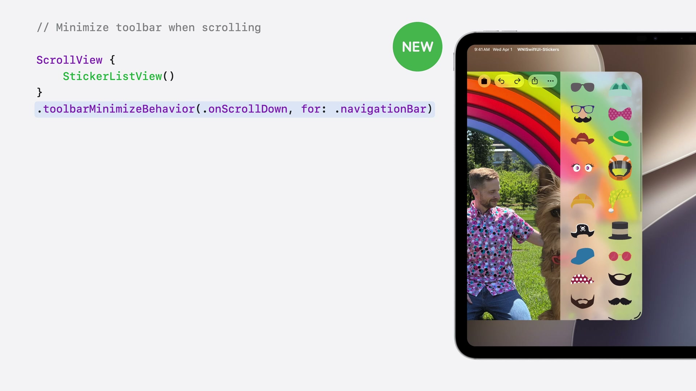

<div style="background-color: #e6f3ff; padding: 10px; border-radius: 8px; border: 1px solid #e6e6e6; width: 100%;">
<svg xmlns="http://www.w3.org/2000/svg" width="16" height="16" viewBox="0 0 24 24" fill="none" stroke="currentColor" stroke-width="2" stroke-linecap="round" stroke-linejoin="round" style="vertical-align: middle; margin-right: 4px;"><path d="M4 19.5A2.5 2.5 0 0 1 6.5 17H20"></path><path d="M6.5 2H20v20H6.5A2.5 2.5 0 0 1 4 19.5v-15A2.5 2.5 0 0 1 6.5 2z"></path></svg>
<a href="https://developer.apple.com/documentation/swiftui/view/toolbarminimizebehavior(_:for:)">
toolbarMinimizeBehavior
</a>
</div>

---

## 2. Document-based apps（ドキュメントベースのアプリ）

SwiftUIは、ドキュメントベースのアプリを構築するための基盤（`FileDocument` や `ReferenceFileDocument` プロトコル）をさらに拡張しました。

新規作成（Cmd+N）や開く（Cmd+O）、自動保存、スマートな編集済みインジケーターなどの標準システム機能をそのまま活用しながら、以下の3つの主要な改善点が追加されました。

1. **ドキュメント作成コンテキスト（Document Creation Context）の追加**
2. **ディスクの読み書きパフォーマンスの最適化**
3. **ドキュメントURLへのダイレクトアクセス対応**

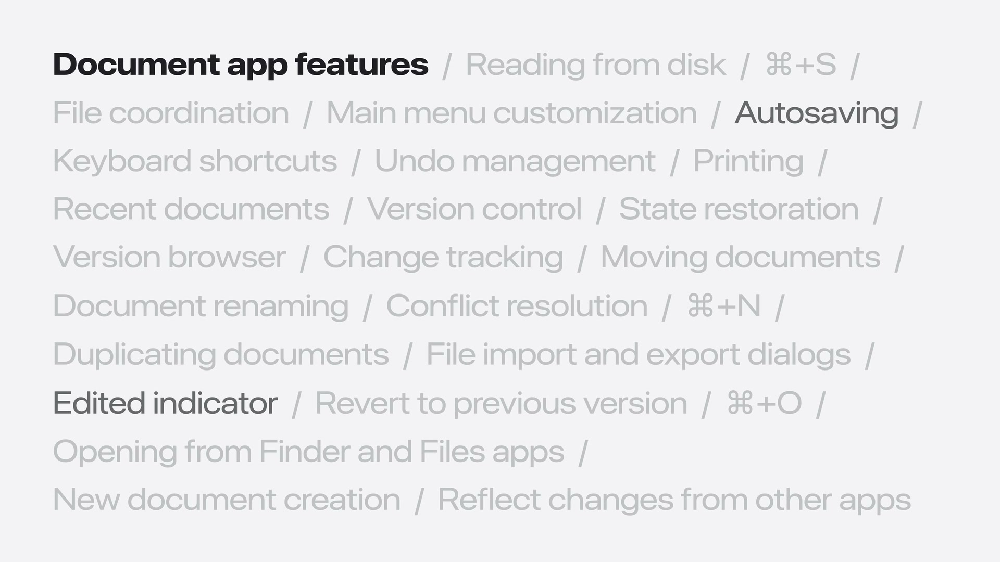

### ドキュメント作成コンテキスト（DocumentCreationSource）

新規ドキュメントを作成する際のソース（空白から作成、写真から作成など）を宣言するための `DocumentCreationSource` APIが追加されました。

```swift
@main
struct Stickers: App {
    var body: some Scene {
        DocumentGroupLaunchScene("Create a Sticker Page") {
            NewDocumentButton("New Sticker Page", source: .blank)
            NewDocumentButton("Sticker Page from Photo…", source: .photo)
        }
       
        DocumentGroup { document in
            StickerPageDocumentView(document)
        } { configuration, context in
            StickerPageDocument(configuration: configuration, context: context)
        }
    }
}
  
extension DocumentCreationSource {
    static let blank = Self(id: "blank")
    static let photo = Self(id: "photo")
}
```

ボタンが選択されると、SwiftUIはソース情報を `context` パラメーターを通じてドキュメントの作成クロージャに渡します。初期化時に `context` を確認し、例えば `photo` がソースの場合は、ドキュメントが開いた直後にフォトピッカーを表示するようなフローを構築できます。

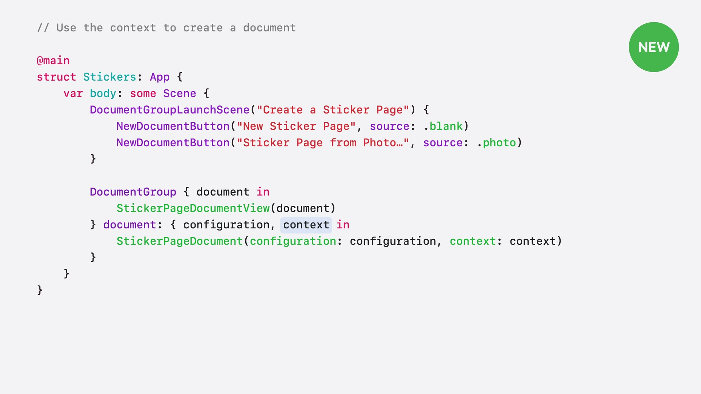
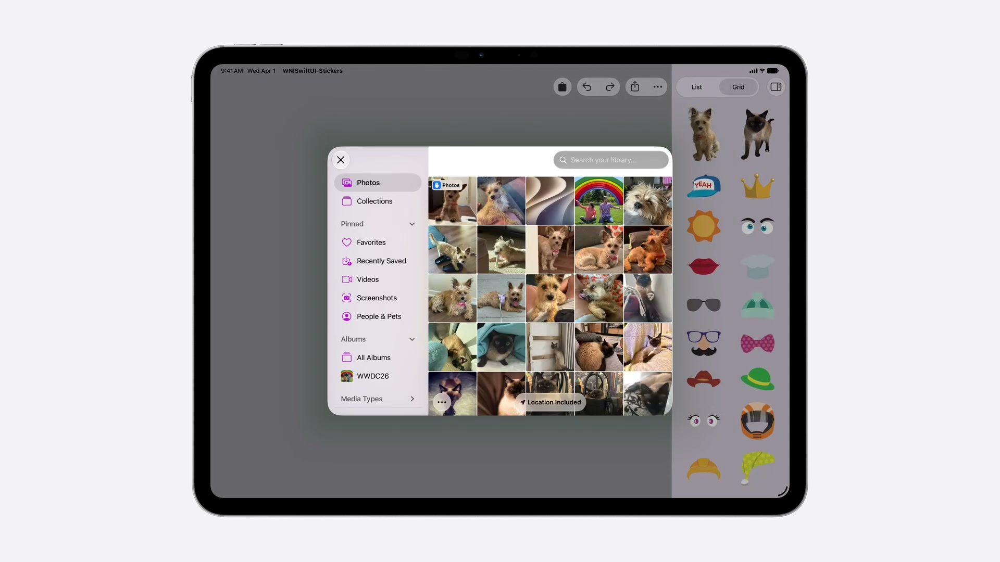

### 読み書きパフォーマンスの最適化（Observationとの連携）

`DocumentGroup` 宣言と `@Observable` マクロがシームレスに連携するようになり、ビューは依存しているプロパティが変更されたときのみ更新されるようになります。

```swift
@main
struct Stickers: App {
    var body: some Scene {
        DocumentGroup { /* ... */ }
        WindowGroup { /* ... */ }
    }
}
```

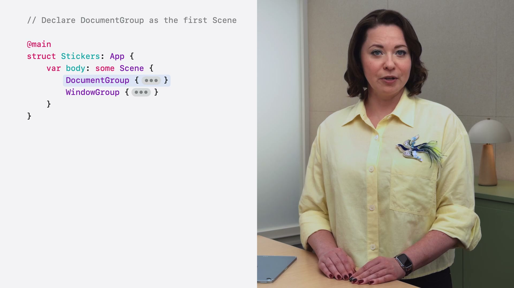
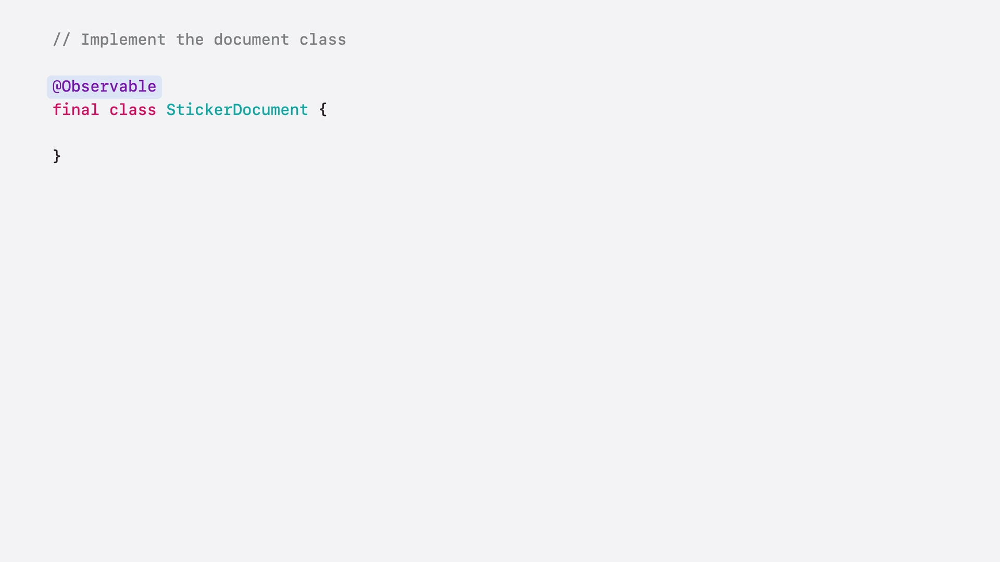

#### WritableDocumentとDocumentWriterによる書き込み最適化
効率的な書き込みを実現するために、ドキュメントクラスを `WritableDocument` に準拠させ、`DocumentWriter` を提供します。

```swift
@Observable
final class StickerDocument: WritableDocument {
    
    static let writableDocumentTypes: [UTType] = [.stickerDocument]
  
    @MainActor
    func snapshot(contentType: UTType) async throws -> sending PageSnapshot {
        makeSnapshot()
    }
      
    func writer(configuration: sending WriteConfiguration) -> sending Writer {
        Writer(contentType: configuration.contentType)
    }
}
```

`snapshot` メソッドは、現在のドキュメント状態を表す値型スナップショット（例：背景画像やステッカー位置をカプセル化した `PageSnapshot`）を返します。

```swift
struct PageSnapshot {
    var background: Image
    var metadata: StickerPlacements
    var stickers: [Image]
}

struct StickerPlacements { /* ... */ }
```

`DocumentWriter` に準拠した `Writer` 構造体が、非同期にディスクへデータを書き込みます。

```swift
struct Writer<Snapshot>: DocumentWriter {
    typealias Snapshot = PageSnapshot
  
    let contentType: UTType
    
    nonisolated func write(
        snapshot: sending PageSnapshot, to destination: URL,
        previous: sending PageSnapshot?, progress: consuming Subprogress
    ) async throws {
        // write .stickerDocument
    }
}
```

##### パフォーマンス最適化のメリット:
* **非同期かつnonisolated**: ディスク書き込み操作が完全にバックグラウンドで実行され、メインスレッドのUI動作を妨げません。
* **差分書き込み**: 現在のスナップショットと前回のスナップショット（`previous`）を比較し、実際に変更されたデータのみを保存できます。
* **進捗管理（Subprogress）**: 長時間の保存処理において、`Subprogress` APIを介して進捗をシステムに報告できます。

#### ReadableDocumentによる読み込み
`WritableDocument` に対応する対として、読み込み側には `ReadableDocument` プロトコルと `DocumentReader` が提供され、重いディスク読み込み処理をバックグラウンドで処理できます。

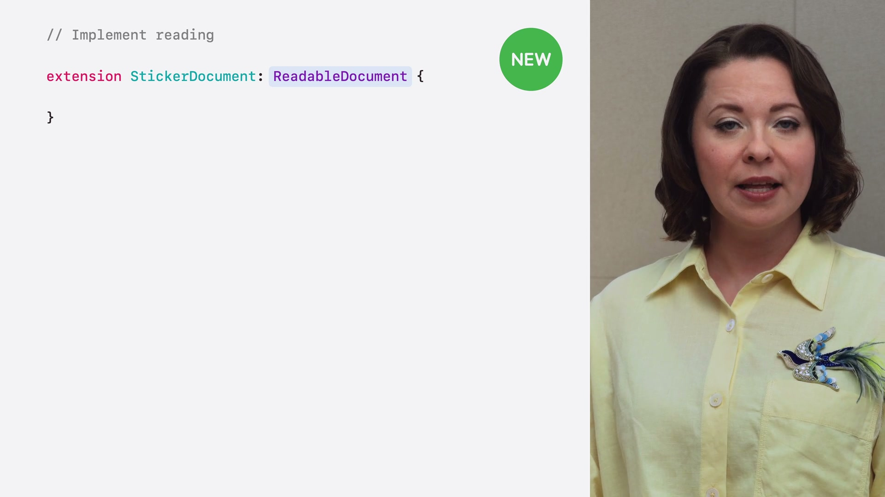

### 複数フォーマットでの保存サポート

同じドキュメントを、独自のパッケージ形式だけでなくPNG画像など他のフォーマットでもエクスポートできるように、`writableContentTypes` に複数のUTTypeを登録できます。

```swift
@Observable
final class StickerDocument: WritableDocument {
  
    static let writableContentTypes: [UTType] = [.stickerDocument, .png]
}
```

`Writer` の `write` メソッド内で、リクエストされた `contentType` に応じて書き出し処理を分岐します。

```swift
struct Writer<Snapshot>: DocumentWriter {
    typealias Snapshot = PageSnapshot
  
    let contentType: UTType
    
    nonisolated func write(
        snapshot: sending PageSnapshot, to destination: URL,
        previous: sending PageSnapshot?, progress: consuming Subprogress
    ) async throws {
        if contentType.conforms(to: .stickerDocument) {
            // write .stickerDocument
        } else if contentType.conforms(to: .png) {
            let context = CGContext(/* ... */) 
            context.draw(/* ... */)
        }
    }
}
```

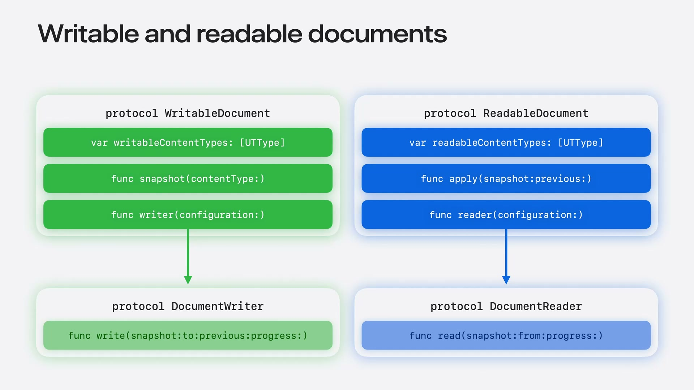

<div style="background-color: #e6f3ff; padding: 10px; border-radius: 8px; border: 1px solid #e6e6e6; width: 100%;">
<svg xmlns="http://www.w3.org/2000/svg" width="16" height="16" viewBox="0 0 24 24" fill="none" stroke="currentColor" stroke-width="2" stroke-linecap="round" stroke-linejoin="round" style="vertical-align: middle; margin-right: 4px;"><path d="M4 19.5A2.5 2.5 0 0 1 6.5 17H20"></path><path d="M6.5 2H20v20H6.5A2.5 2.5 0 0 1 4 19.5v-15A2.5 2.5 0 0 1 6.5 2z"></path></svg>
<a href="https://developer.apple.com/documentation/swiftui/documentcreationsource">
DocumentCreationSource
</a>
</div>

---

## 3. Presentation and interaction（プレゼンテーションとインタラクション）

### reorderableコンテナAPIによる要素の並び替え

ListやGridなど、あらゆるコンテナ内の要素をドラッグ＆ドロップで並び替え可能にする新しい `reorderable` APIが追加されました。

`ForEach` 内のビューに `.reorderable()` を適用し、親コンテナに `.reorderContainer(for:)` を設定します。

```swift
List {
    ForEach(stickers) { sticker in
        StickerListItemView(sticker: sticker)
    }
    .reorderable()
}
.reorderContainer(for: Sticker.self) { difference in
    difference.apply(to: &stickers)
}
```

並び替え処理には、Apple公式のオープンソースパッケージである `OrderedCollections` (`swift-collections`) の `apply` メソッドを利用するのがベストプラクティスです。

```swift
import OrderedCollections // from https://github.com/apple/swift-collections

extension ReorderDifference where CollectionID == ReorderableSingleCollectionIdentifier {
    func apply(to values: inout [some Identifiable<ItemID>]) {
        var dictionary = OrderedDictionary(uniqueKeys: values.map { $0.id }, values: values)
        let destinationOffset: Int? = switch destination.position {
        case .before(let destination):
            dictionary.keys.firstIndex(of: destination)
        case .end:
            nil
        }
        dictionary.move(keys: sources, to: destinationOffset ?? values.endIndex)
        values = dictionary.values.elements
    }
}
```

#### LazyVGridでの並び替え
このAPIは List 以外のあらゆるコンテナに対応しており、以下のコードのように `List` から `LazyVGrid` に置き換えても、内部ロジックを変更することなく並び替え動作が実現します。

```swift
LazyVGrid {
    ForEach(stickers) { sticker in
        StickerListItemView(sticker: sticker)
    }
    .reorderable()
}
.reorderContainer(for: Sticker.self) { difference in
    difference.apply(to: &stickers)
}
```

このアップデートにより、watchOSでも初めて並び替え機能がサポートされました。

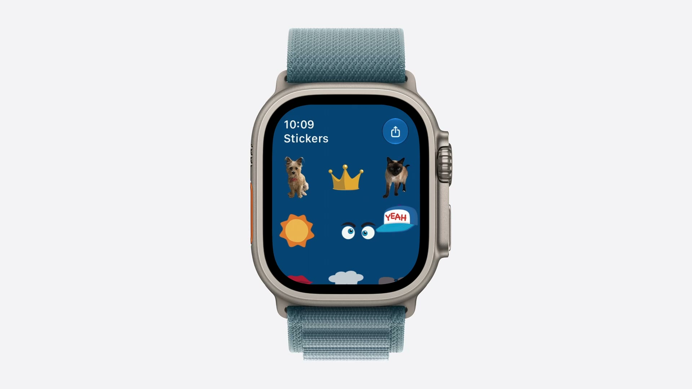

<div style="background-color: #fffef0; padding: 10px; border-radius: 8px; border: 1px solid #e6e6e6; width: 100%;">
<svg xmlns="http://www.w3.org/2000/svg" width="16" height="16" viewBox="0 0 24 24" fill="none" stroke="currentColor" stroke-width="2" stroke-linecap="round" stroke-linejoin="round" style="vertical-align: middle; margin-right: 4px;"><polygon points="23 7 16 12 23 17 23 7"></polygon><rect x="1" y="5" width="15" height="14" rx="2" ry="2"></rect></svg>
<a href="https://developer.apple.com/videos/play/wwdc2026/271/">
Code-along: Build powerful drag and drop in SwiftUI
</a>
</div>

### あらゆるビューでのスワイプアクション対応

これまで `List` のみで利用可能だった `.swipeActions` モディファイアが、`LazyVStack` やその他のコンテナ内のビューでも使用できるようになりました。スクロールビュー内の項目をカスタマイズする柔軟性が大幅に向上します。

スワイプを実行したいコンテナの親ビューに `.swipeActionsContainer()` を追加して使用します。

```swift
ScrollView {
    LazyVStack {
        ForEach(stickers) { sticker in
            StickerListItemView(sticker: sticker)
                .swipeActions {
                    DeleteButton(sticker: sticker)
                }
        }
    }
}
.swipeActionsContainer()
```

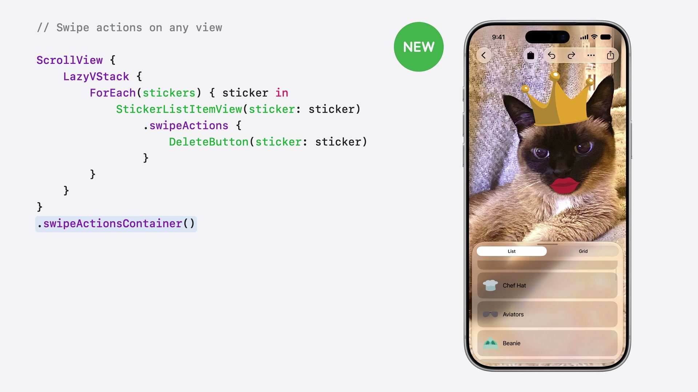

<div style="background-color: #e6f3ff; padding: 10px; border-radius: 8px; border: 1px solid #e6e6e6; width: 100%;">
<svg xmlns="http://www.w3.org/2000/svg" width="16" height="16" viewBox="0 0 24 24" fill="none" stroke="currentColor" stroke-width="2" stroke-linecap="round" stroke-linejoin="round" style="vertical-align: middle; margin-right: 4px;"><path d="M4 19.5A2.5 2.5 0 0 1 6.5 17H20"></path><path d="M6.5 2H20v20H6.5A2.5 2.5 0 0 1 4 19.5v-15A2.5 2.5 0 0 1 6.5 2z"></path></svg>
<a href="https://developer.apple.com/documentation/swiftui/view/swipeactionscontainer()">
swipeActionsContainer
</a>
</div>

### confirmationDialog と alert の item バインディング対応

確認ダイアログ（`confirmationDialog`）および `alert` が、シート（`sheet`）と同様の `item-binding` パターン（値が代入されたときに自動でプレゼンテーションを表示する仕組み）をサポートしました。

これにより、削除ボタンなどを押して状態変数に値（アイテム）が格納された時点でダイアログを表示することが可能です。

```swift
struct StickerCanvasView: View {
    var stickers: [Sticker]
    @State private var stickerToDelete: Sticker?

    var body: some View {
        ZStack {
            ForEach(stickers) { sticker in
                PlacedStickerView(sticker: sticker)
                    .contextMenu {
                        // ...
                    }
            }
        }
        .confirmationDialog(
            "Delete?", item: $stickerToDelete
        ) { sticker in
            DeleteStickerButton(sticker)
        }   
    }
}
```

`alert` でも同様に動作します。

```swift
        .alert(
            "Delete?", item: $stickerToDelete
        ) { sticker in
            DeleteStickerButton(sticker)
        }   
```

---

## 4. Data flow and performance（データフローとパフォーマンス）

### AsyncImageのHTTPキャッシングの標準サポート

これまで `AsyncImage` は画像をメモリに保持していなかったため、画面外にスクロールして戻ると再読み込みが発生していました。

iOS 27 / macOS 17 以降では、`AsyncImage` が標準の **HTTPキャッシュ機能** を自動的にサポートし、キャッシュヘッダーを尊重してデータをキャッシュするようになりました。コードの変更は不要で、すべてのアプリで自動的に有効化されます。

#### ダウンロードのカスタマイズ
キャッシュポリシーを個別に設定する場合や、長期のカスタムキャッシュを使用する場合は、独自の `URLRequest` やカスタム `URLSession` を定義して `asyncImageURLSession` モディファイアに渡すことができます。

```swift
@Observable class StickerStore {
    static let imageSession: URLSession = {
        let config = URLSessionConfiguration.default
        config.urlCache = URLCache(
            memoryCapacity: 64 * 1024 * 1024,
            diskCapacity: 256 * 1024 * 1024)
        return URLSession(configuration: config)
    }()
}

ForEach(pets) { pet in
    AsyncImage(request: URLRequest(
        url: pet.imageURL,
        cachePolicy: .returnCacheDataElseLoad)
    )
}
.asyncImageURLSession(StickerStore.imageSession)
```

<div style="background-color: #e6f3ff; padding: 10px; border-radius: 8px; border: 1px solid #e6e6e6; width: 100%;">
<svg xmlns="http://www.w3.org/2000/svg" width="16" height="16" viewBox="0 0 24 24" fill="none" stroke="currentColor" stroke-width="2" stroke-linecap="round" stroke-linejoin="round" style="vertical-align: middle; margin-right: 4px;"><path d="M4 19.5A2.5 2.5 0 0 1 6.5 17H20"></path><path d="M6.5 2H20v20H6.5A2.5 2.5 0 0 1 4 19.5v-15A2.5 2.5 0 0 1 6.5 2z"></path></svg>
<a href="https://developer.apple.com/documentation/swiftui/view/asyncimageurlsession(_:)">
asyncImageURLSession
</a>
</div>

### @Observableクラスの @State初期化がlazyに

親ビューの再レンダリングによってビューの構造体が再作成される際、従来の挙動では `@State` 内に定義された `@Observable` クラスインスタンスもその都度新しく初期化され（その後破棄される）、不要なパフォーマンスオーバーヘッドとなっていました。

Xcode27以降では、`@State` プロパティでインスタンス化されるクラスが自動的に **lazy（遅延初期化）** となり、ビューのライフタイム中に一度だけ初期化されるように最適化されました。

```swift
@Observable class StickerStore { }

struct StickerStoreView: View {
    // store is now lazily initialized, only
    // created once for the lifetime of the view
    @State private var store = StickerStore()

    var body: some View {
        // ...
    }
}
```

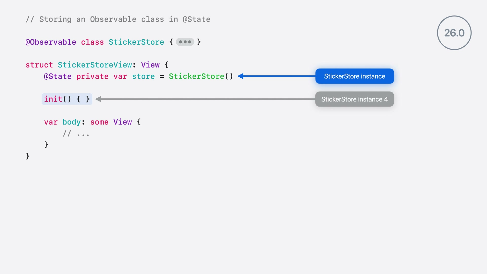

この挙動変更は、`@Observable` が導入された最初のOSバージョン（iOS 17、macOS 14 等）まで自動的に **バックポート適用** されます。

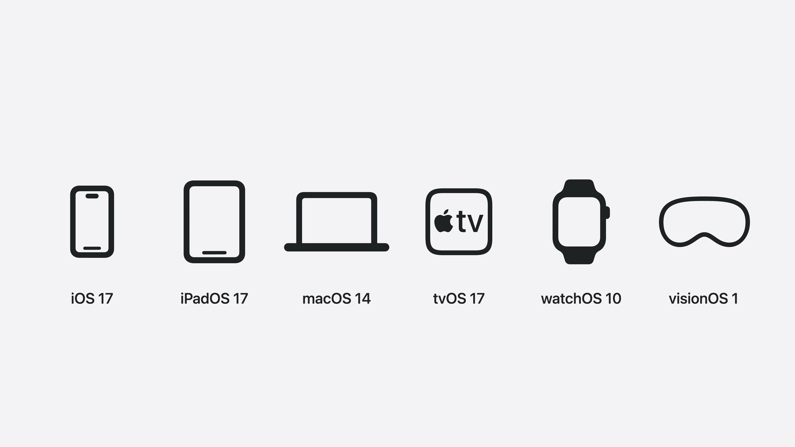

### コンパイラ型チェックの高速化と ContentBuilder

ビューが深くネストされた構造（`Section` や `Group`、`ForEach` の入れ子）では、コンパイラがどのオーバーロード候補（ビュービルダーかテーブル行ビルダーかなど）を使用すべきか判断するために、膨大な型チェックの組み合わせパスを検証する必要があり、ビルド時に「型チェックの時間が長すぎます」というコンパイルエラーが発生することがありました。

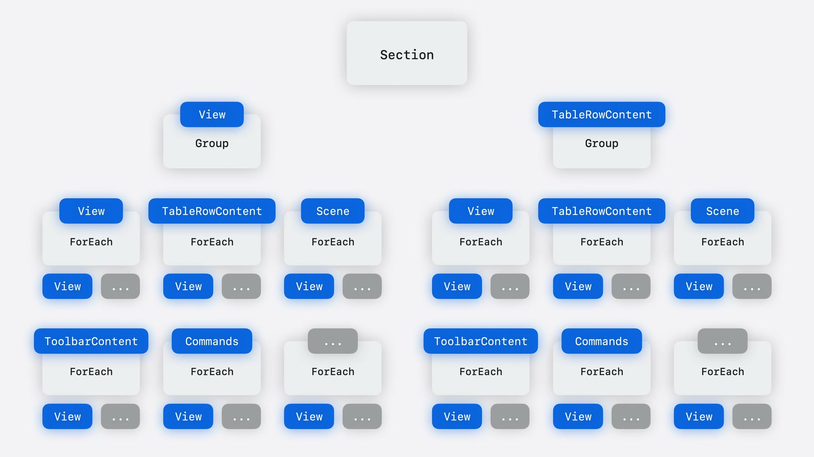

iOS 27 / macOS 17 以降では、最も一般的な複数のビルダー型が内部的に統合され、コンパイラが処理すべきパスが1つに削減されました。

この型安全な統合を担うのが、新しく導入された **`@ContentBuilder`** です。

```swift
@ContentBuilder
func stickerLibraryView() -> some View {
  // ...
}
```

`ContentBuilder` は既存の `ViewBuilder` の進化形で、iOSの最小デプロイターゲットに関わらず使用でき、Xcode 27 を使用したSwiftUIの型チェックのビルドパフォーマンスを大幅に向上させます。

<div style="background-color: #e6f3ff; padding: 10px; border-radius: 8px; border: 1px solid #e6e6e6; width: 100%;">
<svg xmlns="http://www.w3.org/2000/svg" width="16" height="16" viewBox="0 0 24 24" fill="none" stroke="currentColor" stroke-width="2" stroke-linecap="round" stroke-linejoin="round" style="vertical-align: middle; margin-right: 4px;"><path d="M4 19.5A2.5 2.5 0 0 1 6.5 17H20"></path><path d="M6.5 2H20v20H6.5A2.5 2.5 0 0 1 4 19.5v-15A2.5 2.5 0 0 1 6.5 2z"></path></svg>
<a href="https://developer.apple.com/documentation/swiftui/contentbuilder">
ContentBuilder
</a>
</div>

### Xcode 27 エージェントスキル（Agent Skills）

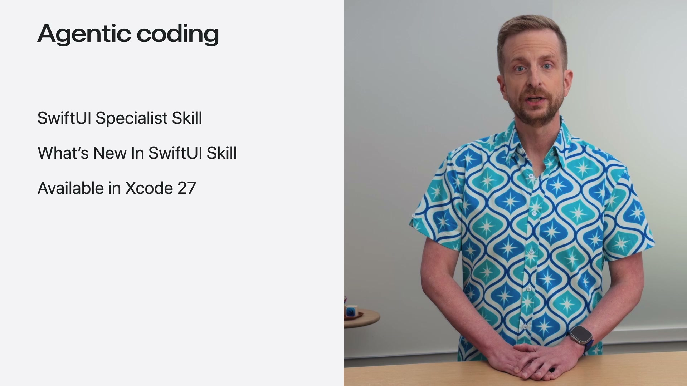


開発環境の支援機能として、Xcode 27 の Coding Assistant 向けに新しい2つのエージェントスキルが導入されました。

* **SwiftUI Specialist Skill**: アプリでSwiftUIのベストプラクティスが遵守されているかを分析・支援します。
* **What's New In SwiftUI Skill**: 新しいAPIや機能の導入をガイドします。

これらのスキルは、以下のコマンドを実行することでMarkdownファイルとしてエクスポートでき、サードパーティ製の他の開発ツールやワークフローに組み込むことも可能です。

```bash
xcrun agent skills export
```

---

## 6. まとめ

- Liquid Glassが改善
- ドキュメントベースのアプリが作りやすく
- 全てのコンテナ内で要素の並び替えやスワイプアクションを使えるように
- confirmationDialogとalertでitem-bindingが使えるように
- AsyncImageのcache対応
- @Stateの改善
- @ContentBuilderによる型チェックの高速化
- Xcode 17 Agent Skillsの導入

