WWDC26のセッション [Foundation Modelフレームワークの新機能](https://developer.apple.com/jp/videos/play/wwdc2026/241/) で紹介された内容を、後から見返しやすいように整理します。

Appleの説明では、Foundation Modelsは **OS内外との統合**、**より幅広いモデル対応**、そして **エージェント体験を構築するための新しいプリミティブ** が大きなテーマです。具体的には、モデルのアップデート、Vision対応、Private Cloud Compute、モデル抽象化、システムツール、Dynamic Profile、Evaluations、Mac向けツール、Python SDK、オープンソース化が紹介されています。

## Foundation Models frameworkのオープンソース化

Foundation Modelsフレームワークは、本セッションで紹介された多くの新しいAPIを含めてオープンソースになります。コアフレームワークに加えて、次のOSバージョンアップを待たずに更新される [**Foundation Models framework utilities**](https://github.com/apple/foundation-models-utilities) も公開されます。

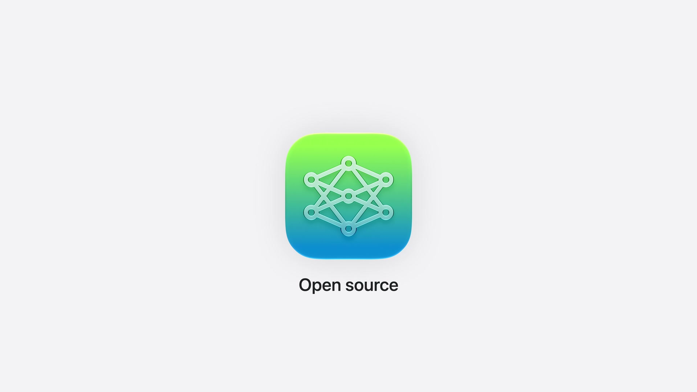

関連ドキュメント: [Foundation Models Documentation](https://developer.apple.com/documentation/foundationmodels) / [Foundation Models updates](https://developer.apple.com/documentation/Updates/FoundationModels) / [Foundation Models framework utilitiesのGitHubリポジトリ](https://github.com/apple/foundation-models-utilities)

## 新しいオンデバイスモデル

このリリースでは、新しいオンデバイスモデルが登場します。Appleの説明では、ゼロから再構築され、知性、ロジック、ツール呼び出しが向上しています。

iOS 26.4では、モデルのコンテキストサイズを検査するAPIと、命令・プロンプト・トランスクリプトのトークン数を数えるAPIがリリースされました。今後はこれらを活用して、アプリを実行中のハードウェアに適応させることが推奨されています。

```swift
// Context size and token counting
  
  let model = SystemLanguageModel()
  print(model.contextSize)
  // 8192
  
  let count = try await model.tokenCount(for: "What are the Japanese characters for origami?")
  print(count)
```

ガードレールも改善されています。AppleはiOS 26.4で誤検知を減らす調整を行い、iOS 27でもさらに改善を続けていると説明しています。

## Vision: image understanding

オンデバイスモデルにはVision機能も追加されました。これにより、テキストとともに画像添付ファイルをプロンプトへ挿入し、モデルに画像について質問できます。

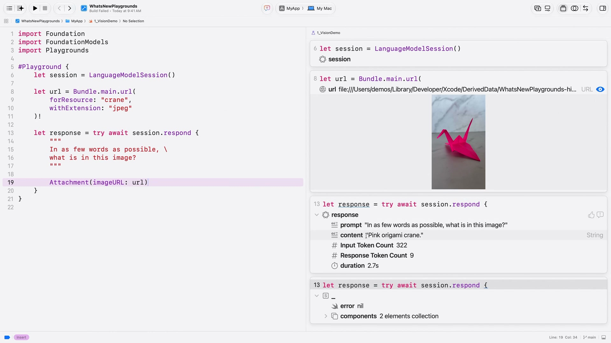


```swift
// Attachable image types

  let response = try await session.respond {
      "What animal is this?"
      Attachment(UIImage(...))
  }
```

画像添付ファイルは、`UIImage`、`NSImage`、`CGImage`、Core Image型、Pixel Buffer、ファイルURLなど、さまざまな型から作成できます。

モデルはあらゆるサイズとアスペクト比の画像をサポートします。特定の形状へのトリミングやパディングは不要です。ただし、大きな画像ほどトークンを消費し、レイテンシが増加する点には注意が必要です。

関連ドキュメント: [Analyzing images with multimodal prompting](https://developer.apple.com/documentation/FoundationModels/analyzing-images-with-multimodal-prompting)

## Private Cloud Compute

さらに処理能力が必要な場合は、新しい [`PrivateCloudComputeLanguageModel`](https://developer.apple.com/documentation/FoundationModels/adding-server-side-intelligence-with-private-cloud-compute) でAppleのサーバーモデルを利用できます。

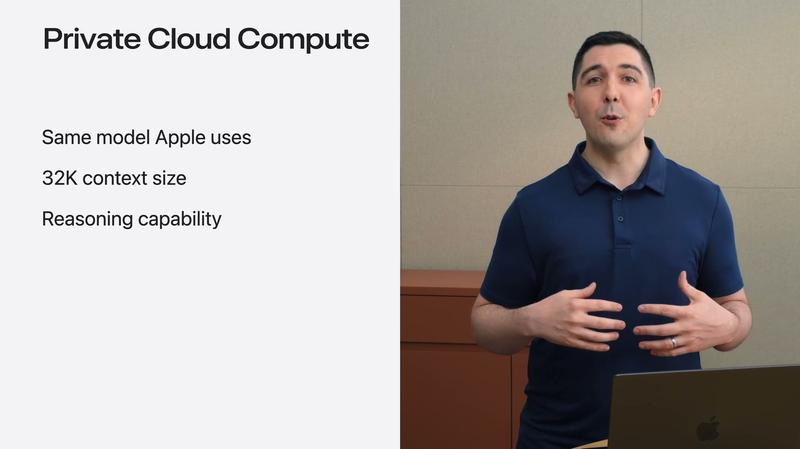

Private Cloud Computeモデルは、Apple Intelligence機能の多くを支えるモデルと同じ系統として説明されています。オンデバイスモデルより大きく、32,000トークンのコンテキストウィンドウを持ち、リーズニングにも対応します。

Private Cloud Computeは、モデルのインスタンスを作成し、それを使って `LanguageModelSession` を初期化するだけで利用できます。プロンプト送信時には `contextOptions` でリーズニングレベルを指定できます。`ReasoningLevel` は、モデルが応答前に考える量を制御します。深いリーズニングは追加の計算と引き換えに、より良い応答を生成します。

Appleは、Private Cloud Computeの利点として、アカウント設定・認証・APIキー保存が不要であること、プロンプトが保存されないこと、独立した研究者が検証できることを強調しています。

また、Private Cloud Computeにより、Foundation ModelフレームワークをwatchOSにも展開できます。watchOS 27から、手首でも強力なインテリジェンス機能を利用できます。

PCCはクラウドAPIコストなしで利用可能で、Appleの説明では「first-time downloadsが200万件未満」のデベロッパに提供されます。ユーザーは毎日PCCにアクセスでき、iCloud+に登録している場合は利用上限がさらに高くなります。なお、利用には対応OSやEntitlementの追加など条件があります。

## Model abstraction layer

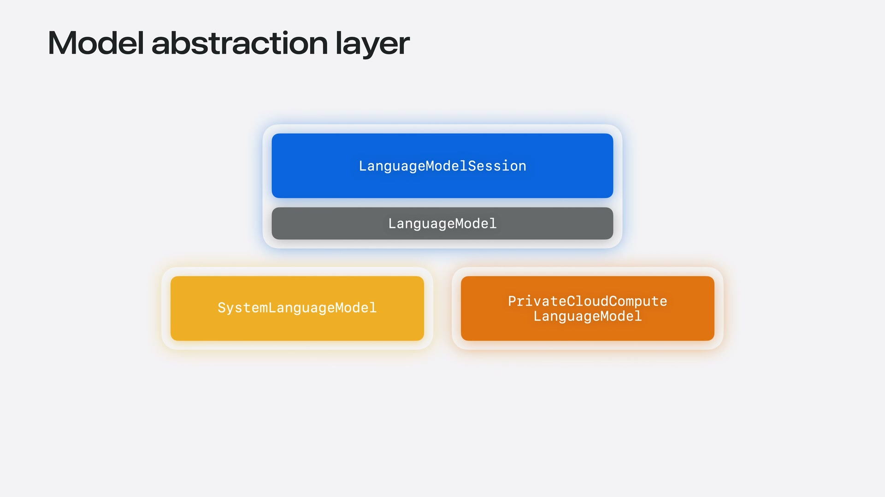


刷新されたオンデバイスモデルとPrivate Cloud Computeモデルに加えて、Appleはモデル抽象化レイヤーを開放します。これは、ほぼあらゆる言語モデルをFoundation Modelフレームワークで使えるようにするためのものです。

抽象化レイヤーは新しい `LanguageModel` プロトコルを中心に構築されます。関連する基本概念はApple公式の[`LanguageModelSession`](https://developer.apple.com/documentation/foundationmodels/languagemodelsession)ドキュメントでも確認できます。ローカルモデルとサーバーモデルのどちらも `LanguageModelSession` を支えられます。

`SystemLanguageModel` や `PrivateCloudComputeLanguageModel` はすでにこのプロトコルに準拠しています。さらに、MacのApple Neural EngineやGPUで多数のローカルモデルを実行するための `CoreAILanguageModel` と `MLXLanguageModel` もオープンソース化されます。

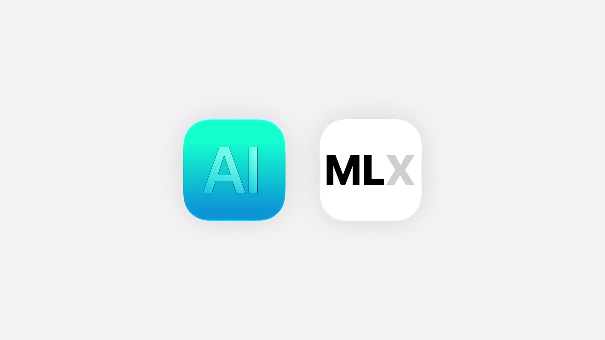

## Partner model integrations

Appleは、さまざまなフロンティアサーバーモデルへのアクセスも紹介しました。AnthropicとGoogleがSwiftパッケージを公開し、最新モデルへのアクセスを提供します。

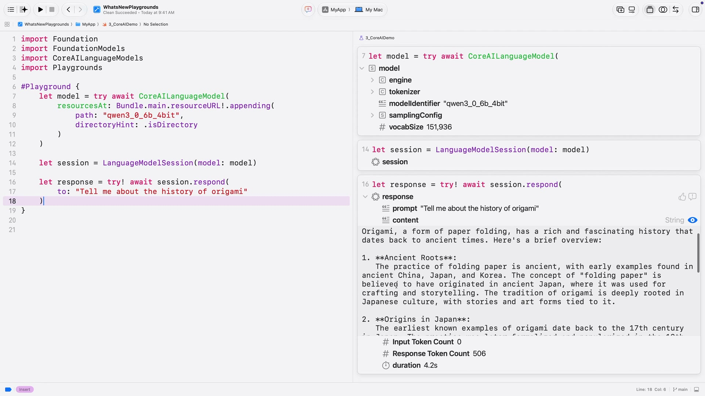

利用方法は、Swift Package Managerで言語モデルパッケージをインポートし、使用するモデルを初期化して、セッション作成時に渡すだけです。以降の処理は同じです。

一方で、サードパーティのサーバーモデルを使う場合は、認証と請求の両方をデベロッパが処理する必要があります。Appleは、アプリのバイナリに秘密鍵を保存せず、OAuthなどの安全な仕組みでアクセストークンを取得し、Keychainを使って安全に保存するよう説明しています。

サードパーティモデル使用時は通常トークンごとに請求されるため、使用量を追跡できるAPIも追加されています。


```swift
// Inspecting usage
  
  let response = try await session.respond(
      to: "Recommend a craft that doesn't require scissors.",
      contextOptions: ContextOptions(reasoningLevel: .light)
  )

  print(response.usage.input.totalTokenCount)
  print(response.usage.input.cachedTokenCount)

  print(response.usage.output.totalTokenCount)
  print(response.usage.output.reasoningTokenCount)
```

セッションと応答には `usage` プロパティが追加され、入力・出力トークン数、キャッシュから読み込まれた入力トークン数、リーズニングに使用された応答トークン数を確認できます。

## System tools: Vision and Spotlight

`LanguageModelSession` を強化するシステム提供のツールも追加されました。

Foundation Modelsには2つのネイティブツールが追加されました。`BarcodeReaderTool` はバーコードから情報を読み取れるようにし、`OCRTool` は画像から構造化テキストを抽出できるようにします。どちらもVisionフレームワークの機能に支えられています。

Spotlightを使った検索ツールも導入されます。これは完全ローカルなRetrieval-Augmented Generation（RAG）を実装するためのSpotlightベースの検索ツールとのことです。

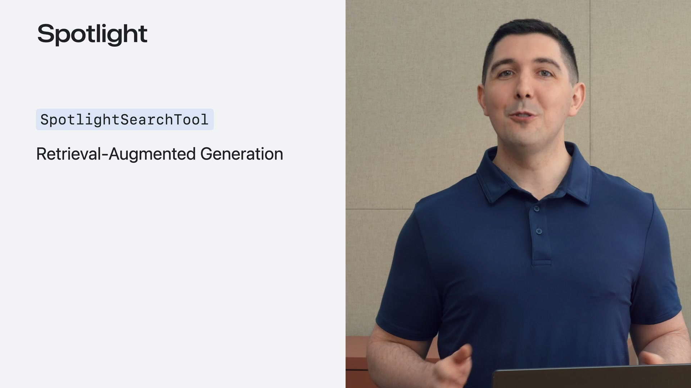

RAGは、モデルに最新の個人的またはドメイン知識へのアクセスを与える技術です。このツールでは、Spotlightインデックスと特別に処理されたクエリを活用します。

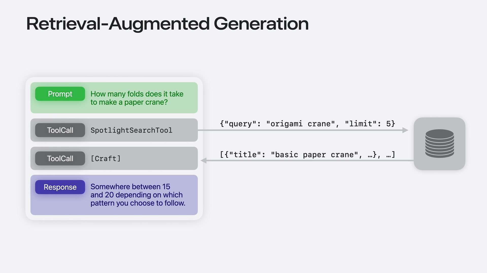

## Dynamic Profiles for agentic apps

Dynamic Profileは、エージェント体験を構築するための新しいプリミティブです。

関連ドキュメント: [Composing dynamic sessions with instructions and profiles](https://developer.apple.com/documentation/FoundationModels/composing-dynamic-sessions-with-instructions-and-profiles)


従来の実装では、モードが変わるたびに元のトランスクリプトを取り出し、新しい命令とツールを持つセッションを作り直す必要がありました。

Dynamic Profileは、それらを改善し、コンテキストで重要なことに集中できるようにする宣言的APIです。

シンプルなDynamic Profileは、`LanguageModelSession.DynamicProfile` に準拠したstructとして宣言します。

```swift
// Describing the profile for craft app

  struct CraftProfile: LanguageModelSession.DynamicProfile {
      var body: some DynamicProfile {
          Profile {
              Instructions {
                  """
                  You are an expert crafting assistant. \
                  Record craft project image analyses   \
                  using the recordImageAnalysis tool.
                  """
              }
              RecordImageAnalysisTool()
          }
      }
  }

  let session = LanguageModelSession(
      profile: CraftProfile()
  )
```

`body` プロパティには `Profile` を含めます。`Profile` では、その時点でコンテキストに存在すべき命令とツールを指定できます。`LanguageModelSession` はDynamic Profileで初期化できます。

### モデルと設定の動的な構成

Dynamic Profileは、命令やツールだけでなく、モデルや設定も動的に切り替えられます。

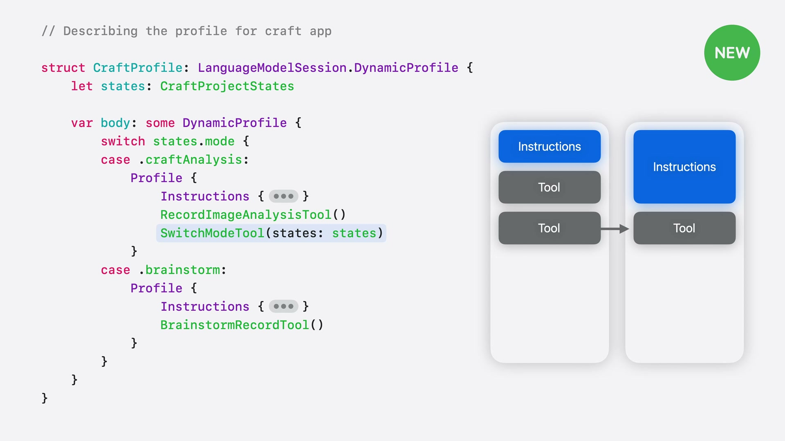

クラフト分析のような素早いタスクには `SystemLanguageModel` で十分です。一方、ブレインストーミングでは深い推論を設定したPrivate Cloud Computeを指定できます。

これらの設定はModifierで記述します。

```swift
// Describing the profile for craft app
  
  struct CraftProfile: LanguageModelSession.DynamicProfile {
      let states: CraftProjectStates

      var body: some DynamicProfile {
          switch states.mode {
          case .craftAnalysis:
              Profile {
                  Instructions { /* ... */ }
                  RecordImageAnalysisTool()
                  SwitchModeTool(states: states)
              }
          case .brainstorm:
              Profile {
                  Instructions { /* ... */ }
                  BrainstormRecordTool()
              }
              .model(states.privateCloudCompute)
              .reasoningLevel(.deep)
          }
      }
  }
```

ここでは、PCCを指定する `.model(...)` と、モデルに十分に考えさせる `.reasoningLevel(.deep)` が使われています。

重要なのは、Dynamic Profileが常に単一のアクティブな `Profile` に解決されることです。条件分岐でどの `Profile` をアクティブにするかを選び、frameworkが移行を処理します。

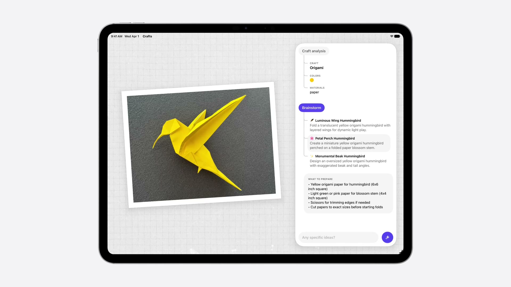

Appleは、このAPIを使用する際は、プライバシー境界、モデル機能、コストを考慮するよう説明しています。

## Evaluation framework

言語モデルは本質的に非決定論的であるため、動作の予測が難しくなります。Evaluationsフレームワークは、インテリジェンス機能の品質を測定するための新しいSwiftフレームワークです。

Evaluationフレームワークを使うと、プロンプトを調整しながら精度を定量化できます。Appleは、このフレームワークをアプリデベロッパのためのものとして説明しており、変更の統計的影響を理解し、自信を持ってアプリをリリースするために役立つとしています。

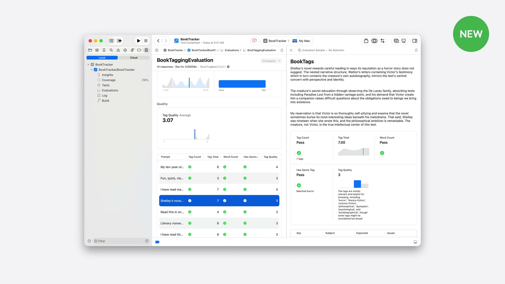

関連リンク: [Evaluating prompts to measure performance and improve model responses](https://developer.apple.com/documentation/foundationmodels/evaluating-prompts-to-measure-performance-and-improve-model-responses)

## fm command line tool

macOS 27では、Foundation Modelsをコマンドラインで利用できます。`fm` CLIはApple Foundation Modelsを使う新しい方法で、端末からオンデバイスモデルとPCCにアクセスできます。

`fm chat` を使うと、アプリ機能のためにモデルを試せます。セッションでは「折り紙の文脈で谷折りとは何を意味するか？」を尋ねる例が示されました。

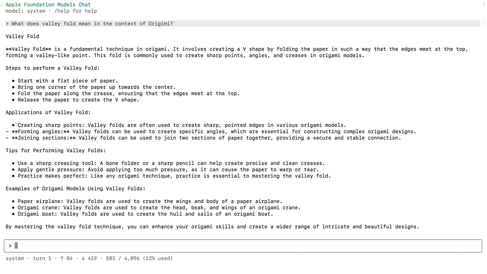

`fm` はシェルスクリプトに組み込み、ドキュメントの要約、情報抽出、コンテンツ生成などにも使えます。例として、ランダムな名前の写真に対して、画像の内容に基づく説明的なファイル名を生成するデモが紹介されました。

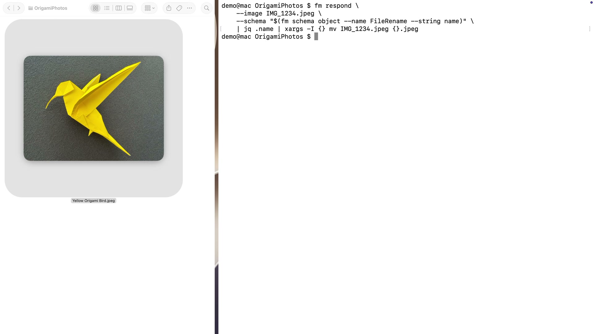

## Foundation Models SDK for Python

Pythonエコシステムで作業するデータサイエンティストや研究者向けには、[Foundation Models SDK for Python](https://github.com/apple/python-apple-fm-sdk) が提供されます。GitHubの説明では、macOS上のApple Intelligenceの中核にあるオンデバイスモデルへアクセスするためのPythonバインディングです。

Python SDKは、Swift Foundation Modelsフレームワークを動かすものと同じオンデバイスモデルへの直接アクセスを提供します。モデルの利用可能性を確認し、数行のPythonで応答を生成できます。

```swift
# Foundation Models SDK for Python
  
  import apple_fm_sdk as fm

  model = fm.SystemLanguageModel()

  # Check the model's availability
  is_available, reason = model.is_available()

  if is_available:

      # Create a session
      session = fm.LanguageModelSession(model=model)

      # Generate a response
      response = await session.respond(prompt="Hello!")
      print(response)
```

SDKにはSwiftフレームワークのコア機能が含まれており、プロンプトから構造化された応答を得られます。

## Open source and framework utilities

[Foundation Models framework utilities](https://github.com/apple/foundation-models-utilities)には、LLMを使った新しいプラクティスを探索するためのビルディングブロックが含まれます。

噛み砕いて言えば、最近のAIアプリでよく使われる仕組みを、OSリリースを待たずに試せる部品集という位置付けです。

例えば、トランスクリプト管理のためのProfile Modifierや手続き型知識読み込みのためのスキルAPIを提供します。また、Chat Completions APIと互換性のあるインターフェースで利用できる言語モデルも提供します。

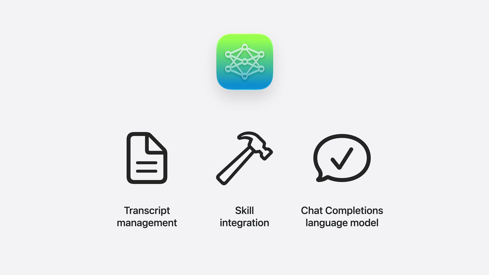

Appleは、Foundation Modelsフレームワークのコアもオープンソースになると説明しました。これにより、Swiftが動く環境、Linuxサーバーも含めて、LLMとの対話に使えるようになります。

AnthropicやGoogleなどのモデルプロバイダーに加え、CoreAIとMLXのインテグレーションも含め、どこでも任意のモデルを実行できるようになる、という位置づけです。

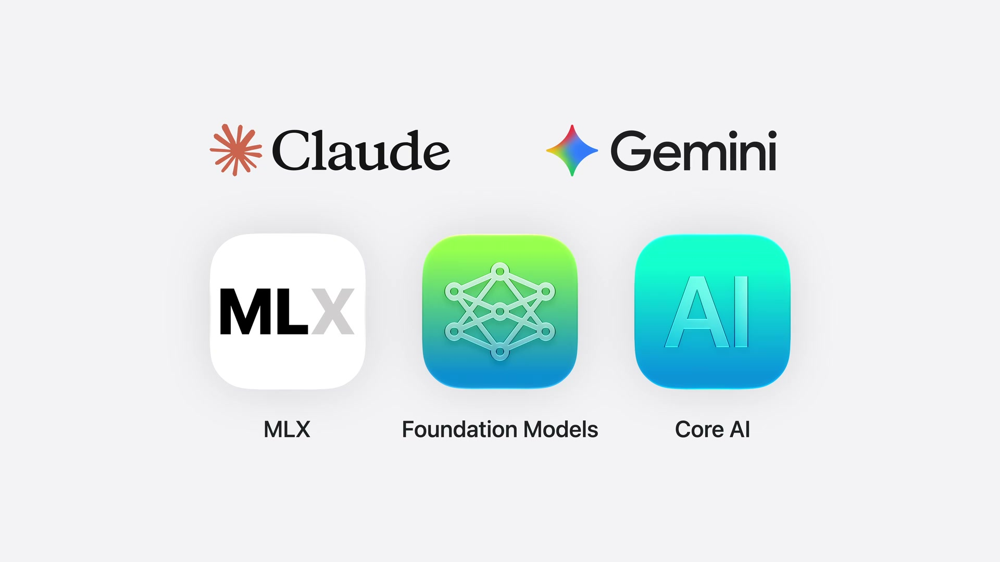

## 関連セッション＆関連リンク

- [サンプルコード  Origami: Crafting a dynamic tutorial for Apple Intelligence](https://developer.apple.com/documentation/FoundationModels/origami-crafting-a-dynamic-tutorial-for-apple-intelligence)
- [Foundation Modelフレームワークによる、エージェントを活用したアプリ体験の構築](https://developer.apple.com/jp/videos/play/wwdc2026/242/)
- [Evaluationsフレームワークについて](https://developer.apple.com/jp/videos/play/wwdc2026/298/)

## まとめ

- 新しいオンデバイスモデルは、知性・ロジック・ツール呼び出しが向上
- 画像理解ができるようになり、画像添付をプロンプトに含められる
- Private Cloud Computeにより、より大きなコンテキストとリーズニングを利用できる
- `LanguageModel` プロトコルにより、ローカル・サーバー・サードパーティモデルを同じ抽象化で扱える
- `usage` により、トークン使用量を追跡できる
- VisionとSpotlightのシステムツールが追加される
- Dynamic Profileにより、エージェント的なアプリ体験のコンテキスト管理を宣言的に書ける
- Evaluationフレームワークにより、プロンプト変更の品質影響を測定できる
- `fm` CLIとPython SDKにより、アプリ外のワークフローでもFoundation Modelsを利用できる
- Foundation Models frameworkとutilitiesがオープンソース化される

